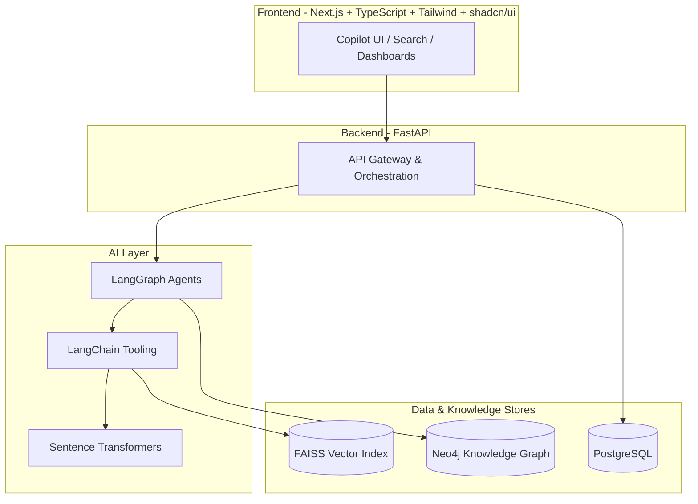
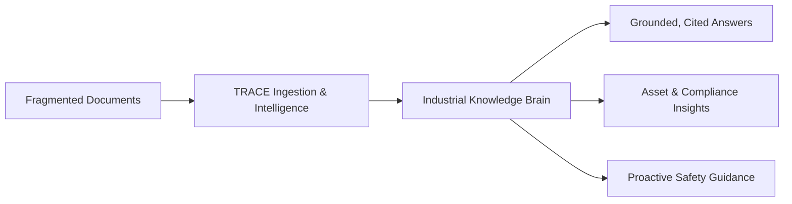
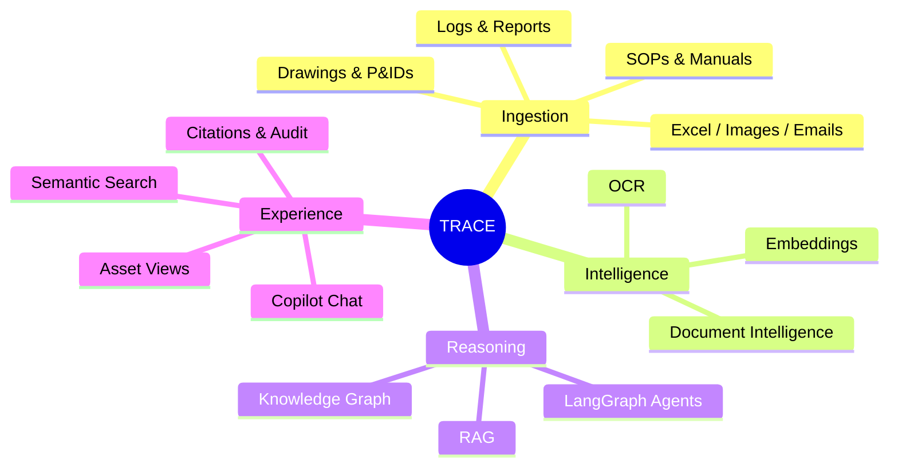
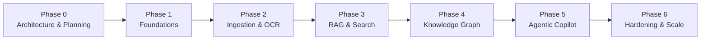

# TRACE

### Technical Records & Asset Compliance Engine

> An AI-powered Industrial Knowledge Intelligence Platform that turns scattered, unstructured industrial documents into a single, searchable **Industrial Knowledge Brain**.

[]()
[]()
[]()

---

## Table of Contents

1. [Project Overview](#1-project-overview)
2. [Tech Stack](#2-tech-stack)
3. [Folder Structure](#3-folder-structure)
4. [Vision](#4-vision)
5. [Features](#5-features)
6. [Development Phases](#6-development-phases)
7. [Documentation Index](#7-documentation-index)
8. [References](#8-references)

---

## 1. Project Overview

**TRACE (Technical Records & Asset Compliance Engine)** is an enterprise-grade,
AI-powered Industrial Knowledge Intelligence Platform built for **Problem Statement 8**.

Industrial organizations — refineries, power plants, manufacturing facilities, oil & gas
operators, and heavy-asset enterprises — generate enormous volumes of technical knowledge.
This knowledge is locked inside heterogeneous documents: engineering drawings, P&IDs,
SOPs, maintenance logs, inspection reports, incident reports, OEM manuals, safety manuals,
spreadsheets, scanned images, and email threads.

Today, this knowledge is **fragmented, undiscoverable, and slowly decaying**. Engineers
spend hours searching across shared drives, document management systems, and personal
archives. Critical safety and compliance information is buried in PDFs that no search engine
can reason about.

TRACE ingests these documents and transforms them into **one searchable Industrial Knowledge
Brain** using a layered AI pipeline of OCR, Document Intelligence, Retrieval-Augmented
Generation (RAG), a Knowledge Graph, and orchestrated AI Agents powered by LLMs.

> **TRACE is NOT a PDF chatbot.**
> It behaves like *Microsoft Copilot for industrial operations* — understanding assets,
> compliance, procedures, and incidents, and reasoning across them.

### What makes TRACE different

| Conventional Document Search | TRACE |
| --- | --- |
| Keyword matching | Semantic + graph-aware reasoning |
| One document at a time | Cross-document, cross-asset synthesis |
| No understanding of engineering artifacts | Understands P&IDs, drawings, tags, assets |
| Returns links | Returns grounded, cited answers |
| Static | Agentic — plans, retrieves, verifies, explains |

---

## 2. Tech Stack

### Frontend

| Technology | Purpose |
| --- | --- |
| **Next.js** | React framework, SSR/streaming UI, app router |
| **TypeScript** | Type-safe frontend development |
| **TailwindCSS** | Utility-first styling system |
| **shadcn/ui** | Accessible, composable component library |

### Backend

| Technology | Purpose |
| --- | --- |
| **FastAPI** | High-performance Python API layer & orchestration gateway |

### Database

| Technology | Purpose |
| --- | --- |
| **PostgreSQL** | Relational store for metadata, users, documents, audit, jobs |

### AI / Intelligence Layer

| Technology | Purpose |
| --- | --- |
| **LangGraph** | Stateful, multi-step AI agent orchestration |
| **LangChain** | LLM tooling, chains, retrievers, integrations |
| **Neo4j** | Knowledge Graph for assets, relationships, compliance links |
| **FAISS** | High-speed vector similarity search |
| **Sentence Transformers** | Embedding generation for semantic retrieval |

### High-Level Stack Diagram



---

## 3. Folder Structure

```text
TRACE/
├── docs/                       # Architecture & planning documentation
│   ├── 01_PROBLEM_STATEMENT.md
│   └── 02_PRODUCT_REQUIREMENTS.md
├── frontend/                   # Next.js + TypeScript + Tailwind + shadcn/ui (planned)
├── backend/                    # FastAPI service layer (planned)
├── ai/                         # LangGraph / LangChain / RAG / Knowledge Graph (planned)
├── datasets/                   # Sample industrial documents & corpora (planned)
├── scripts/                    # Utility & data-prep scripts (planned)
└── README.md                   # This file
```

| Folder | Responsibility |
| --- | --- |
| `docs/` | Problem definition, product requirements, architecture decisions |
| `frontend/` | User-facing Copilot interface, search, dashboards, document viewer |
| `backend/` | API gateway, auth, ingestion orchestration, query routing |
| `ai/` | OCR, document intelligence, embeddings, RAG, knowledge graph, agents |
| `datasets/` | Representative industrial documents for development & evaluation |
| `scripts/` | One-off tooling, ingestion helpers, evaluation harnesses |

> **Note:** During the current phase only architecture documentation is produced. No
> application code, deployment, CI/CD, or container configuration is generated yet.

---

## 4. Vision

> **To become the single, trusted intelligence layer for industrial knowledge —
> where every engineer, operator, and inspector can ask any question about any asset,
> procedure, or incident and receive an instant, grounded, and auditable answer.**

TRACE aims to:

- **Eliminate knowledge loss** when experienced engineers retire or move on.
- **Collapse search time** from hours to seconds across decades of documentation.
- **Connect the dots** between assets, procedures, incidents, and compliance obligations.
- **Make safety proactive** by surfacing relevant procedures and historical incidents before work begins.
- **Provide an auditable trail** for every answer, satisfying regulatory and compliance needs.



---

## 5. Features

### Core Capabilities

| # | Feature | Description |
| --- | --- | --- |
| 1 | **Universal Ingestion** | Ingests drawings, P&IDs, SOPs, logs, reports, manuals, Excel, images, and emails |
| 2 | **OCR & Document Intelligence** | Extracts text, tables, tags, and structure from scanned and native documents |
| 3 | **Semantic Search (RAG)** | Natural-language search with grounded, cited responses |
| 4 | **Knowledge Graph** | Links assets, equipment tags, procedures, incidents, and compliance items |
| 5 | **AI Copilot** | Conversational, multi-turn assistant for industrial operations |
| 6 | **Agentic Reasoning** | LangGraph agents that plan, retrieve, verify, and synthesize answers |
| 7 | **Citations & Provenance** | Every answer links back to source documents and pages |
| 8 | **Compliance Awareness** | Surfaces applicable standards, SOPs, and safety requirements |
| 9 | **Asset-Centric Views** | Browse all knowledge associated with a specific asset or tag |
| 10 | **Audit & Traceability** | Full logging of queries, sources, and answers |

### Feature Map



---

## 6. Development Phases



| Phase | Name | Key Outcomes |
| --- | --- | --- |
| **Phase 0** | Architecture & Planning | Problem statement, requirements, system design ✅ |
| **Phase 1** | Foundations | Project scaffolding, health endpoint, DB connection ✅ (Milestone 1) |
| **Phase 2** | Ingestion & OCR | Document upload, OCR, parsing, document intelligence pipeline |
| **Phase 3** | RAG & Search | Embeddings, FAISS index, retrieval, grounded answering |
| **Phase 4** | Knowledge Graph | Neo4j entity/relationship extraction, asset linking |
| **Phase 5** | Agentic Copilot | LangGraph orchestration, multi-step reasoning, citations |
| **Phase 6** | Hardening & Scale | Performance, security, observability, evaluation |

> **Current status:** Milestone 1 complete — local dev environment (Next.js + FastAPI + PostgreSQL config). Authentication and AI features are next.

---

## Local Development (Milestone 1)

### Prerequisites

- Node.js 20+
- Python 3.11+
- PostgreSQL 15+ (local install)

### 1. Environment

```bash
cp .env.example .env
cp frontend/.env.local.example frontend/.env.local
```

Edit `.env` if your PostgreSQL credentials differ from the defaults (`trace` / `trace`).

### 2. PostgreSQL

Create the database (as postgres superuser):

```bash
psql -U postgres -f scripts/init-db.sql
```

Verify connection:

```bash
cd backend
.venv\Scripts\python scripts\verify_db.py   # Windows
# source .venv/bin/activate && python scripts/verify_db.py   # macOS/Linux
```

### 3. Backend

```bash
cd backend
python -m venv .venv
.venv\Scripts\activate          # Windows
pip install -r requirements.txt
uvicorn app.main:app --reload --host 0.0.0.0 --port 8000
```

Health check: [http://localhost:8000/api/health](http://localhost:8000/api/health)

### 4. Frontend

```bash
cd frontend
npm install
npm run dev
```

Open [http://localhost:3000](http://localhost:3000) — you should see **TRACE** with **Backend Status: 🟢 Online**.

---

## 7. Documentation Index

| Document | Description |
| --- | --- |
| [`docs/00_OFFICIAL_PROBLEM_STATEMENT.md`](docs/00_OFFICIAL_PROBLEM_STATEMENT.md) | Official Problem Statement 8 brief |
| [`docs/01_PROBLEM_STATEMENT.md`](docs/01_PROBLEM_STATEMENT.md) | The problem, context, challenges, and expected solution |
| [`docs/02_PRODUCT_REQUIREMENTS.md`](docs/02_PRODUCT_REQUIREMENTS.md) | Product vision, requirements, metrics, and user stories |
| [`docs/03_SYSTEM_ARCHITECTURE.md`](docs/03_SYSTEM_ARCHITECTURE.md) | High-level system architecture |
| [`docs/04_DATABASE_ARCHITECTURE.md`](docs/04_DATABASE_ARCHITECTURE.md) | PostgreSQL schema design |
| [`docs/05_FRONTEND_ARCHITECTURE.md`](docs/05_FRONTEND_ARCHITECTURE.md) | Next.js frontend architecture |
| [`docs/06_BACKEND_ARCHITECTURE.md`](docs/06_BACKEND_ARCHITECTURE.md) | FastAPI backend architecture |
| [`docs/07_UI_UX_DESIGN.md`](docs/07_UI_UX_DESIGN.md) | UI/UX design system |
| [`docs/08_AI_ARCHITECTURE.md`](docs/08_AI_ARCHITECTURE.md) | AI layer architecture |
| [`docs/09_AGENT_ARCHITECTURE.md`](docs/09_AGENT_ARCHITECTURE.md) | Agent designs |
| [`docs/10_RAG_PIPELINE.md`](docs/10_RAG_PIPELINE.md) | RAG pipeline design |
| [`docs/11_KNOWLEDGE_GRAPH.md`](docs/11_KNOWLEDGE_GRAPH.md) | Neo4j knowledge graph design |
| [`docs/12_DOCUMENT_PIPELINE.md`](docs/12_DOCUMENT_PIPELINE.md) | Document ingestion pipeline |
| [`docs/13_API_SPECIFICATION.md`](docs/13_API_SPECIFICATION.md) | REST API specification |
| [`docs/14_IMPLEMENTATION_ROADMAP.md`](docs/14_IMPLEMENTATION_ROADMAP.md) | 20-day implementation plan |
| [`docs/15_AI_DEVELOPMENT_RULES.md`](docs/15_AI_DEVELOPMENT_RULES.md) | AI engineering rules |
| [`docs/16_TESTING_STRATEGY.md`](docs/16_TESTING_STRATEGY.md) | Testing strategy |
| [`docs/17_PRESENTATION_GUIDE.md`](docs/17_PRESENTATION_GUIDE.md) | Demo and presentation guide |

---

## 8. References

- Problem Statement 8 — Industrial Knowledge Intelligence (challenge brief).
- Retrieval-Augmented Generation (RAG): Lewis et al., *"Retrieval-Augmented Generation for Knowledge-Intensive NLP Tasks"*, 2020.
- LangGraph Documentation — https://langchain-ai.github.io/langgraph/
- LangChain Documentation — https://python.langchain.com/
- Neo4j Knowledge Graph Documentation — https://neo4j.com/docs/
- FAISS — https://faiss.ai/
- Sentence Transformers — https://www.sbert.net/
- FastAPI — https://fastapi.tiangolo.com/
- Next.js — https://nextjs.org/docs
- shadcn/ui — https://ui.shadcn.com/
