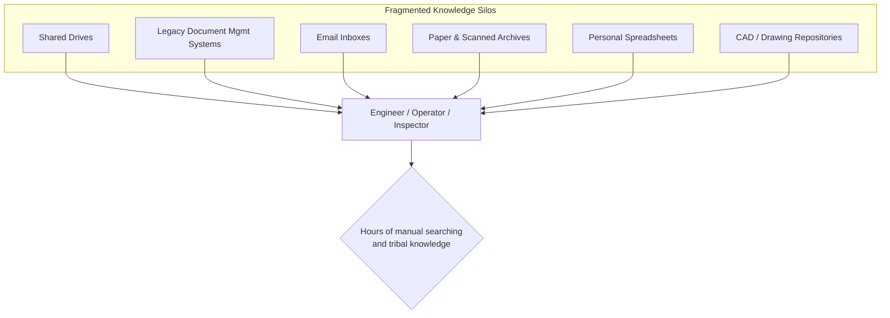
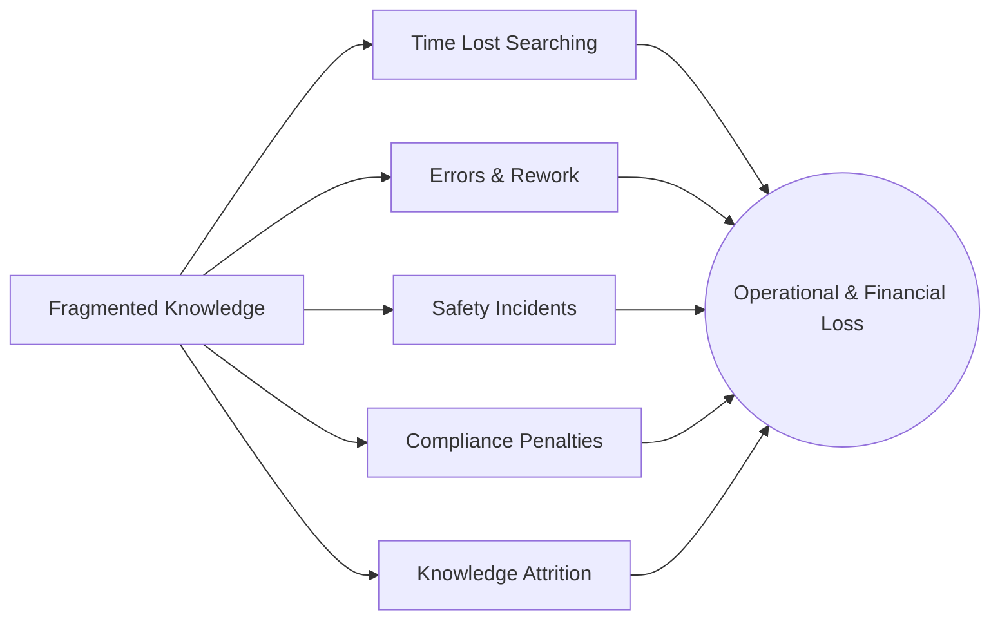
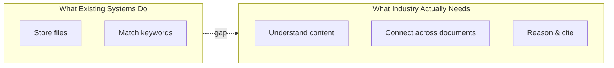
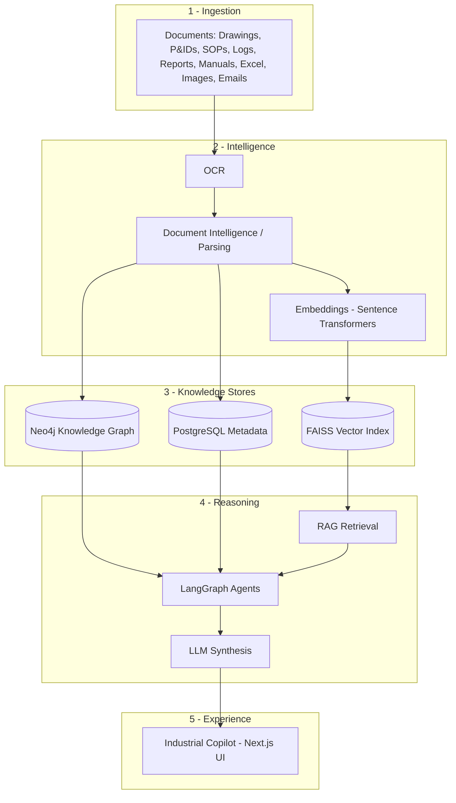
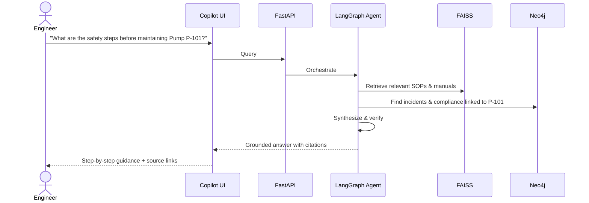
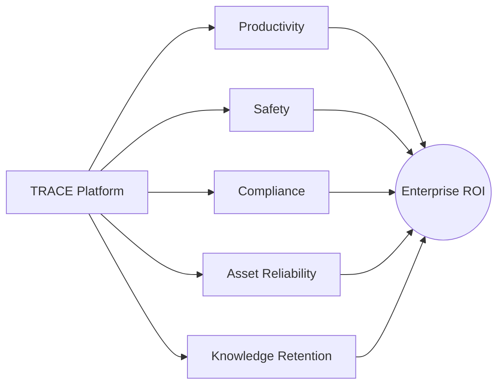
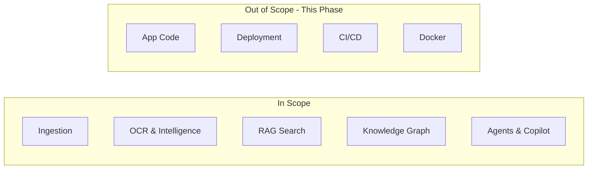
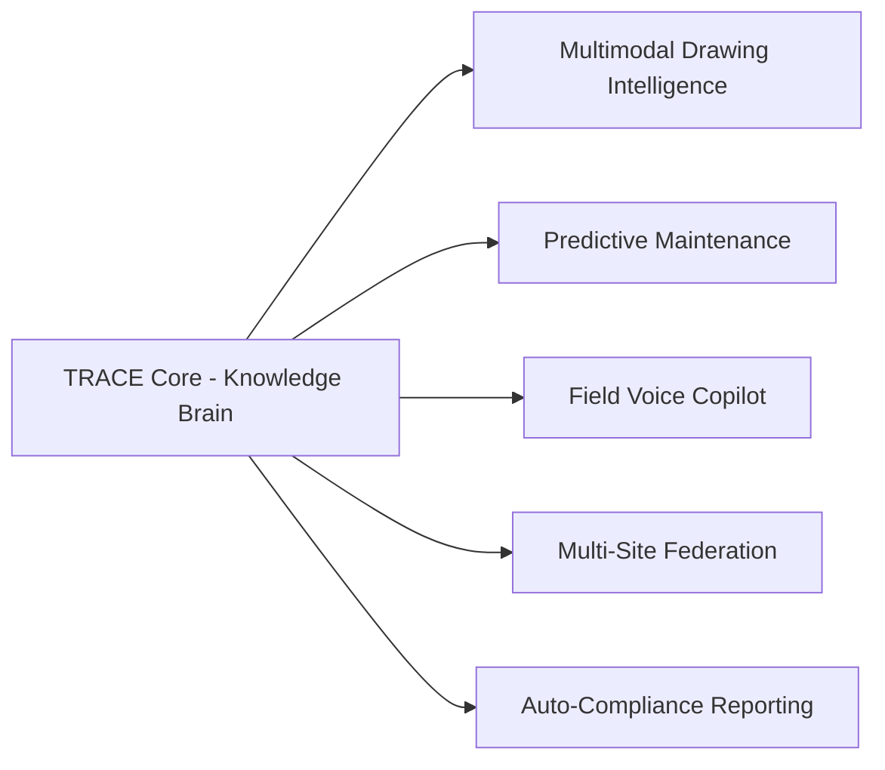

# TRACE — Problem Statement

### Technical Records & Asset Compliance Engine · Problem Statement 8

---

## Table of Contents

1. [Executive Summary](#1-executive-summary)
2. [Problem Context](#2-problem-context)
3. [Current Challenges](#3-current-challenges)
4. [Why Current Systems Fail](#4-why-current-systems-fail)
5. [Expected Solution](#5-expected-solution)
6. [Business Value](#6-business-value)
7. [Objectives](#7-objectives)
8. [Scope](#8-scope)
9. [Future Scope](#9-future-scope)
10. [References](#10-references)

---

## 1. Executive Summary

Industrial enterprises operate on knowledge that is overwhelmingly **unstructured,
fragmented, and trapped in documents**. A single facility may hold hundreds of thousands of
engineering drawings, P&IDs, Standard Operating Procedures (SOPs), maintenance logs,
inspection and incident reports, OEM and safety manuals, spreadsheets, scanned images, and
email threads accumulated over decades.

This knowledge is mission-critical — it governs how assets are operated, maintained, and
kept compliant — yet it is **practically undiscoverable**. Engineers waste hours hunting
across shared drives and legacy document systems; tribal knowledge walks out the door when
experts retire; and safety-critical information remains buried until an incident exposes the
gap.

**TRACE (Technical Records & Asset Compliance Engine)** addresses this by transforming the
entire industrial document estate into a single, searchable **Industrial Knowledge Brain**.
Using OCR, document intelligence, Retrieval-Augmented Generation (RAG), a knowledge graph,
and orchestrated AI agents, TRACE delivers grounded, cited, and auditable answers to natural
-language questions about assets, procedures, compliance, and incidents.

> TRACE is not a PDF chatbot. It is **Copilot for industrial operations**.

---

## 2. Problem Context

Industrial operations — refineries, chemical plants, power generation, manufacturing, oil &
gas, and other heavy-asset sectors — are document-intensive by regulation and by engineering
necessity. The knowledge estate has several defining characteristics:

| Dimension | Reality in Industry |
| --- | --- |
| **Volume** | Hundreds of thousands to millions of documents per site |
| **Variety** | Drawings, P&IDs, SOPs, logs, reports, manuals, spreadsheets, images, emails |
| **Veracity** | Multiple versions, conflicting revisions, undated scans |
| **Velocity** | New logs, reports, and emails generated continuously |
| **Format** | Mix of native digital, scanned paper, handwritten notes, CAD exports |
| **Ownership** | Scattered across departments, drives, inboxes, and legacy systems |

### Where the knowledge lives today

The people who need this knowledge — engineers, operators, maintenance technicians,
inspectors, and compliance officers — must manually navigate these silos, often relying on
personal memory or asking colleagues. The result is slow, error-prone, and risky.

---

## 3. Current Challenges

| # | Challenge | Impact |
| --- | --- | --- |
| 1 | **Fragmentation** | Knowledge is spread across disconnected systems with no unified access |
| 2 | **Unstructured formats** | Scanned drawings and PDFs cannot be searched semantically |
| 3 | **No cross-document reasoning** | Answers require synthesizing many documents at once |
| 4 | **Tribal knowledge loss** | Expertise leaves with retiring or departing staff |
| 5 | **Slow retrieval** | Engineers spend hours locating the right document |
| 6 | **Compliance risk** | Outdated or missed procedures lead to violations |
| 7 | **Safety exposure** | Relevant incident history is not surfaced proactively |
| 8 | **Version confusion** | Multiple revisions make the "current" version unclear |
| 9 | **No provenance** | Even when found, answers cannot be easily verified or cited |
| 10 | **Asset blindness** | No single view of all knowledge tied to a specific asset/tag |

### The cost of the status quo

---

## 4. Why Current Systems Fail

| System Type | What It Does | Why It Fails for Industrial Knowledge |
| --- | --- | --- |
| **Keyword search / file search** | Matches filenames and literal text | Cannot read scanned drawings; no semantic understanding |
| **Document Management Systems (DMS)** | Stores and versions files | Storage, not intelligence; no reasoning across documents |
| **Enterprise search portals** | Indexes text content | Returns links, not answers; no engineering context |
| **Generic PDF chatbots** | Answers questions on one PDF | Single-document scope; no asset/graph awareness; hallucinates |
| **Shared drives** | Hierarchical storage | Depends entirely on human memory of folder structure |
| **Spreadsheets / tracking logs** | Manual record keeping | Disconnected, manually maintained, error-prone |

### The core gap

Existing tools treat documents as **files to store** or **text to match**, not as
**knowledge to understand and connect**. Industrial knowledge requires:

- Reading **scanned and engineering artifacts** (OCR + document intelligence).
- **Semantic** understanding rather than keyword matching.
- **Cross-document synthesis** across hundreds of sources.
- A **graph of relationships** between assets, procedures, incidents, and standards.
- **Grounded answers with citations** that can be trusted and audited.

---

## 5. Expected Solution

TRACE is an **AI-powered Industrial Knowledge Intelligence Platform** that ingests the full
document estate and exposes it through a single intelligent interface. It is built as a
layered pipeline:

### Solution Pillars

| Pillar | Description |
| --- | --- |
| **Universal Ingestion** | Accepts all major industrial document formats |
| **OCR & Document Intelligence** | Converts scans and structured documents into machine-readable knowledge |
| **RAG** | Retrieves the most relevant content and grounds LLM answers in it |
| **Knowledge Graph** | Models assets, tags, procedures, incidents, and compliance links |
| **AI Agents** | Plan, retrieve, verify, and synthesize multi-step answers |
| **Copilot Experience** | Conversational, cited, audit-ready interface |

### Illustrative end-to-end query

---

## 6. Business Value

| Value Driver | Description | Benefit |
| --- | --- | --- |
| **Time savings** | Seconds instead of hours to find answers | Higher engineering productivity |
| **Knowledge retention** | Captures and preserves expert knowledge | Resilience against attrition |
| **Safety** | Proactively surfaces procedures & incident history | Fewer incidents |
| **Compliance** | Surfaces applicable standards & SOPs with audit trails | Reduced regulatory risk |
| **Decision quality** | Grounded, cited answers | Better, faster decisions |
| **Asset reliability** | Unified asset knowledge view | Improved maintenance outcomes |
| **Onboarding** | New staff self-serve institutional knowledge | Faster ramp-up |

---

## 7. Objectives

| # | Objective | Description |
| --- | --- | --- |
| O1 | **Unify knowledge** | Ingest all industrial document types into one platform |
| O2 | **Make it searchable** | Enable natural-language semantic search across everything |
| O3 | **Ground every answer** | Provide citations and provenance for trust and audit |
| O4 | **Connect the knowledge** | Build a knowledge graph of assets, procedures, and incidents |
| O5 | **Reason, don't just retrieve** | Use agents for multi-step, cross-document synthesis |
| O6 | **Be Copilot-grade** | Deliver an enterprise-quality conversational experience |
| O7 | **Preserve expertise** | Capture tribal knowledge before it is lost |
| O8 | **Support compliance & safety** | Surface relevant standards and incident history proactively |

---

## 8. Scope

### In Scope

| Area | Included |
| --- | --- |
| Document ingestion | Drawings, P&IDs, SOPs, maintenance logs, inspection/incident reports, OEM & safety manuals, Excel, images, emails |
| OCR & parsing | Text, tables, and structure extraction from native and scanned documents |
| Semantic search & RAG | Embedding-based retrieval with grounded answering |
| Knowledge graph | Assets, equipment tags, procedures, incidents, compliance relationships |
| Agentic reasoning | LangGraph-based multi-step planning and synthesis |
| Copilot UI | Conversational interface, search, asset views, citations |
| Metadata & audit | Document metadata, query logging, traceability |

### Out of Scope (for current planning phase)

| Area | Excluded |
| --- | --- |
| Application code | No implementation in this phase |
| Deployment | No deployment configuration |
| CI/CD | No pipelines |
| Containerization | No Docker/orchestration config |
| Real-time control systems | TRACE is a knowledge layer, not a SCADA/DCS controller |
| Document editing/authoring | TRACE reads and reasons; it is not an authoring tool |

---

## 9. Future Scope

| Theme | Future Capability |
| --- | --- |
| **Multimodal vision** | Deep visual understanding of P&IDs and drawings (symbol recognition, line tracing) |
| **Predictive maintenance** | Combine logs and sensor data to forecast failures |
| **Proactive alerts** | Notify teams of relevant compliance or safety changes |
| **Voice & field access** | Hands-free Copilot for field technicians |
| **Multi-site federation** | Cross-facility knowledge sharing and benchmarking |
| **Real-time data fusion** | Integrate IoT/sensor telemetry with document knowledge |
| **Auto-compliance reporting** | Generate audit-ready compliance documentation |
| **Workflow automation** | Trigger maintenance and inspection workflows from insights |
| **Continuous learning** | Improve retrieval and reasoning from user feedback |

---

## 10. References

- Problem Statement 8 — Industrial Knowledge Intelligence (challenge brief).
- Lewis, P. et al. *Retrieval-Augmented Generation for Knowledge-Intensive NLP Tasks*, NeurIPS 2020.
- LangGraph — https://langchain-ai.github.io/langgraph/
- LangChain — https://python.langchain.com/
- Neo4j Knowledge Graphs — https://neo4j.com/docs/
- FAISS — https://faiss.ai/
- Sentence Transformers — https://www.sbert.net/
- FastAPI — https://fastapi.tiangolo.com/
- ISA-5.1 Instrumentation Symbols & Identification (P&ID standards reference).
- ISO 55000 — Asset Management (compliance reference).
