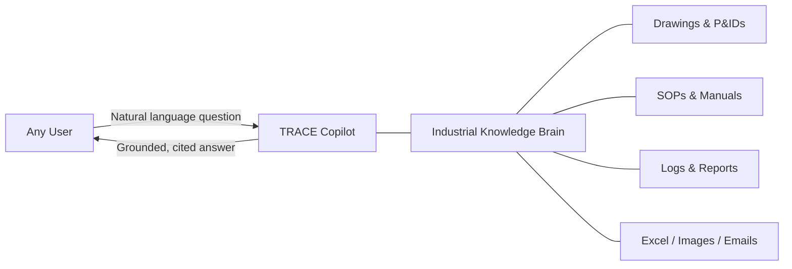
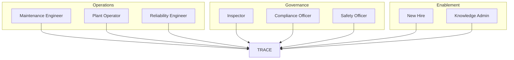
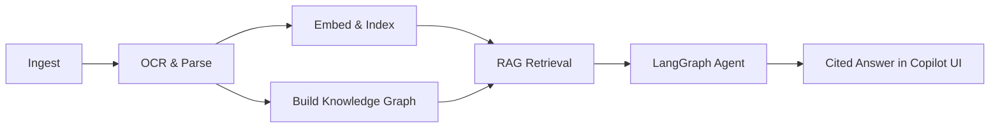
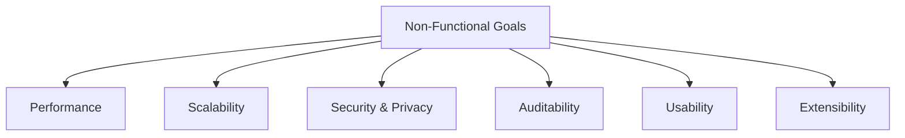
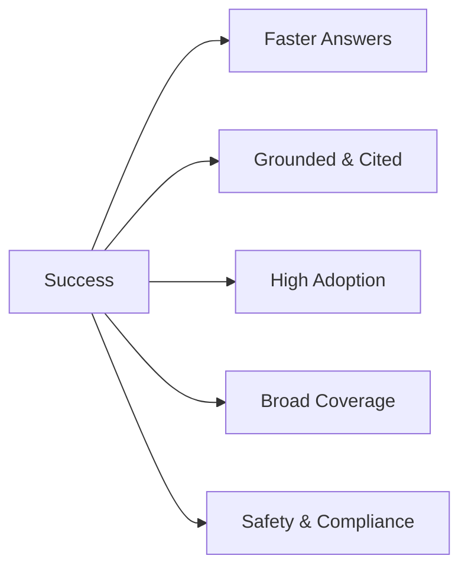
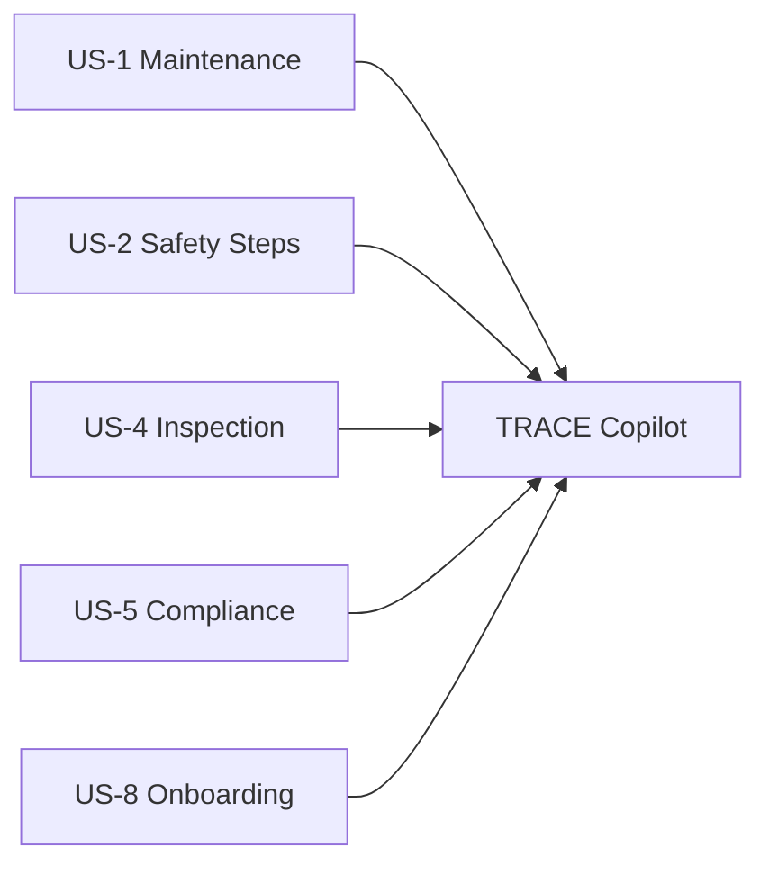
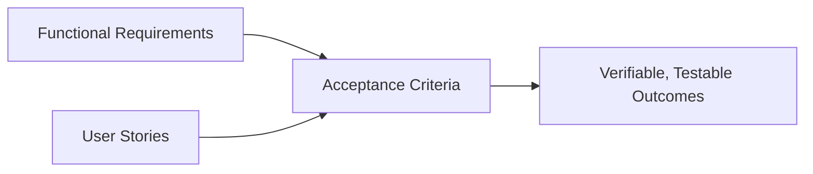

# TRACE — Product Requirements Document (PRD)

### Technical Records & Asset Compliance Engine · Problem Statement 8

---

## Table of Contents

1. [Product Vision](#1-product-vision)
2. [Target Users](#2-target-users)
3. [Functional Requirements](#3-functional-requirements)
4. [Non-Functional Requirements](#4-non-functional-requirements)
5. [Success Metrics](#5-success-metrics)
6. [User Stories](#6-user-stories)
7. [Acceptance Criteria](#7-acceptance-criteria)
8. [References](#8-references)

---

## 1. Product Vision

> **TRACE turns an organization's entire industrial document estate into a single,
> trustworthy Industrial Knowledge Brain — so anyone can ask any question about any asset,
> procedure, or incident and get an instant, grounded, and auditable answer.**

TRACE behaves like **Microsoft Copilot for industrial operations**. It is not a single-document
chatbot; it reasons across hundreds of thousands of heterogeneous documents, connects them
through a knowledge graph, and uses AI agents to plan, retrieve, verify, and synthesize
answers — always with citations.

### Vision Principles

| Principle | Meaning |
| --- | --- |
| **Grounded** | Every answer is backed by source documents and citations |
| **Connected** | Knowledge is linked across documents via a graph |
| **Agentic** | The system reasons in multiple steps, not single lookups |
| **Trustworthy** | Auditable, traceable, and transparent |
| **Accessible** | Simple conversational experience for non-technical and expert users |

---

## 2. Target Users

| Persona | Role | Primary Needs |
| --- | --- | --- |
| **Field / Maintenance Engineer** | Maintains and repairs assets | Fast access to SOPs, manuals, and past fixes for a specific asset |
| **Plant Operator** | Runs day-to-day operations | Quick procedural guidance and safety steps |
| **Inspector** | Performs inspections & audits | Inspection history, standards, prior findings |
| **Compliance Officer** | Ensures regulatory compliance | Applicable standards, audit trails, evidence |
| **Reliability / Asset Engineer** | Improves asset performance | Cross-document asset history and failure patterns |
| **Safety Officer** | Manages workplace safety | Incident history and relevant safety procedures |
| **New Hire / Trainee** | Learning the facility | Self-serve onboarding from institutional knowledge |
| **Knowledge / IT Admin** | Manages the platform | Ingestion control, access management, monitoring |

---

## 3. Functional Requirements

### 3.1 Ingestion

| ID | Requirement | Priority |
| --- | --- | --- |
| FR-1 | Support upload of PDFs, images, Excel, emails, and engineering drawings/P&IDs | Must |
| FR-2 | Support batch and folder-level ingestion | Must |
| FR-3 | Detect document type and route to the appropriate parser | Must |
| FR-4 | Capture document metadata (title, type, asset, date, version, source) | Must |
| FR-5 | Handle multiple revisions and identify the latest version | Should |

### 3.2 OCR & Document Intelligence

| ID | Requirement | Priority |
| --- | --- | --- |
| FR-6 | Perform OCR on scanned and image-based documents | Must |
| FR-7 | Extract text, tables, and structure from documents | Must |
| FR-8 | Extract equipment tags and asset identifiers | Must |
| FR-9 | Chunk documents semantically for retrieval | Must |
| FR-10 | Preserve page/source references for every chunk | Must |

### 3.3 Search & RAG

| ID | Requirement | Priority |
| --- | --- | --- |
| FR-11 | Generate embeddings using Sentence Transformers | Must |
| FR-12 | Store and search embeddings using FAISS | Must |
| FR-13 | Support natural-language semantic search | Must |
| FR-14 | Return grounded answers with citations to source documents | Must |
| FR-15 | Support multi-turn conversational context | Should |

### 3.4 Knowledge Graph

| ID | Requirement | Priority |
| --- | --- | --- |
| FR-16 | Build a Neo4j knowledge graph of assets, procedures, incidents, and standards | Must |
| FR-17 | Link documents to the assets/tags they reference | Must |
| FR-18 | Support asset-centric views aggregating all related knowledge | Should |
| FR-19 | Traverse relationships to answer connected questions | Should |

### 3.5 AI Agents & Reasoning

| ID | Requirement | Priority |
| --- | --- | --- |
| FR-20 | Orchestrate multi-step reasoning using LangGraph | Must |
| FR-21 | Combine vector retrieval and graph traversal in one answer | Must |
| FR-22 | Verify and self-check answers before responding | Should |
| FR-23 | Decline or flag when evidence is insufficient | Must |

### 3.6 Experience & Administration

| ID | Requirement | Priority |
| --- | --- | --- |
| FR-24 | Provide a conversational Copilot UI (Next.js + shadcn/ui) | Must |
| FR-25 | Display citations and allow opening the source document | Must |
| FR-26 | Provide search, asset browsing, and document viewing | Should |
| FR-27 | Provide role-based access control | Must |
| FR-28 | Log all queries, sources, and answers for audit | Must |

### Functional Flow

---

## 4. Non-Functional Requirements

| ID | Category | Requirement | Target |
| --- | --- | --- | --- |
| NFR-1 | **Performance** | Query response latency | < 5s for typical queries |
| NFR-2 | **Scalability** | Document corpus size | Hundreds of thousands of documents |
| NFR-3 | **Accuracy** | Grounded, citation-backed answers | High precision; no unsupported claims |
| NFR-4 | **Security** | Authentication & RBAC | Enterprise-grade |
| NFR-5 | **Auditability** | Full traceability of answers | 100% of queries logged |
| NFR-6 | **Availability** | Platform uptime | High availability target |
| NFR-7 | **Maintainability** | Modular, layered architecture | Clear separation of concerns |
| NFR-8 | **Usability** | Intuitive Copilot experience | Minimal training required |
| NFR-9 | **Extensibility** | Add new document types & tools | Pluggable pipeline |
| NFR-10 | **Privacy** | Data confined to the enterprise | No leakage of proprietary data |
| NFR-11 | **Reliability** | Consistent, repeatable answers | Deterministic retrieval where possible |
| NFR-12 | **Observability** | Monitoring & logging | Pipeline and query metrics |

---

## 5. Success Metrics

| # | Metric | Definition | Target |
| --- | --- | --- | --- |
| M1 | **Time-to-answer** | Median time to find an answer | Reduced from hours to seconds |
| M2 | **Answer groundedness** | % of answers with valid citations | ≥ 95% |
| M3 | **Retrieval relevance** | Precision/recall of retrieved chunks | High relevance |
| M4 | **Adoption** | Active users / queries per period | Growing engagement |
| M5 | **Coverage** | % of document estate ingested & searchable | Maximized |
| M6 | **User satisfaction** | CSAT / thumbs-up rate on answers | High satisfaction |
| M7 | **Deflection** | Questions resolved without human expert | Increasing |
| M8 | **Compliance readiness** | Audit trails available on demand | 100% |
| M9 | **Safety impact** | Relevant procedures surfaced before work | Measurable improvement |
| M10 | **Knowledge retention** | Expert knowledge captured & accessible | Increasing |

---

## 6. User Stories

### Engineer & Operator

| ID | As a... | I want to... | So that... |
| --- | --- | --- | --- |
| US-1 | Maintenance Engineer | ask for the maintenance procedure of a specific pump | I can perform repairs correctly and safely |
| US-2 | Plant Operator | get step-by-step safety actions before a task | I avoid hazards and follow SOPs |
| US-3 | Reliability Engineer | see all historical failures of an asset | I can identify recurring problems |

### Inspector, Compliance & Safety

| ID | As a... | I want to... | So that... |
| --- | --- | --- | --- |
| US-4 | Inspector | review prior inspection findings for an asset | I can perform a thorough inspection |
| US-5 | Compliance Officer | find all standards applicable to a process | I can ensure regulatory compliance |
| US-6 | Compliance Officer | retrieve an audit trail of an answer's sources | I can prove evidence during audits |
| US-7 | Safety Officer | see incident history related to a procedure | I can prevent recurrence |

### Onboarding & Administration

| ID | As a... | I want to... | So that... |
| --- | --- | --- | --- |
| US-8 | New Hire | ask plain-language questions about the facility | I can ramp up without bothering colleagues |
| US-9 | Knowledge Admin | upload and manage document ingestion | the knowledge base stays current |
| US-10 | Knowledge Admin | control access by role | sensitive knowledge is protected |

---

## 7. Acceptance Criteria

Acceptance criteria are expressed in **Given / When / Then** form and mapped to the
functional requirements and user stories above.

### AC for Ingestion (FR-1 to FR-5)

| ID | Given | When | Then |
| --- | --- | --- | --- |
| AC-1 | A supported document (PDF, image, Excel, email, drawing) | The user uploads it | The system ingests it and records metadata |
| AC-2 | A batch/folder of documents | The user submits the batch | All documents are queued and processed |
| AC-3 | Multiple revisions of a document | They are ingested | The latest version is identifiable |

### AC for OCR & Intelligence (FR-6 to FR-10)

| ID | Given | When | Then |
| --- | --- | --- | --- |
| AC-4 | A scanned document | It is processed | Machine-readable text is extracted via OCR |
| AC-5 | A document containing tables | It is parsed | Tables and structure are preserved |
| AC-6 | A document referencing equipment tags | It is processed | Tags are extracted and linked |
| AC-7 | Any ingested chunk | It is stored | Its source/page reference is retained |

### AC for Search & RAG (FR-11 to FR-15)

| ID | Given | When | Then |
| --- | --- | --- | --- |
| AC-8 | An ingested corpus | A user asks a natural-language question | A grounded answer is returned |
| AC-9 | An answer is generated | It is displayed | Citations to source documents are shown |
| AC-10 | Insufficient evidence exists | A user asks | The system declines or flags uncertainty (FR-23) |

### AC for Knowledge Graph (FR-16 to FR-19)

| ID | Given | When | Then |
| --- | --- | --- | --- |
| AC-11 | Documents referencing an asset | They are ingested | The asset and its links appear in the graph |
| AC-12 | A specific asset/tag | A user opens its view | All related knowledge is aggregated |

### AC for Agents (FR-20 to FR-23)

| ID | Given | When | Then |
| --- | --- | --- | --- |
| AC-13 | A question needing multiple sources | It is asked | The agent retrieves and synthesizes across documents |
| AC-14 | A question spanning vector + graph data | It is asked | Both sources are combined in the answer |

### AC for Experience & Admin (FR-24 to FR-28)

| ID | Given | When | Then |
| --- | --- | --- | --- |
| AC-15 | A user with a valid role | They log in | They see only permitted content (RBAC) |
| AC-16 | Any query | It is executed | It is logged for audit with sources |
| AC-17 | A cited answer | The user clicks a citation | The source document opens at the reference |

---

## 8. References

- Problem Statement 8 — Industrial Knowledge Intelligence (challenge brief).
- [`01_PROBLEM_STATEMENT.md`](01_PROBLEM_STATEMENT.md) — TRACE Problem Statement.
- Lewis, P. et al. *Retrieval-Augmented Generation for Knowledge-Intensive NLP Tasks*, NeurIPS 2020.
- LangGraph — https://langchain-ai.github.io/langgraph/
- LangChain — https://python.langchain.com/
- Neo4j — https://neo4j.com/docs/
- FAISS — https://faiss.ai/
- Sentence Transformers — https://www.sbert.net/
- FastAPI — https://fastapi.tiangolo.com/
- Next.js — https://nextjs.org/docs
- shadcn/ui — https://ui.shadcn.com/
- ISO 55000 — Asset Management.
- ISA-5.1 — Instrumentation Symbols and Identification.
