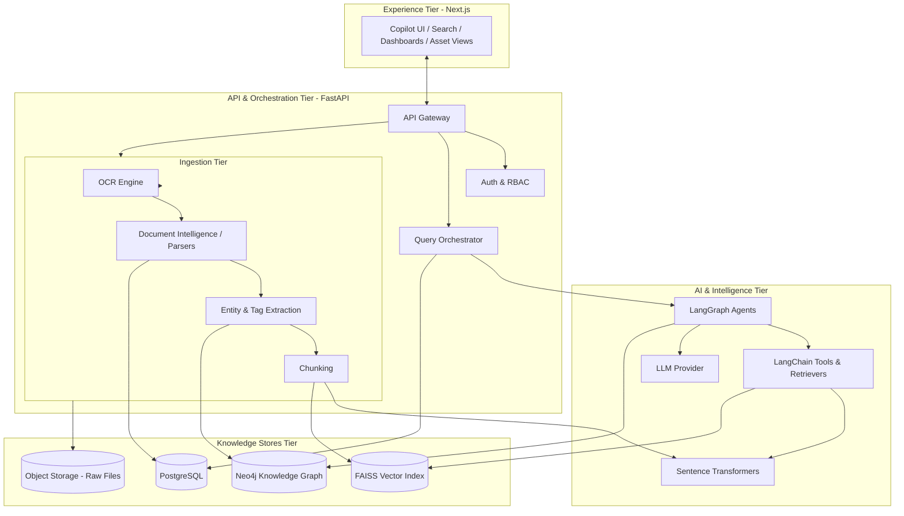
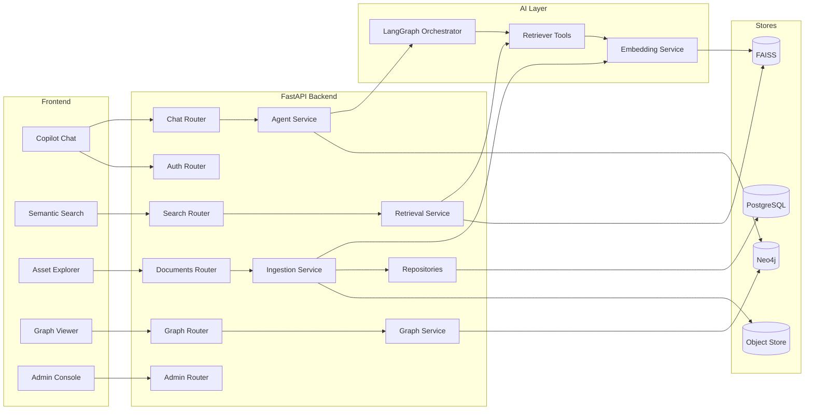
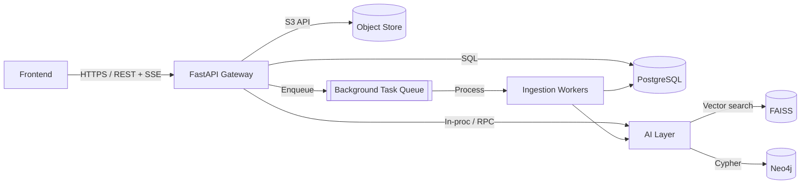
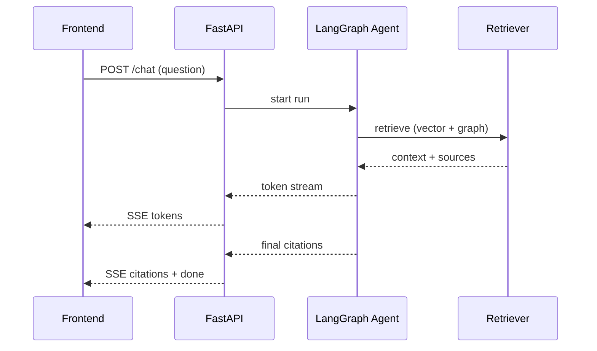
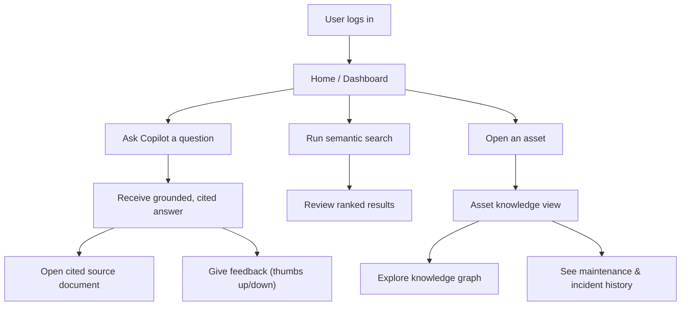
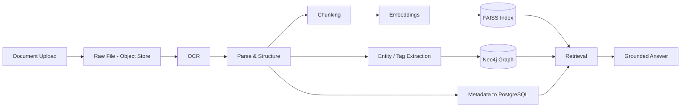
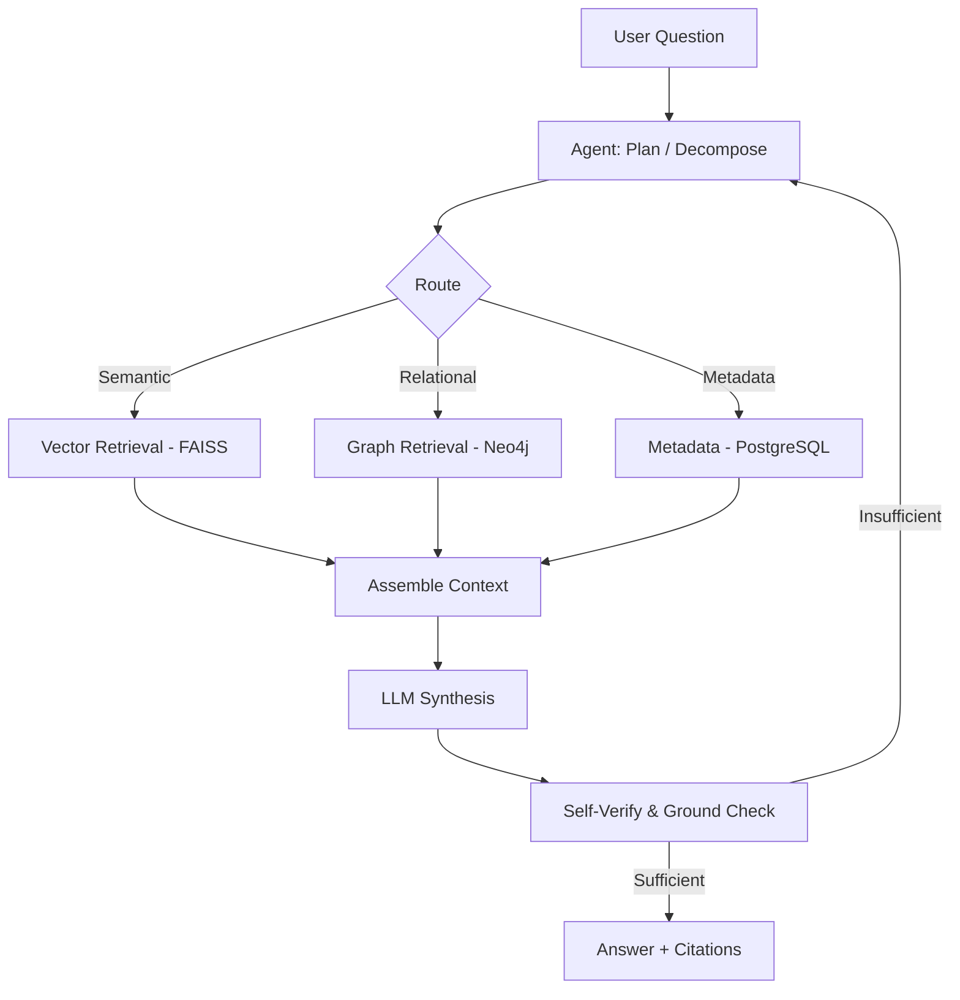
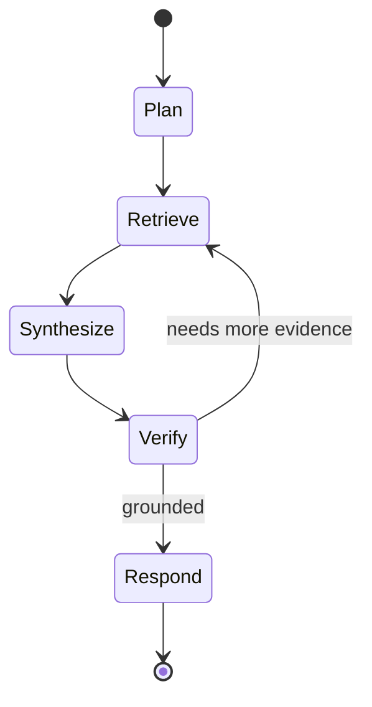
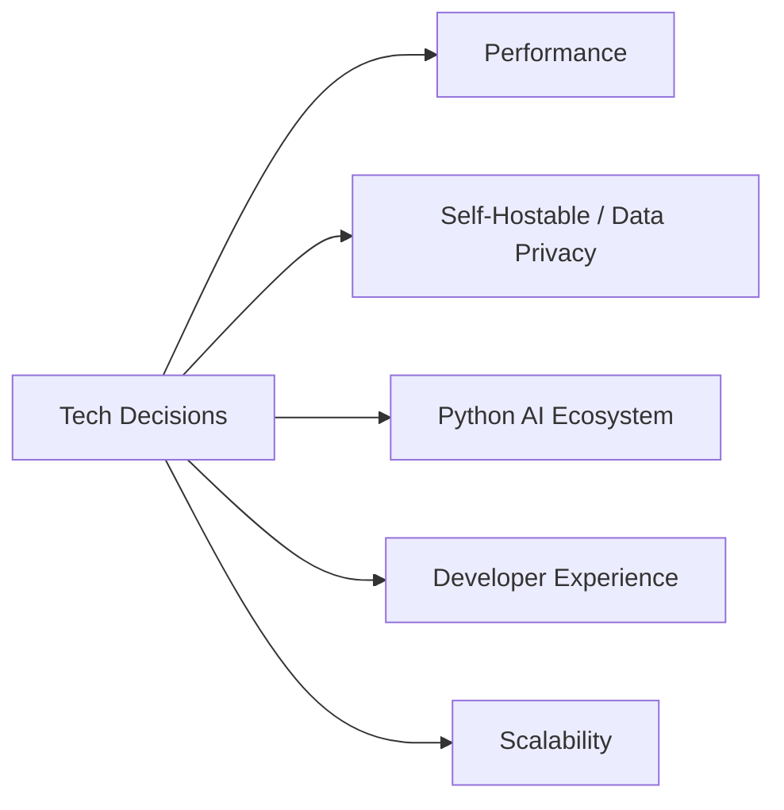
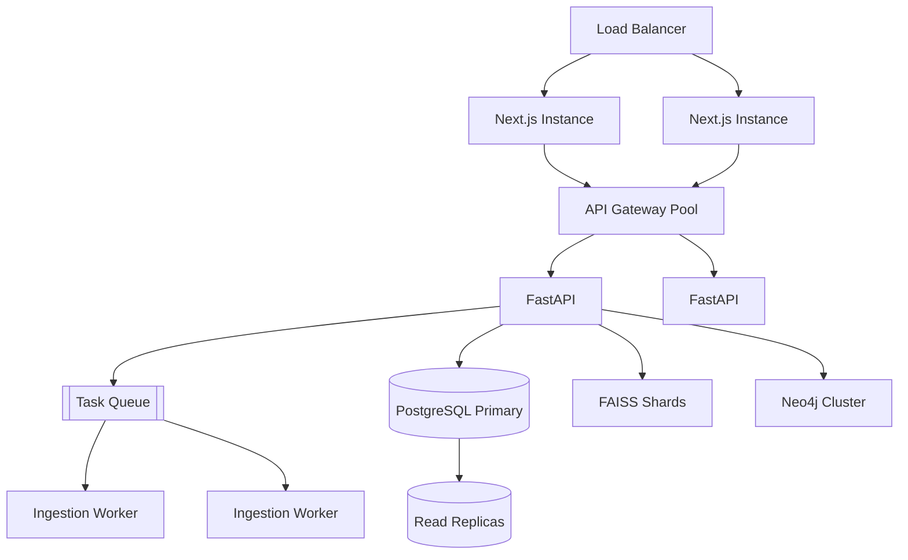

# TRACE — System Architecture

### Technical Records & Asset Compliance Engine · Problem Statement 8

---

## Table of Contents

1. [Overview](#1-overview)
2. [High Level Architecture](#2-high-level-architecture)
3. [Component Diagram](#3-component-diagram)
4. [Service Communication](#4-service-communication)
5. [User Flow](#5-user-flow)
6. [Data Flow](#6-data-flow)
7. [AI Flow](#7-ai-flow)
8. [Technology Decisions](#8-technology-decisions)
9. [Scalability](#9-scalability)
10. [References](#10-references)

---

## 1. Overview

TRACE is a layered, modular platform composed of five logical tiers: **Experience**,
**API/Orchestration**, **AI/Intelligence**, **Knowledge Stores**, and **Ingestion**. Each
tier has clear responsibilities and well-defined contracts, enabling independent evolution
and horizontal scaling.

| Tier | Technologies | Responsibility |
| --- | --- | --- |
| Experience | Next.js, TypeScript, Tailwind, shadcn/ui | Copilot UI, search, dashboards |
| API / Orchestration | FastAPI | Gateway, auth, routing, orchestration |
| AI / Intelligence | LangGraph, LangChain, Sentence Transformers | Agents, RAG, embeddings |
| Knowledge Stores | PostgreSQL, FAISS, Neo4j | Metadata, vectors, graph |
| Ingestion | OCR, Document Intelligence, Parsers | Convert documents into knowledge |

---

## 2. High Level Architecture

### Architectural Principles

| Principle | Description |
| --- | --- |
| **Separation of concerns** | Each tier owns a single responsibility |
| **Stateless services** | API/AI services are stateless; state lives in stores |
| **Pluggable pipeline** | New document types and tools are added as plugins |
| **Grounded by design** | Retrieval and citations are first-class, not bolt-ons |
| **Async ingestion** | Heavy processing runs as background jobs |

---

## 3. Component Diagram

| Component | Responsibility |
| --- | --- |
| Auth Router | Login, tokens, RBAC enforcement |
| Documents Router | Upload, ingestion status, document metadata |
| Search Router | Semantic search queries |
| Chat Router | Conversational Copilot endpoints |
| Graph Router | Knowledge graph queries & asset views |
| Ingestion Service | Orchestrates OCR → parse → extract → chunk → index |
| Retrieval Service | Vector + graph retrieval for RAG |
| Agent Service | Runs LangGraph reasoning workflows |
| Graph Service | Reads/writes Neo4j relationships |
| Repositories | Data access abstraction over PostgreSQL |

---

## 4. Service Communication

| Channel | Protocol | Use |
| --- | --- | --- |
| Frontend ↔ API | HTTPS REST + Server-Sent Events | Requests & streaming answers |
| API ↔ PostgreSQL | SQL (async driver) | Metadata, audit, jobs |
| API ↔ AI Layer | In-process / internal call | Orchestration |
| AI ↔ FAISS | Library API | Vector similarity search |
| AI ↔ Neo4j | Bolt / Cypher | Graph traversal |
| API ↔ Object Store | S3-compatible API | Raw file storage |
| API ↔ Workers | Async task queue | Background ingestion |

### Streaming answer sequence

---

## 5. User Flow

---

## 6. Data Flow

| Stage | Input | Output | Store |
| --- | --- | --- | --- |
| Upload | File | Raw object | Object Store |
| OCR | Raw object | Text layer | — |
| Parse | Text | Structured content | PostgreSQL |
| Extract | Structured content | Entities, tags | Neo4j |
| Chunk | Structured content | Chunks | — |
| Embed | Chunks | Vectors | FAISS |
| Retrieve | Query | Context + sources | — |

---

## 7. AI Flow

### LangGraph state machine

| Step | Description |
| --- | --- |
| Plan | Decompose question, decide retrieval strategy |
| Retrieve | Pull from FAISS, Neo4j, and/or PostgreSQL |
| Synthesize | Generate answer grounded in retrieved context |
| Verify | Check claims against sources; loop if weak |
| Respond | Return answer with citations or flag uncertainty |

---

## 8. Technology Decisions

| Area | Choice | Rationale | Alternatives Considered |
| --- | --- | --- | --- |
| Frontend | Next.js + TypeScript | SSR/streaming, strong ecosystem, type safety | Plain React, Remix |
| Styling | Tailwind + shadcn/ui | Rapid, consistent, accessible components | MUI, Chakra |
| Backend | FastAPI | Async, high performance, Python AI ecosystem | Flask, Django, Node |
| Relational DB | PostgreSQL | Robust, JSONB, full-text, mature | MySQL |
| Vector store | FAISS | Fast, local, no external dependency | pgvector, Pinecone |
| Graph DB | Neo4j | Native graph traversal, Cypher | ArangoDB, JanusGraph |
| Embeddings | Sentence Transformers | Strong semantic quality, self-hosted | OpenAI embeddings |
| Agent orchestration | LangGraph | Stateful, controllable multi-step flows | Plain LangChain, custom |
| LLM tooling | LangChain | Mature retriever/tool abstractions | LlamaIndex |

### Decision drivers

---

## 9. Scalability

| Dimension | Strategy |
| --- | --- |
| Stateless API/AI | Horizontal scaling behind a load balancer |
| Ingestion | Async workers scaled by queue depth |
| PostgreSQL | Primary + read replicas, connection pooling |
| FAISS | Index sharding / partitioning by corpus |
| Neo4j | Clustering for read scaling |
| Caching | Cache embeddings, hot queries, and graph reads |
| Backpressure | Queue-based throttling for ingestion spikes |

| Bottleneck | Mitigation |
| --- | --- |
| Embedding throughput | Batch embedding, GPU workers, caching |
| Large corpus retrieval | Sharded FAISS + metadata pre-filtering |
| Heavy graph queries | Query tuning, indexes, caching |
| LLM latency | Streaming responses, response caching |

---

## 10. References

- [`01_PROBLEM_STATEMENT.md`](01_PROBLEM_STATEMENT.md)
- [`02_PRODUCT_REQUIREMENTS.md`](02_PRODUCT_REQUIREMENTS.md)
- LangGraph — https://langchain-ai.github.io/langgraph/
- LangChain — https://python.langchain.com/
- Neo4j — https://neo4j.com/docs/
- FAISS — https://faiss.ai/
- Sentence Transformers — https://www.sbert.net/
- FastAPI — https://fastapi.tiangolo.com/
- Next.js — https://nextjs.org/docs
