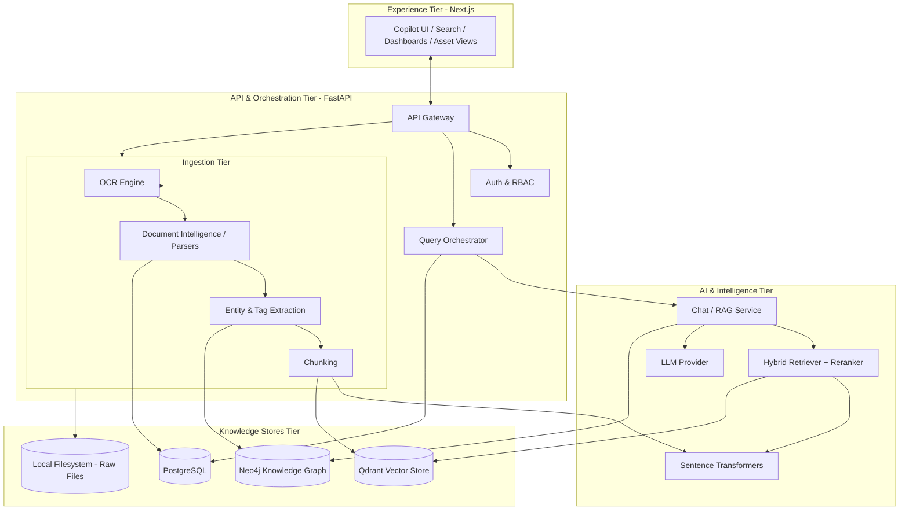
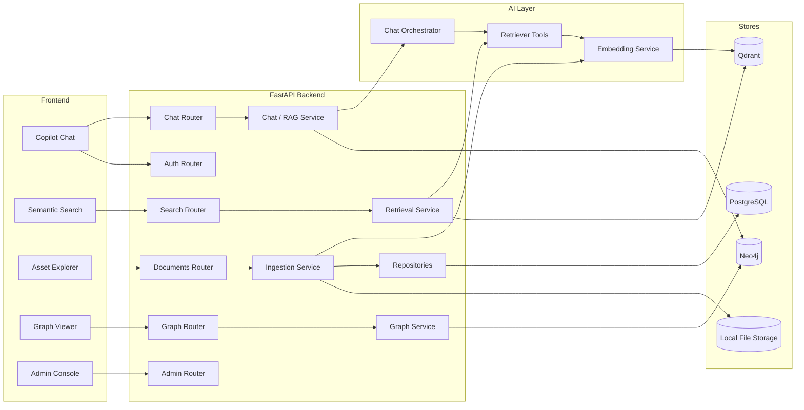
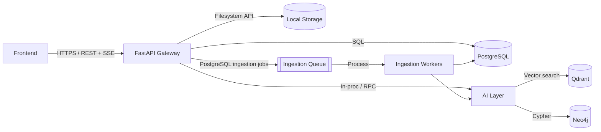
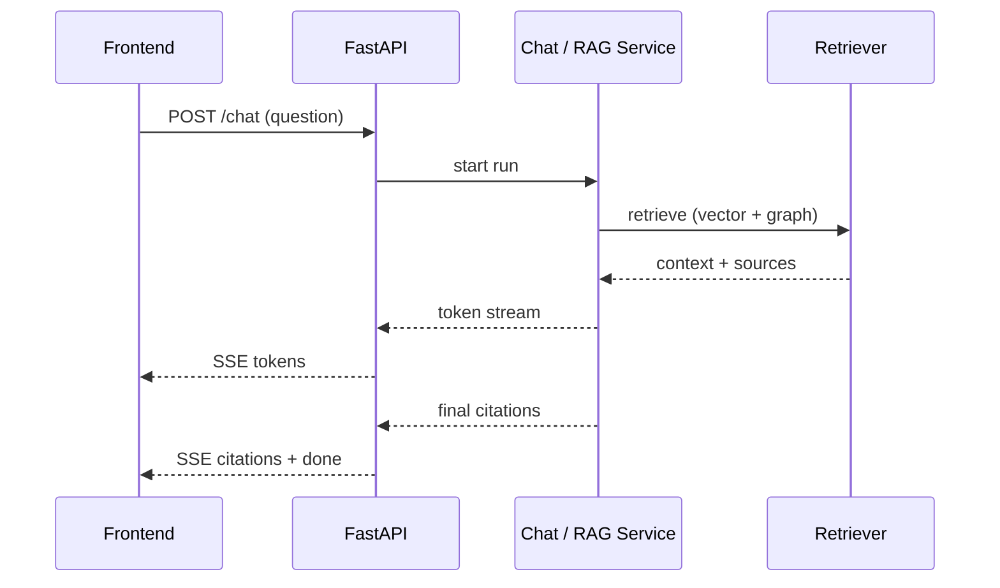
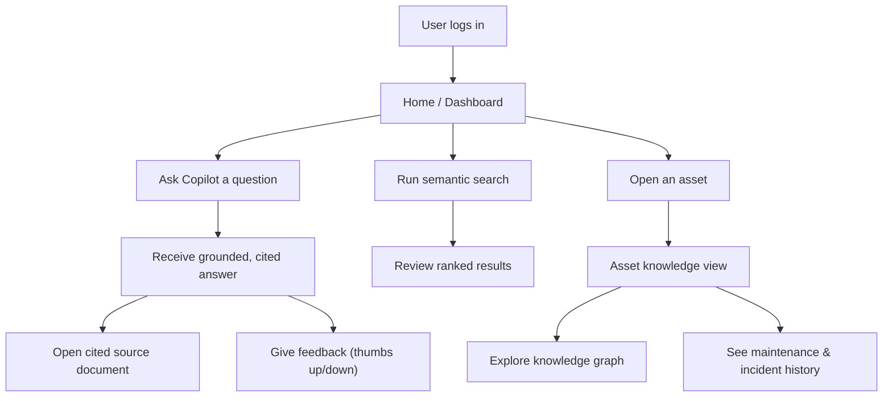
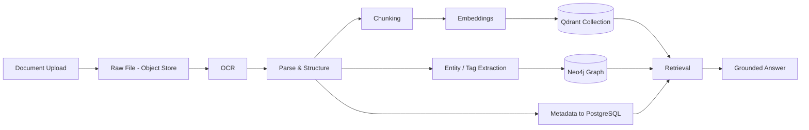
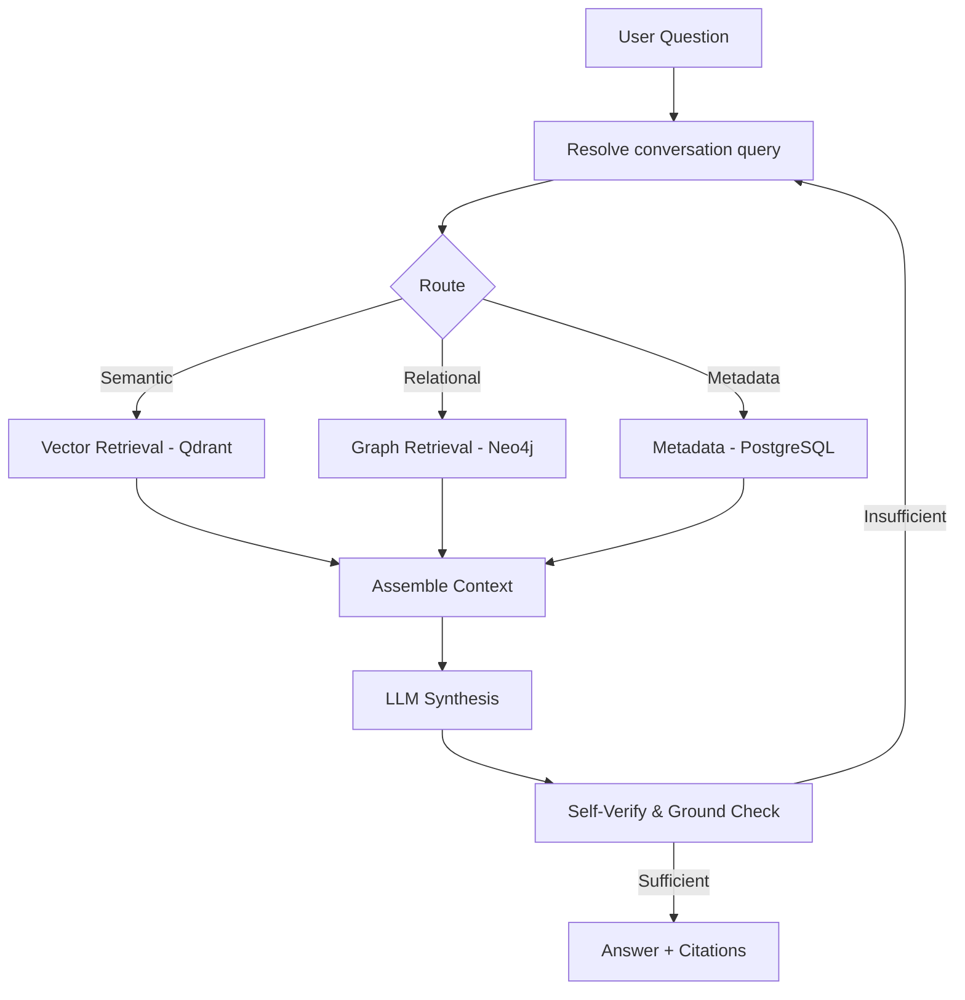
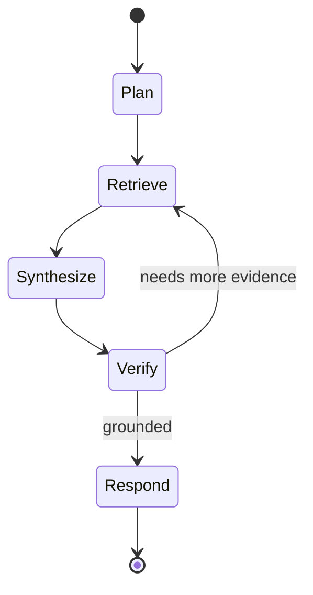
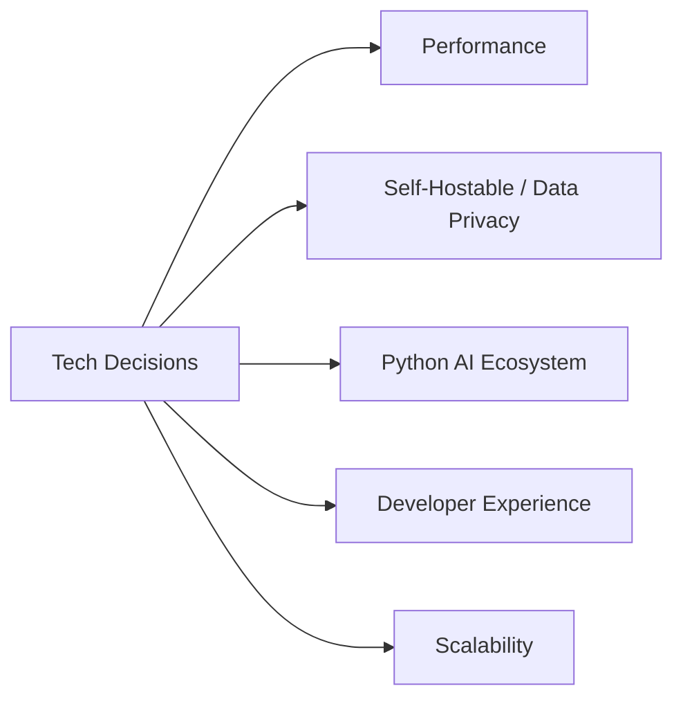
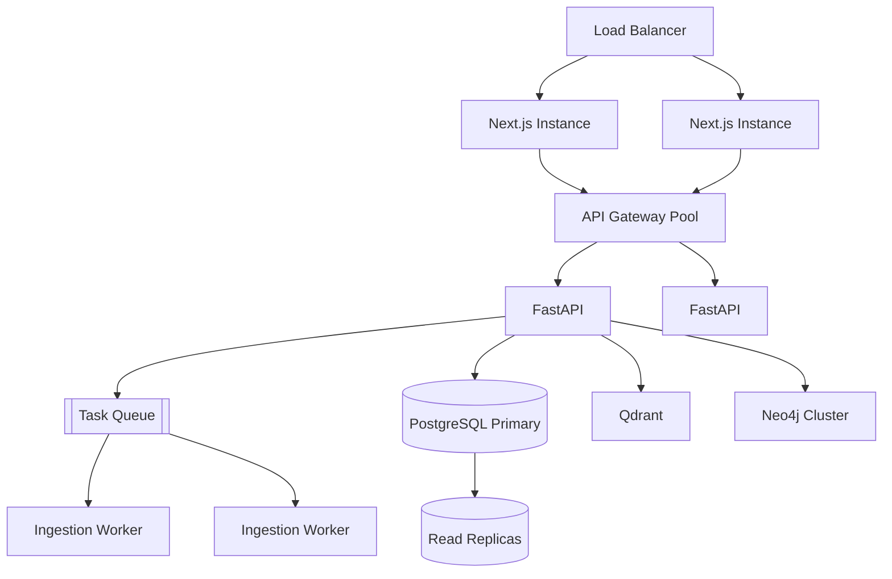

# TRACE — System Architecture

### Technical Records & Asset Compliance Engine · Problem Statement 8

> **Implemented architecture (2 October 2026).** The live system is Next.js → FastAPI →
> PostgreSQL/Qdrant/Neo4j/local file storage, with an in-process ingestion worker and a
> single hybrid RAG/Copilot orchestration path. The former LangGraph multi-agent framework
> was removed and is not part of the architecture. Docker Compose provides PostgreSQL and
> the backend in the base file, with Qdrant and Neo4j in the local-development overlay.

---

## Table of Contents

1. [Overview](#1-overview)
2. [High Level Architecture](#2-high-level-architecture)
3. [Component Diagram](#3-component-diagram)
4. [Service Communication](#4-service-communication)
5. [User Flow](#5-user-flow)
6. [Data Flow](#6-data-flow)
7. [AI Flow](#7-ai-flow)
8. [Technology Decisions](#8-technology-decisions)
9. [Scalability](#9-scalability)
10. [References](#10-references)

---

## 1. Overview

TRACE is a layered, modular platform composed of five logical tiers: **Experience**,
**API/Orchestration**, **AI/Intelligence**, **Knowledge Stores**, and **Ingestion**. Each
tier has clear responsibilities and well-defined contracts, enabling independent evolution
and horizontal scaling.

| Tier | Technologies | Responsibility |
| --- | --- | --- |
| Experience | Next.js, TypeScript, Tailwind, shadcn/ui | Copilot UI, search, dashboards |
| API / Orchestration | FastAPI | Gateway, auth, routing, orchestration |
| AI / Intelligence | Hybrid RAG services, Sentence Transformers, Groq `openai/gpt-oss-120b` | Retrieval, reranking, grounding, generation |
| Knowledge Stores | PostgreSQL, Qdrant, Neo4j, local filesystem | Metadata, vectors, graph, source files |
| Ingestion | OCR, Document Intelligence, Parsers | Convert documents into knowledge |

---

## 2. High Level Architecture

```mermaid
flowchart TB
    subgraph EXP["Experience Tier - Next.js"]
        UI["Copilot UI / Search / Dashboards / Asset Views"]
    end

    subgraph API["API & Orchestration Tier - FastAPI"]
        GW["API Gateway"]
        AUTH["Auth & RBAC"]
        ORCH["Query Orchestrator"]
        ING["Ingestion Orchestrator"]
    end

    subgraph AI["AI & Intelligence Tier"]
        LG["Chat / RAG Service"]
        LC["Hybrid Retriever + Reranker"]
        EMB["Sentence Transformers"]
        LLM["LLM Provider"]
    end

    subgraph KS["Knowledge Stores Tier"]
        PG[("PostgreSQL")]
        VEC[("Qdrant Vector Store")]
        NEO[("Neo4j Knowledge Graph")]
        OBJ[("Local Filesystem - Raw Files")]
    end

    subgraph ING["Ingestion Tier"]
        OCR["OCR Engine"]
        DI["Document Intelligence / Parsers"]
        EXT["Entity & Tag Extraction"]
        CHK["Chunking"]
    end

    UI <--> GW
    GW --> AUTH
    GW --> ORCH
    GW --> ING
    ORCH --> LG
    LG --> LC
    LC --> EMB
    LG --> LLM
    LC --> VEC
    LG --> NEO
    ORCH --> PG
    ING --> OCR --> DI --> EXT --> CHK
    CHK --> EMB
    CHK --> VEC
    EXT --> NEO
    DI --> PG
    ING --> OBJ
```

### Architectural Principles

| Principle | Description |
| --- | --- |
| **Separation of concerns** | Each tier owns a single responsibility |
| **Stateless services** | API/AI services are stateless; state lives in stores |
| **Pluggable pipeline** | New document types and tools are added as plugins |
| **Grounded by design** | Retrieval and citations are first-class, not bolt-ons |
| **Async ingestion** | Heavy processing runs as background jobs |

---

## 3. Component Diagram

```mermaid
flowchart LR
    subgraph Frontend
        C1["Copilot Chat"]
        C2["Semantic Search"]
        C3["Asset Explorer"]
        C4["Graph Viewer"]
        C5["Admin Console"]
    end

    subgraph Backend["FastAPI Backend"]
        R1["Auth Router"]
        R2["Documents Router"]
        R3["Search Router"]
        R4["Chat Router"]
        R5["Graph Router"]
        R6["Admin Router"]
        S1["Ingestion Service"]
        S2["Retrieval Service"]
        S3["Chat / RAG Service"]
        S4["Graph Service"]
        REPO["Repositories"]
    end

    subgraph AILayer["AI Layer"]
        A1["Chat Orchestrator"]
        A2["Retriever Tools"]
        A3["Embedding Service"]
    end

    subgraph Stores
        PG[("PostgreSQL")]
        VEC[("Qdrant")]
        NEO[("Neo4j")]
        OBJ[("Local File Storage")]
    end

    C1 --> R4
    C2 --> R3
    C3 --> R2
    C4 --> R5
    C5 --> R6
    C1 --> R1

    R2 --> S1
    R3 --> S2
    R4 --> S3
    R5 --> S4

    S3 --> A1 --> A2 --> A3
    S2 --> A2
    S1 --> A3

    S1 --> REPO
    S2 --> VEC
    S3 --> NEO
    S4 --> NEO
    A3 --> VEC
    REPO --> PG
    S1 --> OBJ
```

| Component | Responsibility |
| --- | --- |
| Auth Router | Login, tokens, RBAC enforcement |
| Documents Router | Upload, ingestion status, document metadata |
| Search Router | Semantic search queries |
| Chat Router | Conversational Copilot endpoints |
| Graph Router | Knowledge graph queries & asset views |
| Ingestion Service | Orchestrates OCR → parse → extract → chunk → index |
| Retrieval Service | Vector + graph retrieval for RAG |
| Chat / RAG Service | Resolves conversation context, retrieves/reranks evidence, calls the LLM, and classifies grounding |
| Graph Service | Reads/writes Neo4j relationships |
| Repositories | Data access abstraction over PostgreSQL |

---

## 4. Service Communication

```mermaid
flowchart LR
    FE["Frontend"] -->|HTTPS / REST + SSE| API["FastAPI Gateway"]
    API -->|SQL| PG[("PostgreSQL")]
    API -->|In-proc / RPC| AI["AI Layer"]
    AI -->|Vector search| VEC[("Qdrant")]
    AI -->|Cypher| NEO[("Neo4j")]
    API -->|Filesystem API| OBJ[("Local Storage")]
    API -->|PostgreSQL ingestion jobs| Q[["Ingestion Queue"]]
    Q -->|Process| WORK["Ingestion Workers"]
    WORK --> AI
    WORK --> PG
```

| Channel | Protocol | Use |
| --- | --- | --- |
| Frontend ↔ API | HTTPS REST + Server-Sent Events | Requests & streaming answers |
| API ↔ PostgreSQL | SQL (async driver) | Metadata, audit, jobs |
| API ↔ AI Layer | In-process / internal call | Orchestration |
| AI ↔ Qdrant | HTTP API | Vector, keyword, and hybrid search |
| AI ↔ Neo4j | Bolt / Cypher | Graph traversal |
| API ↔ Local Storage | Filesystem backend protocol | Raw file storage |
| API ↔ Worker | PostgreSQL-backed polling queue | Background ingestion |

### Streaming answer sequence

```mermaid
sequenceDiagram
    participant FE as Frontend
    participant API as FastAPI
    participant AG as Chat / RAG Service
    participant RT as Retriever
    FE->>API: POST /chat (question)
    API->>AG: start run
    AG->>RT: retrieve (vector + graph)
    RT-->>AG: context + sources
    AG-->>API: token stream
    API-->>FE: SSE tokens
    AG-->>API: final citations
    API-->>FE: SSE citations + done
```

---

## 5. User Flow

```mermaid
flowchart TD
    L["User logs in"] --> H["Home / Dashboard"]
    H --> CH["Ask Copilot a question"]
    H --> SR["Run semantic search"]
    H --> AS["Open an asset"]
    CH --> ANS["Receive grounded, cited answer"]
    ANS --> SRC["Open cited source document"]
    SR --> RES["Review ranked results"]
    AS --> AV["Asset knowledge view"]
    AV --> GR["Explore knowledge graph"]
    AV --> HIST["See maintenance & incident history"]
    ANS --> FB["Give feedback (thumbs up/down)"]
```

---

## 6. Data Flow

```mermaid
flowchart LR
    UP["Document Upload"] --> RAW["Raw File - Object Store"]
    RAW --> OCR["OCR"]
    OCR --> PARSE["Parse & Structure"]
    PARSE --> META["Metadata to PostgreSQL"]
    PARSE --> ENT["Entity / Tag Extraction"]
    ENT --> NEO[("Neo4j Graph")]
    PARSE --> CHK["Chunking"]
    CHK --> EMB["Embeddings"]
    EMB --> VEC[("Qdrant Collection")]
    VEC --> RET["Retrieval"]
    NEO --> RET
    META --> RET
    RET --> ANS["Grounded Answer"]
```

| Stage | Input | Output | Store |
| --- | --- | --- | --- |
| Upload | File | Raw object | Object Store |
| OCR | Raw object | Text layer | — |
| Parse | Text | Structured content | PostgreSQL |
| Extract | Structured content | Entities, tags | Neo4j |
| Chunk | Structured content | Chunks | — |
| Embed | Chunks | Vectors | Qdrant |
| Retrieve | Query | Context + sources | — |

---

## 7. AI Flow

```mermaid
flowchart TD
    Q["User Question"] --> PLAN["Resolve conversation query"]
    PLAN --> ROUTE{"Route"}
    ROUTE -->|Semantic| VR["Vector Retrieval - Qdrant"]
    ROUTE -->|Relational| GR["Graph Retrieval - Neo4j"]
    ROUTE -->|Metadata| MR["Metadata - PostgreSQL"]
    VR --> CTX["Assemble Context"]
    GR --> CTX
    MR --> CTX
    CTX --> SYN["LLM Synthesis"]
    SYN --> VERIFY["Self-Verify & Ground Check"]
    VERIFY -->|Sufficient| OUT["Answer + Citations"]
    VERIFY -->|Insufficient| PLAN
```

### Implemented RAG sequence

```mermaid
stateDiagram-v2
    [*] --> Plan
    Plan --> Retrieve
    Retrieve --> Synthesize
    Synthesize --> Verify
    Verify --> Respond: grounded
    Verify --> Retrieve: needs more evidence
    Respond --> [*]
```

| Step | Description |
| --- | --- |
| Plan | Decompose question, decide retrieval strategy |
| Retrieve | Pull from Qdrant and Neo4j, with PostgreSQL metadata |
| Synthesize | Generate answer grounded in retrieved context |
| Verify | Check claims against sources; loop if weak |
| Respond | Return answer with citations or flag uncertainty |

---

## 8. Technology Decisions

| Area | Choice | Rationale | Alternatives Considered |
| --- | --- | --- | --- |
| Frontend | Next.js + TypeScript | SSR/streaming, strong ecosystem, type safety | Plain React, Remix |
| Styling | Tailwind + shadcn/ui | Rapid, consistent, accessible components | MUI, Chakra |
| Backend | FastAPI | Async, high performance, Python AI ecosystem | Flask, Django, Node |
| Relational DB | PostgreSQL | Robust, JSONB, full-text, mature | MySQL |
| Vector store | Qdrant | Vector and full-text search with filterable payloads | pgvector, FAISS |
| Graph DB | Neo4j | Native graph traversal, Cypher | ArangoDB, JanusGraph |
| Embeddings | Sentence Transformers | Strong semantic quality, self-hosted | OpenAI embeddings |
| RAG orchestration | Application services | Explicit, testable retrieval and generation flow | Agent frameworks |
| LLM provider | Groq (`openai/gpt-oss-120b`) | Streaming inference with a narrow provider abstraction | Other hosted providers |

### Decision drivers

```mermaid
flowchart LR
    D["Tech Decisions"] --> P["Performance"]
    D --> SH["Self-Hostable / Data Privacy"]
    D --> ECO["Python AI Ecosystem"]
    D --> DX["Developer Experience"]
    D --> SC["Scalability"]
```

---

## 9. Scalability

```mermaid
flowchart TB
    LB["Load Balancer"] --> FE1["Next.js Instance"]
    LB --> FE2["Next.js Instance"]
    FE1 --> AGW["API Gateway Pool"]
    FE2 --> AGW
    AGW --> API1["FastAPI"]
    AGW --> API2["FastAPI"]
    API1 --> QUEUE[["Task Queue"]]
    QUEUE --> W1["Ingestion Worker"]
    QUEUE --> W2["Ingestion Worker"]
    API1 --> PGRW[("PostgreSQL Primary")]
    PGRW --> PGRO[("Read Replicas")]
    API1 --> VECS["Qdrant"]
    API1 --> NEOC["Neo4j Cluster"]
```

| Dimension | Strategy |
| --- | --- |
| Stateless API/AI | Horizontal scaling behind a load balancer |
| Ingestion | Async workers scaled by queue depth |
| PostgreSQL | Primary + read replicas, connection pooling |
| Qdrant | Collection/index tuning and managed scaling when justified |
| Neo4j | Clustering for read scaling |
| Caching | Cache embeddings, hot queries, and graph reads |
| Backpressure | Queue-based throttling for ingestion spikes |

| Bottleneck | Mitigation |
| --- | --- |
| Embedding throughput | Batch embedding, GPU workers, caching |
| Large corpus retrieval | Qdrant payload filters and index tuning |
| Heavy graph queries | Query tuning, indexes, caching |
| LLM latency | Streaming responses, response caching |

---

## 10. References

- [`01_PROBLEM_STATEMENT.md`](01_PROBLEM_STATEMENT.md)
- [`02_PRODUCT_REQUIREMENTS.md`](02_PRODUCT_REQUIREMENTS.md)
- Neo4j — https://neo4j.com/docs/
- Qdrant — https://qdrant.tech/documentation/
- Sentence Transformers — https://www.sbert.net/
- FastAPI — https://fastapi.tiangolo.com/
- Next.js — https://nextjs.org/docs
