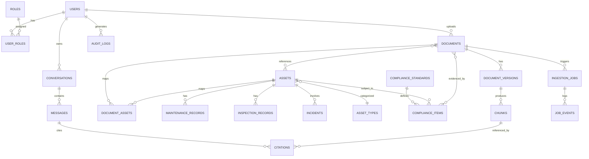
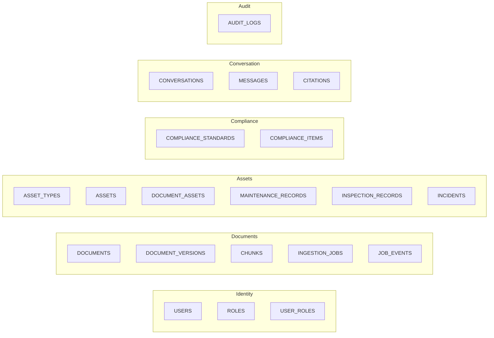
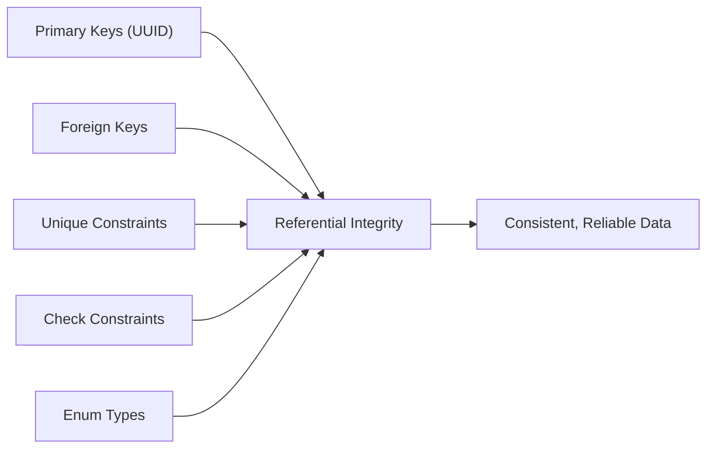

# TRACE — Database Architecture (PostgreSQL)

### Technical Records & Asset Compliance Engine · Problem Statement 8

---

## Table of Contents

1. [Overview](#1-overview)
2. [Design Principles](#2-design-principles)
3. [Entity Relationship Diagram](#3-entity-relationship-diagram)
4. [Schema Domains](#4-schema-domains)
5. [Table Specifications](#5-table-specifications)
6. [Relationships](#6-relationships)
7. [Indexes](#7-indexes)
8. [Constraints](#8-constraints)
9. [Data Retention & Audit](#9-data-retention--audit)
10. [References](#10-references)

---

## 1. Overview

PostgreSQL is the **system of record** for structured data in TRACE: users and roles,
documents and their metadata, ingestion jobs, extracted chunks (references), assets,
maintenance and inspection records, compliance items, conversations, and audit logs.

Vector embeddings live in **FAISS** and the relationship graph lives in **Neo4j**;
PostgreSQL stores the canonical identifiers and metadata that tie all stores together. Each
chunk and asset has a stable UUID that is referenced from FAISS and Neo4j.

> Convention: all primary keys are `UUID`, all timestamps are `TIMESTAMPTZ`, and soft
> deletes use a nullable `deleted_at` column.

---

## 2. Design Principles

| Principle | Description |
| --- | --- |
| **UUID keys** | Globally unique, store-agnostic identifiers |
| **Normalization** | 3NF for core entities; JSONB for flexible metadata |
| **Referential integrity** | Foreign keys with explicit `ON DELETE` behavior |
| **Auditability** | `created_at`, `updated_at`, and dedicated audit log |
| **Soft deletes** | `deleted_at` preserves history where needed |
| **Cross-store linkage** | UUIDs shared with FAISS and Neo4j |
| **Enumerations** | Status fields use Postgres `ENUM` types |

---

## 3. Entity Relationship Diagram

---

## 4. Schema Domains

| Domain | Tables |
| --- | --- |
| Identity & Access | `users`, `roles`, `user_roles` |
| Documents | `documents`, `document_versions`, `chunks`, `ingestion_jobs`, `job_events` |
| Assets | `asset_types`, `assets`, `document_assets`, `maintenance_records`, `inspection_records`, `incidents` |
| Compliance | `compliance_standards`, `compliance_items` |
| Conversation | `conversations`, `messages`, `citations` |
| Audit | `audit_logs` |

---

## 5. Table Specifications

### 5.1 Identity & Access

**`users`**

| Column | Type | Notes |
| --- | --- | --- |
| id | UUID PK | `gen_random_uuid()` |
| email | VARCHAR(255) | UNIQUE, NOT NULL |
| full_name | VARCHAR(255) | NOT NULL |
| password_hash | TEXT | NOT NULL |
| is_active | BOOLEAN | DEFAULT true |
| last_login_at | TIMESTAMPTZ | nullable |
| created_at | TIMESTAMPTZ | DEFAULT now() |
| updated_at | TIMESTAMPTZ | DEFAULT now() |
| deleted_at | TIMESTAMPTZ | nullable (soft delete) |

**`roles`**

| Column | Type | Notes |
| --- | --- | --- |
| id | UUID PK | |
| name | VARCHAR(64) | UNIQUE (e.g. admin, engineer, inspector) |
| description | TEXT | |
| created_at | TIMESTAMPTZ | DEFAULT now() |

**`user_roles`** (junction)

| Column | Type | Notes |
| --- | --- | --- |
| user_id | UUID FK → users.id | ON DELETE CASCADE |
| role_id | UUID FK → roles.id | ON DELETE CASCADE |
| PK | (user_id, role_id) | composite |

### 5.2 Documents

**`documents`**

| Column | Type | Notes |
| --- | --- | --- |
| id | UUID PK | |
| title | VARCHAR(512) | NOT NULL |
| doc_type | doc_type_enum | drawing, pid, sop, log, inspection, incident, manual, safety, excel, image, email |
| source | VARCHAR(255) | origin system / uploader |
| storage_uri | TEXT | object store path |
| mime_type | VARCHAR(128) | |
| current_version_id | UUID | FK → document_versions.id (nullable) |
| uploaded_by | UUID FK → users.id | ON DELETE SET NULL |
| metadata | JSONB | flexible attributes |
| created_at | TIMESTAMPTZ | DEFAULT now() |
| updated_at | TIMESTAMPTZ | DEFAULT now() |
| deleted_at | TIMESTAMPTZ | nullable |

**`document_versions`**

| Column | Type | Notes |
| --- | --- | --- |
| id | UUID PK | |
| document_id | UUID FK → documents.id | ON DELETE CASCADE |
| version_no | INTEGER | NOT NULL |
| storage_uri | TEXT | NOT NULL |
| checksum | VARCHAR(64) | SHA-256 |
| page_count | INTEGER | |
| is_latest | BOOLEAN | DEFAULT false |
| created_at | TIMESTAMPTZ | DEFAULT now() |

**`chunks`** (canonical reference for FAISS vectors)

| Column | Type | Notes |
| --- | --- | --- |
| id | UUID PK | also the FAISS vector id |
| document_version_id | UUID FK → document_versions.id | ON DELETE CASCADE |
| chunk_index | INTEGER | order within document |
| content | TEXT | extracted text |
| page_no | INTEGER | source page |
| token_count | INTEGER | |
| embedding_model | VARCHAR(128) | e.g. sentence-transformers model |
| metadata | JSONB | bbox, section, tags |
| created_at | TIMESTAMPTZ | DEFAULT now() |

**`ingestion_jobs`**

| Column | Type | Notes |
| --- | --- | --- |
| id | UUID PK | |
| document_id | UUID FK → documents.id | ON DELETE CASCADE |
| status | job_status_enum | queued, running, succeeded, failed, cancelled |
| stage | VARCHAR(64) | ocr, parse, extract, chunk, embed, index |
| error | TEXT | nullable |
| started_at | TIMESTAMPTZ | |
| finished_at | TIMESTAMPTZ | |
| created_at | TIMESTAMPTZ | DEFAULT now() |

**`job_events`**

| Column | Type | Notes |
| --- | --- | --- |
| id | UUID PK | |
| job_id | UUID FK → ingestion_jobs.id | ON DELETE CASCADE |
| event_type | VARCHAR(64) | stage_start, stage_end, error |
| message | TEXT | |
| created_at | TIMESTAMPTZ | DEFAULT now() |

### 5.3 Assets

**`asset_types`**

| Column | Type | Notes |
| --- | --- | --- |
| id | UUID PK | |
| name | VARCHAR(128) | UNIQUE (pump, valve, vessel, motor...) |
| description | TEXT | |

**`assets`**

| Column | Type | Notes |
| --- | --- | --- |
| id | UUID PK | also Neo4j node id |
| tag | VARCHAR(128) | UNIQUE (e.g. P-101) |
| name | VARCHAR(255) | |
| asset_type_id | UUID FK → asset_types.id | ON DELETE SET NULL |
| location | VARCHAR(255) | |
| status | asset_status_enum | active, inactive, decommissioned |
| metadata | JSONB | |
| created_at | TIMESTAMPTZ | DEFAULT now() |
| updated_at | TIMESTAMPTZ | DEFAULT now() |

**`document_assets`** (junction)

| Column | Type | Notes |
| --- | --- | --- |
| document_id | UUID FK → documents.id | ON DELETE CASCADE |
| asset_id | UUID FK → assets.id | ON DELETE CASCADE |
| relation | VARCHAR(64) | references, governs, evidences |
| PK | (document_id, asset_id, relation) | composite |

**`maintenance_records`**

| Column | Type | Notes |
| --- | --- | --- |
| id | UUID PK | |
| asset_id | UUID FK → assets.id | ON DELETE CASCADE |
| performed_at | TIMESTAMPTZ | |
| description | TEXT | |
| technician | VARCHAR(255) | |
| source_document_id | UUID FK → documents.id | ON DELETE SET NULL |
| metadata | JSONB | |
| created_at | TIMESTAMPTZ | DEFAULT now() |

**`inspection_records`**

| Column | Type | Notes |
| --- | --- | --- |
| id | UUID PK | |
| asset_id | UUID FK → assets.id | ON DELETE CASCADE |
| inspected_at | TIMESTAMPTZ | |
| result | VARCHAR(64) | pass, fail, conditional |
| findings | TEXT | |
| inspector | VARCHAR(255) | |
| source_document_id | UUID FK → documents.id | ON DELETE SET NULL |
| created_at | TIMESTAMPTZ | DEFAULT now() |

**`incidents`**

| Column | Type | Notes |
| --- | --- | --- |
| id | UUID PK | |
| asset_id | UUID FK → assets.id | ON DELETE SET NULL |
| occurred_at | TIMESTAMPTZ | |
| severity | severity_enum | low, medium, high, critical |
| summary | TEXT | |
| root_cause | TEXT | |
| source_document_id | UUID FK → documents.id | ON DELETE SET NULL |
| created_at | TIMESTAMPTZ | DEFAULT now() |

### 5.4 Compliance

**`compliance_standards`**

| Column | Type | Notes |
| --- | --- | --- |
| id | UUID PK | |
| code | VARCHAR(64) | UNIQUE (e.g. ISO-55000, ISA-5.1) |
| title | VARCHAR(512) | |
| description | TEXT | |
| created_at | TIMESTAMPTZ | DEFAULT now() |

**`compliance_items`**

| Column | Type | Notes |
| --- | --- | --- |
| id | UUID PK | |
| standard_id | UUID FK → compliance_standards.id | ON DELETE CASCADE |
| asset_id | UUID FK → assets.id | ON DELETE CASCADE |
| requirement | TEXT | |
| status | compliance_status_enum | compliant, non_compliant, pending |
| due_date | DATE | |
| evidence_document_id | UUID FK → documents.id | ON DELETE SET NULL |
| created_at | TIMESTAMPTZ | DEFAULT now() |

### 5.5 Conversation

**`conversations`**

| Column | Type | Notes |
| --- | --- | --- |
| id | UUID PK | |
| user_id | UUID FK → users.id | ON DELETE CASCADE |
| title | VARCHAR(255) | |
| created_at | TIMESTAMPTZ | DEFAULT now() |
| updated_at | TIMESTAMPTZ | DEFAULT now() |

**`messages`**

| Column | Type | Notes |
| --- | --- | --- |
| id | UUID PK | |
| conversation_id | UUID FK → conversations.id | ON DELETE CASCADE |
| role | message_role_enum | user, assistant, system |
| content | TEXT | |
| token_count | INTEGER | |
| created_at | TIMESTAMPTZ | DEFAULT now() |

**`citations`**

| Column | Type | Notes |
| --- | --- | --- |
| id | UUID PK | |
| message_id | UUID FK → messages.id | ON DELETE CASCADE |
| chunk_id | UUID FK → chunks.id | ON DELETE SET NULL |
| score | NUMERIC(5,4) | relevance score |
| created_at | TIMESTAMPTZ | DEFAULT now() |

### 5.6 Audit

**`audit_logs`**

| Column | Type | Notes |
| --- | --- | --- |
| id | UUID PK | |
| user_id | UUID FK → users.id | ON DELETE SET NULL |
| action | VARCHAR(128) | login, query, upload, delete |
| entity_type | VARCHAR(64) | document, asset, conversation |
| entity_id | UUID | nullable |
| ip_address | INET | |
| details | JSONB | |
| created_at | TIMESTAMPTZ | DEFAULT now() |

---

## 6. Relationships

| Relationship | Type | On Delete |
| --- | --- | --- |
| users → user_roles → roles | many-to-many | CASCADE |
| users → documents | one-to-many | SET NULL |
| documents → document_versions | one-to-many | CASCADE |
| document_versions → chunks | one-to-many | CASCADE |
| documents ↔ assets (document_assets) | many-to-many | CASCADE |
| assets → maintenance_records | one-to-many | CASCADE |
| assets → inspection_records | one-to-many | CASCADE |
| assets → incidents | one-to-many | SET NULL |
| compliance_standards → compliance_items | one-to-many | CASCADE |
| assets → compliance_items | one-to-many | CASCADE |
| conversations → messages | one-to-many | CASCADE |
| messages → citations | one-to-many | CASCADE |
| chunks → citations | one-to-many | SET NULL |

---

## 7. Indexes

| Table | Index | Purpose |
| --- | --- | --- |
| users | UNIQUE(email) | login lookup |
| documents | INDEX(doc_type) | filter by type |
| documents | INDEX(uploaded_by) | per-user listing |
| documents | GIN(metadata) | JSONB attribute search |
| documents | GIN(to_tsvector(title)) | full-text title search |
| document_versions | INDEX(document_id, version_no) | version lookup |
| chunks | INDEX(document_version_id) | reassemble document |
| chunks | GIN(metadata) | tag/section filters |
| assets | UNIQUE(tag) | tag lookup |
| assets | INDEX(asset_type_id) | type filtering |
| document_assets | INDEX(asset_id) | reverse lookup |
| maintenance_records | INDEX(asset_id, performed_at) | history queries |
| inspection_records | INDEX(asset_id, inspected_at) | history queries |
| incidents | INDEX(asset_id, occurred_at) | history queries |
| compliance_items | INDEX(asset_id, status) | compliance dashboards |
| ingestion_jobs | INDEX(status) | queue monitoring |
| messages | INDEX(conversation_id, created_at) | thread retrieval |
| audit_logs | INDEX(user_id, created_at) | audit queries |

---

## 8. Constraints

| Type | Constraint |
| --- | --- |
| Primary keys | UUID on every table; composite on junctions |
| Foreign keys | Explicit `ON DELETE CASCADE / SET NULL` per relationship |
| Unique | `users.email`, `roles.name`, `assets.tag`, `compliance_standards.code` |
| Check | `document_versions.version_no > 0`; `citations.score BETWEEN 0 AND 1` |
| Not null | All required business fields |
| Enums | `doc_type_enum`, `job_status_enum`, `asset_status_enum`, `severity_enum`, `compliance_status_enum`, `message_role_enum` |
| Partial unique | One `is_latest = true` per document |
| Triggers | Auto-update `updated_at` on row modification |

---

## 9. Data Retention & Audit

| Concern | Approach |
| --- | --- |
| Soft deletes | `deleted_at` on `users` and `documents` |
| Audit trail | Every query/upload/delete recorded in `audit_logs` |
| Citations | Persisted per message for full answer provenance |
| Versioning | `document_versions` retains full revision history |
| Cross-store integrity | Chunk/asset UUIDs reconciled with FAISS & Neo4j |

---

## 10. References

- [`03_SYSTEM_ARCHITECTURE.md`](03_SYSTEM_ARCHITECTURE.md)
- PostgreSQL Documentation — https://www.postgresql.org/docs/
- PostgreSQL JSONB & GIN Indexes — https://www.postgresql.org/docs/current/datatype-json.html
- Neo4j — https://neo4j.com/docs/
- FAISS — https://faiss.ai/
- ISO 55000 — Asset Management.
