# TRACE — Frontend Architecture

### Technical Records & Asset Compliance Engine · Problem Statement 8

---

## Table of Contents

1. [Overview](#1-overview)
2. [Folder Structure](#2-folder-structure)
3. [Pages](#3-pages)
4. [Components](#4-components)
5. [Layouts](#5-layouts)
6. [Authentication Flow](#6-authentication-flow)
7. [Dashboard](#7-dashboard)
8. [Asset Details](#8-asset-details)
9. [AI Copilot](#9-ai-copilot)
10. [Knowledge Graph](#10-knowledge-graph)
11. [Maintenance](#11-maintenance)
12. [Compliance](#12-compliance)
13. [Responsive Strategy](#13-responsive-strategy)
14. [References](#14-references)

---

## 1. Overview

The frontend is a **Next.js (App Router) + TypeScript** application styled with
**TailwindCSS** and built from **shadcn/ui** primitives. It delivers an enterprise Copilot
experience: conversational AI, semantic search, asset intelligence, knowledge-graph
exploration, maintenance, and compliance views.

> **Implementation status (Milestones 1–2):** Authentication, token persistence, protected
> routes, and the industrial dashboard shell are **implemented**. Copilot, search, assets,
> graph, maintenance, compliance, and admin pages remain **planned** (sidebar links are
> placeholders).

| Concern | Approach (target) | Current implementation |
| --- | --- | --- |
| Rendering | Server Components for data-heavy pages; Client Components for interactivity | Client Components for auth and dashboard |
| Data fetching | Server-side fetch + React Query (client cache) | Axios client; React Query planned |
| Streaming | Server-Sent Events for Copilot token streaming | Not yet implemented |
| State | Local component state + lightweight global store (auth, theme) | `AuthProvider` context + localStorage tokens |
| Styling | Tailwind tokens + shadcn/ui | Industrial dark theme (see [`07_UI_UX_DESIGN.md`](07_UI_UX_DESIGN.md)) |
| Type safety | TypeScript end-to-end with shared API types | `types/auth.ts`, `types/api.ts` |

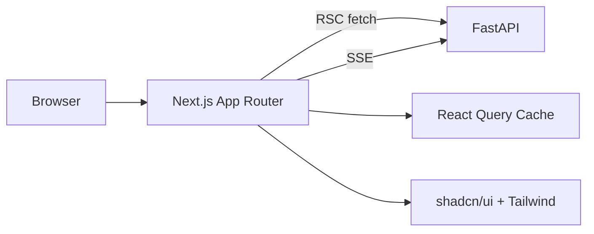

---

## 2. Folder Structure

### Implemented (Milestone 2)

```text
frontend/
├── app/
│   ├── layout.tsx                # Root layout + Providers
│   ├── providers.tsx             # AuthProvider wrapper
│   ├── page.tsx                  # Redirect to /dashboard or /login
│   ├── globals.css               # Industrial theme tokens
│   ├── login/page.tsx            # Login (GuestGuard)
│   ├── register/page.tsx         # Register (GuestGuard)
│   └── dashboard/page.tsx        # Dashboard (AuthGuard)
├── components/
│   ├── auth/                     # login-form, register-form, auth-guard, brand panel
│   ├── layout/                   # auth-shell, dashboard-layout, sidebar, topbar
│   ├── common/                   # trace-logo, form-field, kpi-card, backend-status
│   ├── ui/                       # button, input, label, checkbox, skeleton, badge
│   └── copilot/                  # (placeholder)
├── contexts/
│   └── auth-context.tsx          # AuthProvider, login/register/logout/refresh
├── hooks/
│   └── use-auth.ts               # Auth context hook
├── lib/
│   ├── api/                      # client.ts (Axios), auth.ts, health.ts
│   ├── auth/                     # storage.ts, routes.ts
│   └── utils.ts
├── types/
│   ├── auth.ts
│   └── api.ts
└── public/
```

### Planned (full product)

```text
frontend/
├── app/                          # App Router
│   ├── (auth)/
│   │   ├── login/page.tsx
│   │   └── layout.tsx
│   ├── (dashboard)/
│   │   ├── layout.tsx            # Authenticated shell
│   │   ├── page.tsx              # Dashboard home
│   │   ├── copilot/page.tsx
│   │   ├── search/page.tsx
│   │   ├── assets/
│   │   │   ├── page.tsx          # Asset list
│   │   │   └── [assetId]/page.tsx
│   │   ├── graph/page.tsx
│   │   ├── maintenance/page.tsx
│   │   ├── compliance/page.tsx
│   │   ├── documents/page.tsx
│   │   └── admin/page.tsx
│   ├── layout.tsx                # Root layout (providers, theme)
│   └── globals.css
├── components/
│   ├── ui/                       # shadcn/ui primitives
│   ├── copilot/                  # Chat, message, citation
│   ├── assets/                   # Asset cards, tables
│   ├── graph/                    # Graph canvas, node panels
│   ├── charts/                   # Chart wrappers
│   ├── layout/                   # Sidebar, topbar, breadcrumbs
│   └── common/                   # Buttons, badges, empty states
├── lib/
│   ├── api/                      # Typed API client
│   ├── auth/                     # Session helpers, guards
│   ├── hooks/                    # React Query hooks
│   └── utils/                    # Formatters, helpers
├── stores/                       # Global state (auth, theme, ui)
├── types/                        # Shared TypeScript types
├── styles/                       # Tailwind config extensions
└── public/                       # Static assets
```

| Directory | Responsibility |
| --- | --- |
| `app/` | Routes, layouts, route groups |
| `components/ui/` | Generated shadcn/ui primitives |
| `components/*` | Feature components |
| `lib/api/` | Typed fetch client and API bindings |
| `lib/hooks/` | Data hooks (React Query) |
| `stores/` | Cross-cutting client state |
| `types/` | Shared DTO/types mirroring backend |

---

## 3. Pages

### Implemented routes

| Route | Page | Purpose | Guard | Status |
| --- | --- | --- | --- | --- |
| `/` | Root redirect | Sends authenticated users to `/dashboard`, others to `/login` | — | ✅ |
| `/login` | Login | Email/password sign-in | `GuestGuard` | ✅ |
| `/register` | Register | New user registration | `GuestGuard` | ✅ |
| `/dashboard` | Dashboard | KPI placeholders, profile, backend status | `AuthGuard` | ✅ |

### Planned routes

| Route | Page | Purpose | Rendering |
| --- | --- | --- | --- |
| `/copilot` | Copilot | Conversational AI assistant | Client (SSE) |
| `/search` | Search | Semantic search results | Server + Client |
| `/assets` | Asset List | Browse/filter assets | Server |
| `/assets/[assetId]` | Asset Details | Full asset intelligence | Server + Client |
| `/graph` | Knowledge Graph | Interactive graph exploration | Client |
| `/maintenance` | Maintenance | Maintenance records & schedule | Server |
| `/compliance` | Compliance | Compliance status & evidence | Server |
| `/documents` | Documents | Upload & ingestion status | Client |
| `/admin` | Admin | Users, roles, ingestion control | Server + Client |

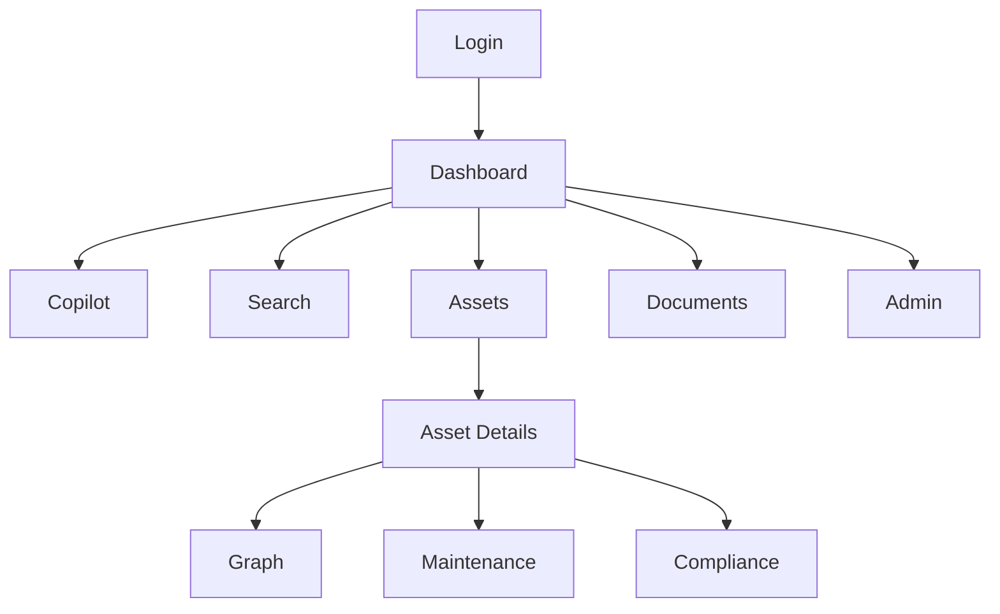

---

## 4. Components

### Implemented component hierarchy

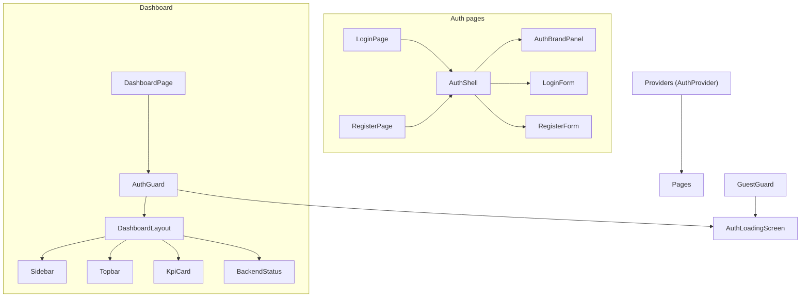

| Category | Implemented components |
| --- | --- |
| Auth | `LoginForm`, `RegisterForm`, `AuthGuard`, `GuestGuard`, `AuthBrandPanel`, `AuthLoadingScreen` |
| Layout | `AuthShell`, `DashboardLayout`, `Sidebar`, `Topbar` |
| Common | `TraceLogo`, `FormField`, `KpiCard`, `BackendStatus` |
| UI (shadcn) | `Button`, `Input`, `Label`, `Checkbox`, `Skeleton`, `Badge` |

### Planned components

| Category | Components |
| --- | --- |
| Copilot | `ChatWindow`, `MessageBubble`, `CitationCard`, `SourceDrawer`, `PromptInput`, `StreamingIndicator` |
| Assets | `AssetCard`, `AssetTable`, `AssetHeader`, `AssetTimeline`, `TagBadge` |
| Graph | `GraphCanvas`, `NodeDetailsPanel`, `GraphLegend`, `GraphFilters` |
| Charts | `KpiCard`, `TrendChart`, `StatusDonut`, `BarChart` |
| Layout | `Breadcrumbs`, `CommandPalette`, `ThemeToggle` |
| Common | `DataTable`, `EmptyState`, `LoadingSkeleton`, `ConfirmDialog`, `Toast` |

### Component composition example (Copilot)

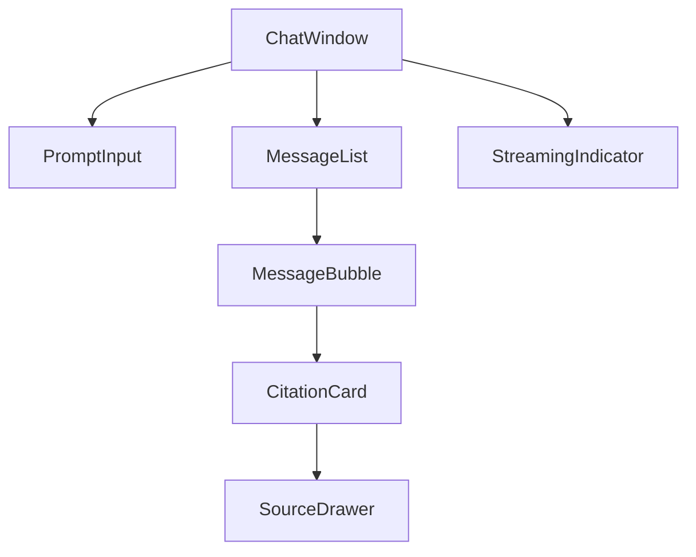

---

## 5. Layouts

| Layout | Used By | Contents | Status |
| --- | --- | --- | --- |
| Root Layout | All routes | `Providers` (AuthProvider), fonts, global CSS | ✅ |
| Auth Shell | `/login`, `/register` | Split layout: brand panel + form card | ✅ |
| Dashboard Layout | `/dashboard` | Sidebar, top bar, content slot | ✅ |

> **Note:** Route groups `(auth)` and `(dashboard)` from the original plan are not used yet;
> auth and dashboard pages use flat routes with client-side guards instead.

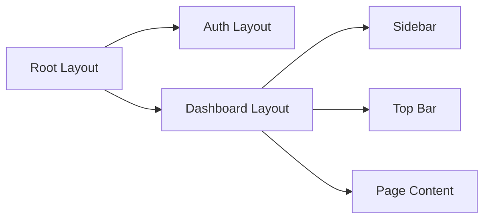

---

## 6. Authentication Flow

### Implemented flow (Milestone 2)

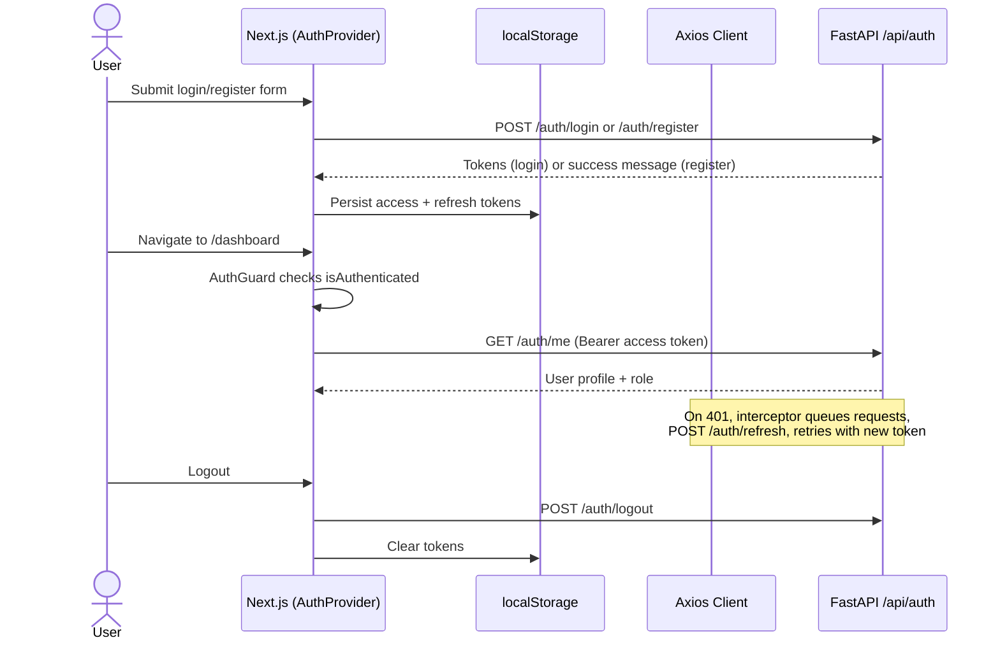

| Aspect | Planned | **Implemented** |
| --- | --- | --- |
| Token storage | httpOnly secure cookies | `localStorage` via `lib/auth/storage.ts` |
| Route protection | Next.js middleware | `AuthGuard` / `GuestGuard` client components |
| Role gating | Conditional rendering by role claims | Role badge in topbar; RBAC on API |
| Refresh | Silent token refresh on expiry | Axios response interceptor with request queue |
| Logout | Clear cookies, invalidate session | Clear storage + `POST /api/auth/logout` |
| Forms | — | React Hook Form + Zod validation |

### Key modules

| Module | Path | Responsibility |
| --- | --- | --- |
| Auth context | `contexts/auth-context.tsx` | Session state, login/register/logout, bootstrap from storage |
| Axios client | `lib/api/client.ts` | Base URL, Bearer header, 401 refresh interceptor |
| Auth API | `lib/api/auth.ts` | Typed calls to `/api/auth/*` |
| Route constants | `lib/auth/routes.ts` | Protected vs guest paths |
| Hook | `hooks/use-auth.ts` | Consumer hook for auth context |

> **Future:** Migrate token storage to httpOnly cookies and add Next.js middleware for
> server-side route protection when deployment hardening begins.

---

## 7. Dashboard

The dashboard is the operational landing surface: KPIs, recent activity, quick Copilot
access, and alerts.

> **Implemented (Milestone 2):** `/dashboard` renders inside `DashboardLayout` with sidebar
> navigation (placeholder links), topbar (search field, role badge, profile, logout), four KPI
> placeholder cards (Documents, Assets, Compliance, Maintenance Tasks), user profile section,
> and `BackendStatus` connectivity check.

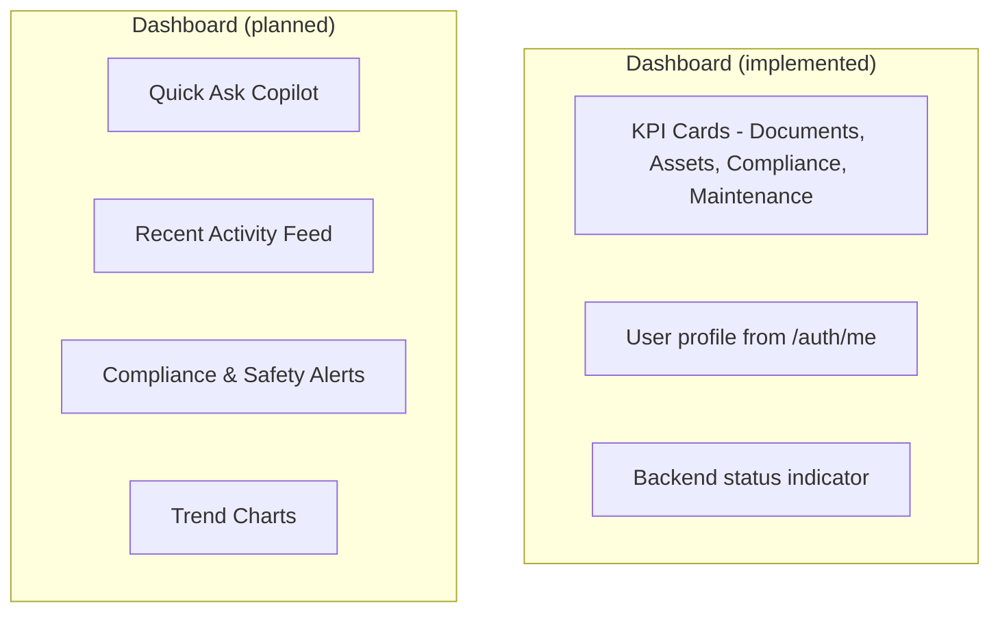

| Widget | Content | Status |
| --- | --- | --- |
| KPI Cards | Documents, Assets, Compliance, Maintenance Tasks (placeholder values) | ✅ |
| User profile | Name, email, role from `/auth/me` | ✅ |
| Backend status | Health API connectivity | ✅ |
| Quick Ask | Inline Copilot prompt | Planned |
| Activity Feed | Recent uploads, queries, status changes | Planned |
| Alerts | Overdue compliance, critical incidents | Planned |
| Trends | Ingestion volume, query volume over time | Planned |

---

## 8. Asset Details

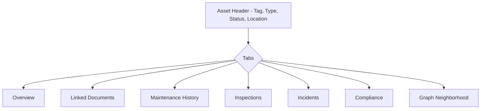

| Section | Content |
| --- | --- |
| Header | Tag, name, type, status badge, location |
| Overview | Summary, key metadata, AI-generated synopsis |
| Linked Documents | All documents referencing the asset, with citations |
| Maintenance | Chronological maintenance records |
| Inspections | Inspection results and findings |
| Incidents | Incident history with severity |
| Compliance | Applicable standards and status |
| Graph Neighborhood | Connected assets, procedures, incidents |

---

## 9. AI Copilot

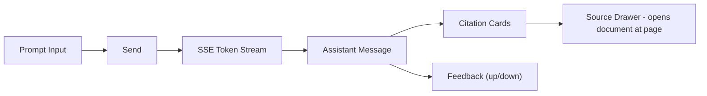

| Capability | Behavior |
| --- | --- |
| Streaming | Tokens render incrementally via SSE |
| Citations | Inline citation chips linking to sources |
| Source drawer | Opens the cited document at the referenced page |
| Multi-turn | Maintains conversation context |
| Suggestions | Context-aware follow-up prompts |
| Feedback | Thumbs up/down captured for metrics |

---

## 10. Knowledge Graph

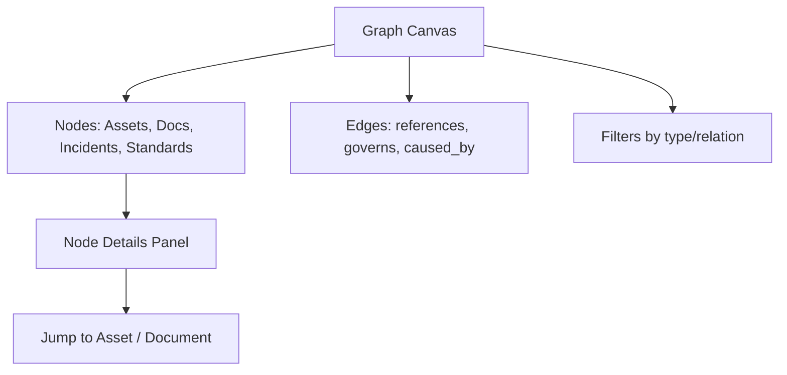

| Feature | Description |
| --- | --- |
| Interactive canvas | Pan, zoom, expand/collapse nodes |
| Node types | Assets, documents, incidents, standards, procedures |
| Edge types | references, governs, caused_by, complies_with |
| Filtering | By node type, relation, or asset |
| Details panel | Metadata and quick navigation |

---

## 11. Maintenance

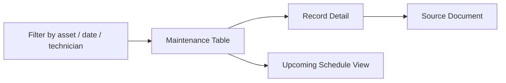

| Element | Content |
| --- | --- |
| Maintenance table | Asset, date, description, technician, source |
| Filters | Asset, date range, technician |
| Record detail | Full description with source citation |
| Schedule view | Upcoming/overdue maintenance |

---

## 12. Compliance

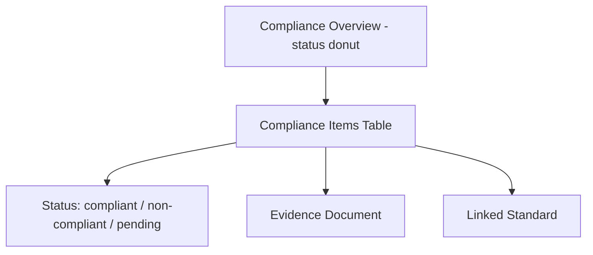

| Element | Content |
| --- | --- |
| Overview | Donut of compliant vs non-compliant vs pending |
| Items table | Standard, asset, requirement, status, due date |
| Evidence | Link to evidencing document |
| Filters | By standard, asset, status |

---

## 13. Responsive Strategy

> **Implemented:** Auth pages use a stacked layout on mobile and split panel on `lg+`.
> Dashboard sidebar collapses to a mobile drawer; KPI grid is 1 → 2 → 4 columns across
> breakpoints. Loading states use `Skeleton` components (not spinners).

| Breakpoint | Target | Layout Behavior |
| --- | --- | --- |
| `sm` (<640px) | Phones | Single column, collapsible sidebar drawer, bottom nav |
| `md` (≥768px) | Tablets | Two-column, icon sidebar |
| `lg` (≥1024px) | Laptops | Full sidebar, multi-column dashboard |
| `xl` (≥1280px) | Desktops | Expanded grids, side-by-side panels |
| `2xl` (≥1536px) | Large displays | Wide content, persistent panels |

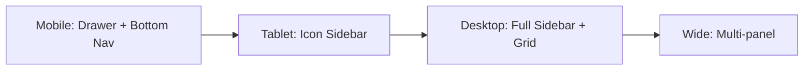

| Principle | Approach |
| --- | --- |
| Mobile-first | Tailwind utilities scale up from base |
| Fluid grids | CSS grid/flex with responsive columns |
| Adaptive nav | Sidebar collapses to drawer on small screens |
| Touch targets | Minimum 44px interactive areas |
| Performance | Lazy-load heavy views (graph, charts) |

---

## 14. References

- [`03_SYSTEM_ARCHITECTURE.md`](03_SYSTEM_ARCHITECTURE.md)
- [`06_BACKEND_ARCHITECTURE.md`](06_BACKEND_ARCHITECTURE.md)
- [`07_UI_UX_DESIGN.md`](07_UI_UX_DESIGN.md)
- Next.js App Router — https://nextjs.org/docs/app
- shadcn/ui — https://ui.shadcn.com/
- TailwindCSS — https://tailwindcss.com/docs
- TanStack Query — https://tanstack.com/query
