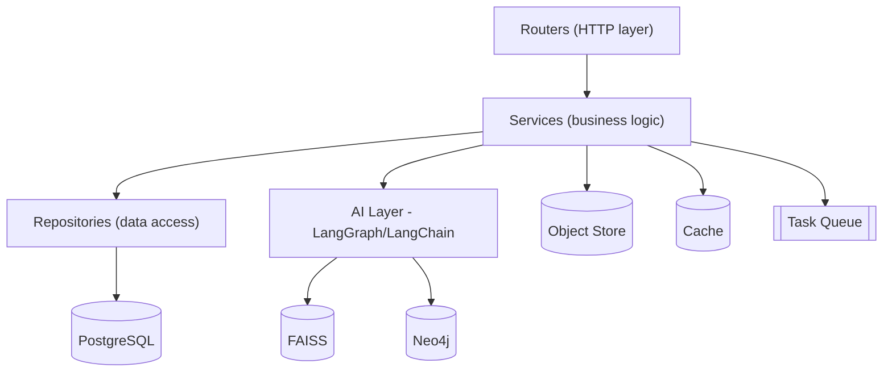
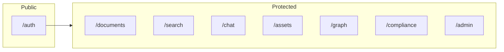
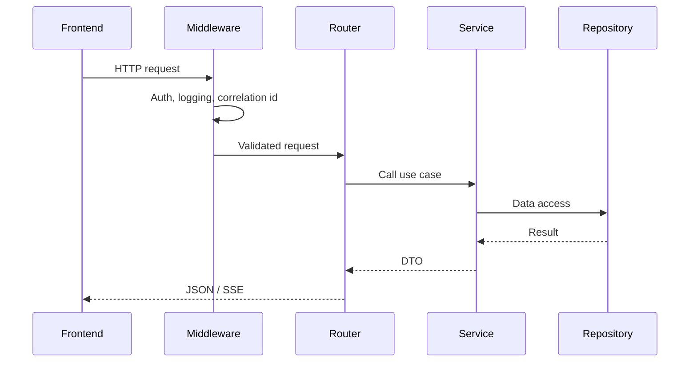
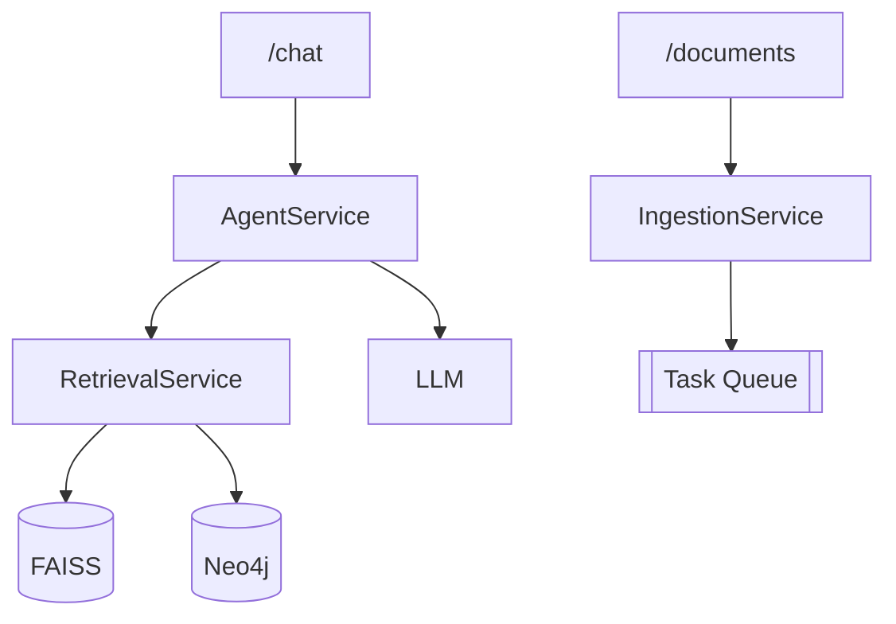
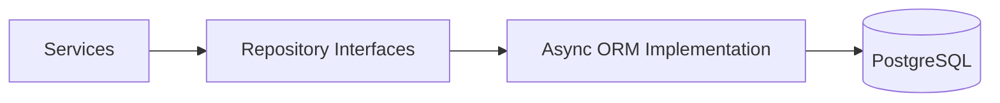
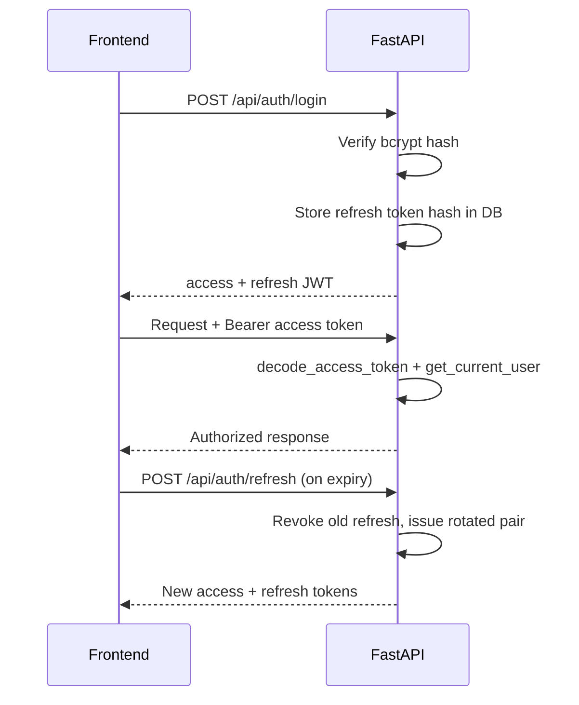
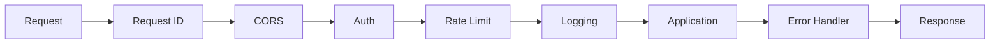
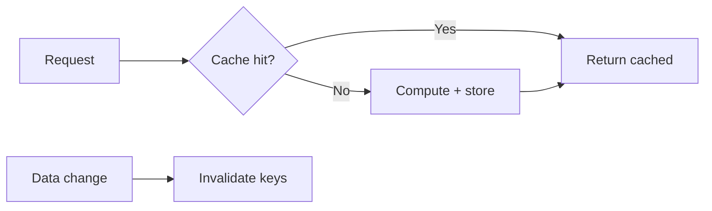
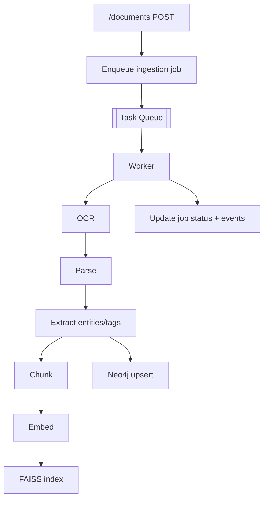
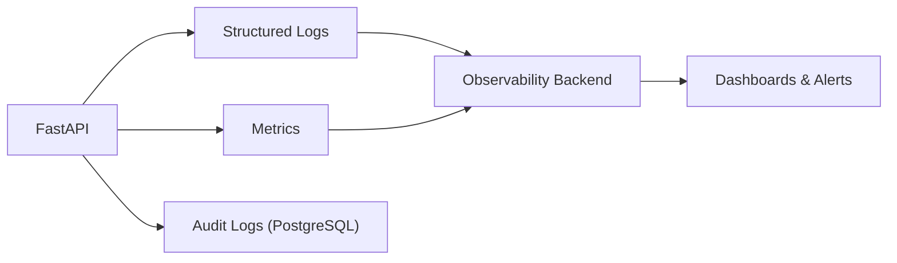

# TRACE — Backend Architecture (FastAPI)

### Technical Records & Asset Compliance Engine · Problem Statement 8

---

## Table of Contents

1. [Overview](#1-overview)
2. [Layered Design](#2-layered-design)
3. [Folder Structure](#3-folder-structure)
4. [Routes](#4-routes)
5. [Services](#5-services)
6. [Repositories](#6-repositories)
7. [Authentication](#7-authentication)
8. [Middleware](#8-middleware)
9. [Caching](#9-caching)
10. [Background Tasks](#10-background-tasks)
11. [Logging & Observability](#11-logging--observability)
12. [References](#12-references)

---

## 1. Overview

The backend is a **FastAPI** application acting as the gateway and orchestration layer
between the frontend, the AI layer, and the data stores. It is **async-first**, layered, and
dependency-injected, exposing a typed REST API with streaming (SSE) for Copilot responses.

> **Implementation status (Milestones 1–2):** Health check, JWT authentication (register,
> login, refresh with rotation, logout, `/auth/me`), User/Role/RefreshToken models,
> repositories, `AuthService`, and `core/security/` package are **implemented**. Document,
> search, chat, asset, graph, compliance, and admin routes remain **planned**.

| Property | Value |
| --- | --- |
| Framework | FastAPI (ASGI) |
| Concurrency | async/await throughout |
| Validation | Pydantic models |
| Persistence | PostgreSQL via SQLAlchemy 2 async |
| API prefix | `/api` (versioned `/api/v1` planned) |
| Auth | JWT access + refresh tokens, bcrypt passwords |
| AI integration | LangGraph / LangChain in service layer *(planned)* |
| Streaming | Server-Sent Events for chat *(planned)* |

---

## 2. Layered Design



| Layer | Responsibility | Must Not |
| --- | --- | --- |
| Routers | HTTP I/O, validation, auth checks | Contain business logic |
| Services | Orchestrate use cases | Touch HTTP directly |
| Repositories | Data access / queries | Contain business rules |
| AI layer | Retrieval & reasoning | Access HTTP |

---

## 3. Folder Structure

### Implemented (Milestones 1–2)

```text
backend/
├── app/
│   ├── main.py                  # App factory, CORS, router registration (/api)
│   ├── core/
│   │   ├── config.py            # Settings (pydantic-settings)
│   │   ├── security/            # JWT + password package
│   │   │   ├── jwt.py           # create/decode access & refresh tokens
│   │   │   ├── passwords.py     # bcrypt hash/verify
│   │   │   ├── exceptions.py
│   │   │   └── types.py
│   │   ├── logging.py
│   │   └── dependencies.py
│   ├── api/
│   │   ├── routes/
│   │   │   ├── health.py        # GET /api/health
│   │   │   └── auth.py          # POST register/login/refresh/logout, GET me
│   │   └── deps.py              # get_auth_service, get_current_user
│   ├── services/
│   │   ├── auth_service.py      # register, login, refresh, logout, get user
│   │   └── exceptions.py
│   ├── repositories/
│   │   ├── user_repository.py
│   │   ├── role_repository.py
│   │   └── refresh_token_repository.py
│   ├── models/
│   │   ├── user.py
│   │   ├── role.py
│   │   ├── refresh_token.py
│   │   └── mixins.py
│   ├── schemas/
│   │   ├── health.py
│   │   └── auth.py
│   ├── db/
│   │   ├── base.py
│   │   └── session.py
│   └── middleware/              # (placeholder)
├── alembic/versions/
│   ├── 001_initial.py
│   └── 002_auth_foundation.py
├── scripts/verify_db.py
└── tests/
```

### Planned (full product)

```text
backend/
├── app/
│   ├── main.py                  # App factory, router registration
│   ├── core/
│   │   ├── config.py            # Settings
│   │   ├── security.py          # JWT, hashing
│   │   ├── logging.py           # Structured logging
│   │   └── dependencies.py      # Shared DI providers
│   ├── api/
│   │   ├── routes/
│   │   │   ├── auth.py
│   │   │   ├── documents.py
│   │   │   ├── search.py
│   │   │   ├── chat.py
│   │   │   ├── assets.py
│   │   │   ├── graph.py
│   │   │   ├── compliance.py
│   │   │   └── admin.py
│   │   └── deps.py              # Route dependencies
│   ├── services/
│   │   ├── ingestion_service.py
│   │   ├── retrieval_service.py
│   │   ├── agent_service.py
│   │   ├── graph_service.py
│   │   ├── asset_service.py
│   │   └── compliance_service.py
│   ├── repositories/
│   │   ├── user_repository.py
│   │   ├── document_repository.py
│   │   ├── chunk_repository.py
│   │   ├── asset_repository.py
│   │   └── audit_repository.py
│   ├── models/                  # ORM models
│   ├── schemas/                 # Pydantic DTOs
│   ├── middleware/
│   │   ├── auth_middleware.py
│   │   ├── logging_middleware.py
│   │   └── error_middleware.py
│   ├── tasks/                   # Background task definitions
│   └── ai/                      # LangGraph graphs, tools, retrievers
└── tests/
```

---

## 4. Routes

### Implemented endpoints (`/api` prefix)

| Route | Method | Purpose | Auth | Status |
| --- | --- | --- | --- | --- |
| `/health` | GET | Liveness check | Public | ✅ |
| `/auth/register` | POST | Create user (default Viewer role) | Public | ✅ |
| `/auth/login` | POST | Authenticate, issue tokens | Public | ✅ |
| `/auth/refresh` | POST | Rotate refresh token, issue new pair | Public (refresh) | ✅ |
| `/auth/logout` | POST | Revoke refresh token | User | ✅ |
| `/auth/me` | GET | Current user profile | User | ✅ |

### Planned endpoints



| Route | Method | Purpose | Auth |
| --- | --- | --- | --- |
| `/documents` | GET/POST | List / upload documents | User |
| `/documents/{id}` | GET/DELETE | Get / delete document | User |
| `/documents/{id}/status` | GET | Ingestion job status | User |
| `/search` | POST | Semantic search | User |
| `/chat` | POST (SSE) | Copilot conversation | User |
| `/chat/{conversationId}` | GET | Conversation history | User |
| `/assets` | GET | List/filter assets | User |
| `/assets/{id}` | GET | Asset details | User |
| `/assets/{id}/history` | GET | Maintenance/inspection/incidents | User |
| `/graph/asset/{id}` | GET | Asset graph neighborhood | User |
| `/graph/query` | POST | Graph query | User |
| `/compliance` | GET | Compliance items | User |
| `/admin/users` | GET/POST | Manage users | Admin |
| `/admin/ingestion` | GET | Ingestion monitoring | Admin |

### Request lifecycle



---

## 5. Services

| Service | Responsibility | Status |
| --- | --- | --- |
| `AuthService` | Register, login, refresh (rotation), logout, current user | ✅ Implemented |
| `IngestionService` | Orchestrate OCR → parse → extract → chunk → embed → index; create jobs | Planned |
| `RetrievalService` | Hybrid retrieval (FAISS vectors + Neo4j graph + metadata filters) | Planned |
| `AgentService` | Execute LangGraph reasoning, stream tokens, attach citations | Planned |
| `GraphService` | Read/write Neo4j relationships, asset neighborhoods | Planned |
| `AssetService` | Asset CRUD, aggregated history | Planned |
| `ComplianceService` | Compliance items, status, evidence linking | Planned |

### AuthService (implemented)

| Method | Description |
| --- | --- |
| `register_user` | Hash password, assign default Viewer role, persist user |
| `login_user` | Verify credentials, issue access + refresh JWTs, store refresh token hash |
| `refresh_tokens` | Validate refresh token, rotate (revoke old, issue new pair) |
| `get_current_user` | Load user + role for `/auth/me` |
| `logout_user` | Revoke refresh token |



---

## 6. Repositories

The repository layer abstracts all database access behind typed interfaces, keeping services
storage-agnostic and testable.

### Implemented repositories

| Repository | Key Operations | Status |
| --- | --- | --- |
| `UserRepository` | get_by_email, create, get_by_id | ✅ |
| `RoleRepository` | get_by_name, list_all | ✅ |
| `RefreshTokenRepository` | create, get_by_hash, revoke, revoke_all_for_user | ✅ |

### Planned repositories

| Repository | Key Operations |
| --- | --- |
| `DocumentRepository` | create, list, get, soft_delete, add_version, set_latest |
| `ChunkRepository` | bulk_insert, get_by_ids, list_for_document |
| `AssetRepository` | get_by_tag, list, link_document, get_history |
| `ComplianceRepository` | list_items, update_status, link_evidence |
| `AuditRepository` | record, query_by_user |



| Principle | Description |
| --- | --- |
| Interface-driven | Services depend on abstractions, not concrete ORM |
| Async | All queries are async, using connection pooling |
| Unit of work | Transactions managed per request/use case |
| No leakage | ORM models never returned directly to routers (DTOs used) |

---

## 7. Authentication

> **Implemented (Milestone 2):** Full JWT authentication with refresh token rotation,
> bcrypt password hashing, role-based access via FastAPI dependencies, and seeded roles
> (Admin, Engineer, Operator, Viewer).



| Aspect | Planned | **Implemented** |
| --- | --- | --- |
| Mechanism | JWT access + refresh tokens | ✅ HS256 JWTs via `python-jose` |
| Hashing | Strong password hashing (bcrypt/argon2) | ✅ bcrypt via `passlib` |
| RBAC | Role-scoped dependencies on routes | ✅ `get_current_user()` + role on User |
| Refresh rotation | Rotating refresh tokens | ✅ Old token revoked on refresh |
| Token transport | httpOnly cookies | Bearer header (frontend localStorage) |
| Default roles | admin, engineer, operator, inspector, compliance_officer | Admin, Engineer, Operator, Viewer (seeded) |
| Protected routes | All domain APIs | `/auth/me`, `/auth/logout` require Bearer token |

### Dependencies (`app/api/deps.py`)

| Dependency | Purpose |
| --- | --- |
| `get_auth_service()` | Inject `AuthService` with repositories + DB session |
| `get_current_user()` | HTTPBearer → decode JWT → load user → return `UserMeResponse` |

### Security package (`app/core/security/`)

| Module | Exports |
| --- | --- |
| `passwords.py` | `hash_password()`, `verify_password()` |
| `jwt.py` | `create_access_token`, `create_refresh_token`, `decode_access_token`, `decode_refresh_token` |
| `exceptions.py` | Token validation errors |
| `types.py` | Token payload types |

---

## 8. Middleware

| Middleware | Responsibility |
| --- | --- |
| Auth Middleware | Validate token, attach `current_user` |
| Logging Middleware | Structured request/response logs, correlation id |
| Error Middleware | Catch exceptions, return consistent error envelope |
| CORS | Restrict origins to frontend |
| Rate Limiting | Throttle abusive clients |
| Request ID | Inject correlation id for tracing |
| GZip | Compress responses |



---

## 9. Caching

| Cache | Content | Strategy |
| --- | --- | --- |
| Query cache | Hot search/chat results | TTL, keyed by normalized query + filters |
| Embedding cache | Embeddings for repeated text | Content-hash key |
| Graph cache | Frequent asset neighborhoods | TTL with invalidation on update |
| Session cache | Auth/session data | Short TTL |
| Metadata cache | Reference data (roles, asset types) | Long TTL, invalidate on change |



| Principle | Description |
| --- | --- |
| Cache-aside | Read-through with explicit population |
| Invalidation | On writes to underlying entities |
| Safety | Never cache unauthorized or per-user-sensitive data across users |

---

## 10. Background Tasks

Heavy work (OCR, parsing, embedding, indexing, graph building) runs asynchronously so API
requests stay fast.



| Task | Trigger | Outcome |
| --- | --- | --- |
| Document ingestion | Upload | Searchable, graph-linked document |
| Re-embedding | Model change | Updated vectors |
| Graph rebuild | Bulk import | Refreshed relationships |
| Index maintenance | Schedule | Optimized FAISS index |
| Cleanup | Schedule | Purge soft-deleted artifacts |

| Aspect | Approach |
| --- | --- |
| Queue | Async task queue with worker pool |
| Idempotency | Jobs safe to retry |
| Progress | `ingestion_jobs` + `job_events` track stages |
| Failure handling | Retries with backoff; failures surfaced to admin |

---

## 11. Logging & Observability

| Concern | Approach |
| --- | --- |
| Structured logs | JSON logs with correlation id, user id, route |
| Levels | DEBUG/INFO/WARN/ERROR with environment config |
| Audit logging | Business events persisted to `audit_logs` |
| Metrics | Request latency, error rate, queue depth, retrieval timings |
| Tracing | Correlation id propagated across services |
| Health checks | Liveness/readiness endpoints |
| AI observability | Token usage, retrieval scores, agent step traces |



---

## 12. References

- [`03_SYSTEM_ARCHITECTURE.md`](03_SYSTEM_ARCHITECTURE.md)
- [`04_DATABASE_ARCHITECTURE.md`](04_DATABASE_ARCHITECTURE.md)
- [`05_FRONTEND_ARCHITECTURE.md`](05_FRONTEND_ARCHITECTURE.md)
- FastAPI — https://fastapi.tiangolo.com/
- Pydantic — https://docs.pydantic.dev/
- LangGraph — https://langchain-ai.github.io/langgraph/
- LangChain — https://python.langchain.com/
- Neo4j — https://neo4j.com/docs/
- FAISS — https://faiss.ai/
