# TRACE — UI / UX Design

### Technical Records & Asset Compliance Engine · Problem Statement 8

---

## Table of Contents

1. [Design Philosophy](#1-design-philosophy)
2. [Navigation](#2-navigation)
3. [Color Palette](#3-color-palette)
4. [Typography](#4-typography)
5. [Dashboard Layout](#5-dashboard-layout)
6. [Cards](#6-cards)
7. [Tables](#7-tables)
8. [Charts](#8-charts)
9. [Animations](#9-animations)
10. [Glassmorphism](#10-glassmorphism)
11. [Mobile Responsiveness](#11-mobile-responsiveness)
12. [Enterprise UI Principles](#12-enterprise-ui-principles)
13. [References](#13-references)

---

## 1. Design Philosophy

TRACE's interface is designed to feel like a **premium enterprise Copilot** — calm,
focused, trustworthy, and fast. It balances information density (industrial users need a lot
of data) with clarity (answers and actions must never feel cluttered).

| Pillar | Meaning |
| --- | --- |
| **Clarity first** | Every screen answers "what do I do / know next?" |
| **Trust through provenance** | Citations and sources are visually prominent |
| **Calm density** | Dense data presented with generous structure and whitespace |
| **Consistent system** | Tokens, spacing, and components are uniform |
| **Accessible by default** | WCAG AA contrast, keyboard, screen-reader support |

> **Implementation status (Milestone 2):** The live UI uses an **industrial enterprise dark
> theme** — not glassmorphism or chatbot styling. Auth pages use a split brand panel + form
> card; the dashboard uses a persistent sidebar, topbar, and skeleton loading states.

### Implemented design language

| Element | Implementation |
| --- | --- |
| Theme | Dark industrial — deep charcoal backgrounds, steel-blue accents |
| Auth layout | Split panel: geometric brand panel (left) + elevated form card (right) |
| Dashboard | Sidebar with grouped nav (disabled future links), topbar with search + profile |
| KPI cards | Four placeholder metrics with icon badges |
| Loading | `Skeleton` components (auth bootstrap, dashboard, backend status) |
| Motion | ~200ms transitions on hover/focus; no decorative animation |
| Typography | System sans-serif stack via Tailwind; semibold headings, muted body text |

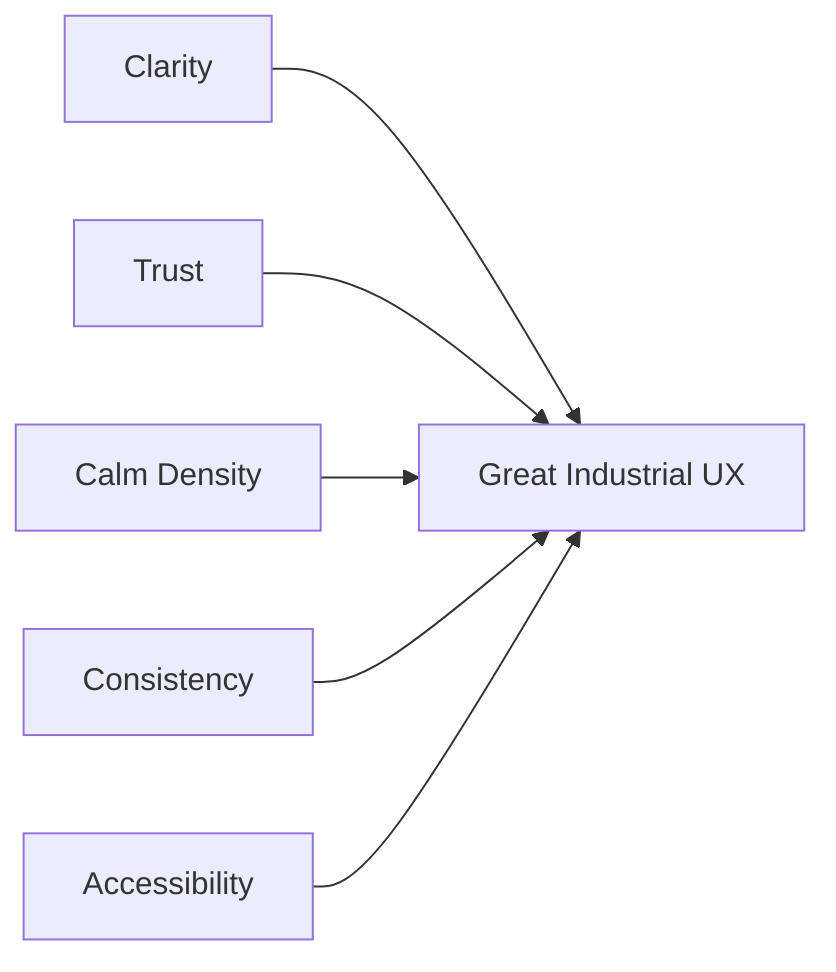

---

## 2. Navigation

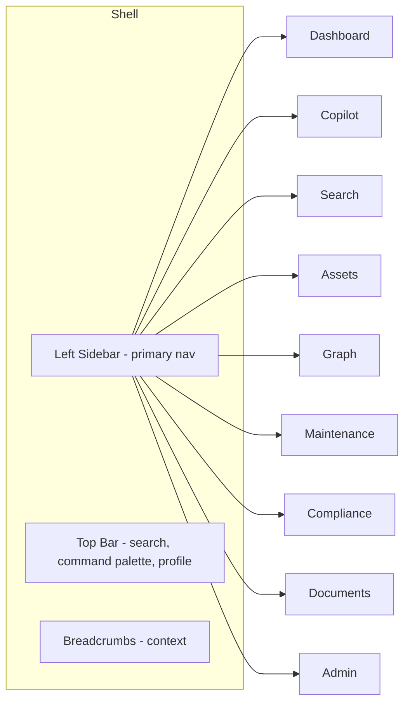

| Element | Behavior |
| --- | --- |
| Left sidebar | Primary navigation; collapsible to icons |
| Top bar | Global search, command palette (⌘K), theme toggle, profile |
| Breadcrumbs | Show hierarchical context (e.g. Assets → P-101 → Maintenance) |
| Command palette | Keyboard-first navigation and quick ask |
| Active state | Clear highlight + accent indicator |

### Authentication pages (implemented)

| Page | Layout | Elements |
| --- | --- | --- |
| `/login` | Split auth shell | Brand panel (logo, tagline, geometric accents) + login form card |
| `/register` | Split auth shell | Same brand panel + registration form (name, email, password) |

| Form element | Style |
| --- | --- |
| Inputs | Dark surface, subtle border, focus ring in steel blue |
| Primary button | Full-width, steel blue background |
| Validation errors | Inline red text below fields |
| Loading | Skeleton placeholders during auth bootstrap |

| Principle | Detail |
| --- | --- |
| Predictable | Persistent nav location across pages |
| Shallow | Most destinations within 1–2 clicks |
| Contextual | Asset views expose related sub-navigation |

---

## 3. Color Palette

A professional, industrial palette: deep neutral base, a confident primary, semantic status
colors, and subtle accent for AI/Copilot surfaces. Supports light and dark themes.

> **Implemented (Milestone 2):** Dark theme only. Tokens are defined in `frontend/app/globals.css`.

| Token | Implemented (dark) | Use |
| --- | --- | --- |
| `--background` | `#0B0F14` | App background |
| `--surface` | `#111827` | Cards, panels, sidebar |
| `--surface-muted` | `#1F2937` | Secondary surfaces, inputs |
| `--primary` | `#3B6EA8` (steel blue) | Primary actions, links, accents |
| `--primary-foreground` | `#FFFFFF` | Text on primary |
| `--border` | `#374151` | Dividers, outlines |
| `--text` | `#F3F4F6` | Primary text |
| `--text-muted` | `#9CA3AF` | Secondary text, labels |
| `--success` | `#22C55E` | Online status, pass |
| `--warning` | `#F59E0B` | Pending states |
| `--danger` | `#EF4444` | Errors, critical |

### Planned tokens (full product)

| Token | Light | Dark | Use |
| --- | --- | --- | --- |
| `--background` | `#F7F8FA` | `#0B0F14` | App background |
| `--surface` | `#FFFFFF` | `#121821` | Cards, panels |
| `--surface-muted` | `#EEF1F5` | `#1A222D` | Secondary surfaces |
| `--primary` | `#1F6FEB` | `#3B82F6` | Primary actions, links |
| `--accent` | `#7C3AED` | `#A78BFA` | AI / Copilot accents |
| `--success` | `#16A34A` | `#22C55E` | Compliant, pass |
| `--warning` | `#D97706` | `#F59E0B` | Pending, due soon |
| `--danger` | `#DC2626` | `#EF4444` | Non-compliant, critical |

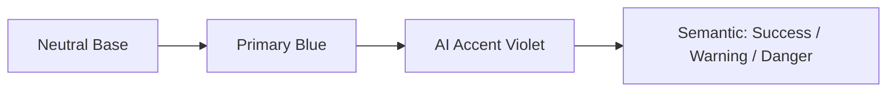

| Guideline | Detail |
| --- | --- |
| Contrast | Meet WCAG AA (≥4.5:1 for body text) |
| Semantic meaning | Status colors reserved for status only |
| AI surfaces | Violet accent signals Copilot/AI context |
| Theming | All colors are CSS variables/tokens |

---

## 4. Typography

> **Implemented:** Tailwind default sans-serif stack (Geist via Next.js font loading where configured).
> Headings use semibold/bold weights; form labels and captions use muted smaller text.

| Role | Size (implemented) | Weight |
| --- | --- | --- |
| Page title (H1) | 24–30px (`text-2xl` / `text-3xl`) | 600–700 |
| Section title (H2) | 18–20px (`text-lg`) | 600 |
| Body | 14–16px (`text-sm` / `text-base`) | 400 |
| Caption / meta | 12–13px (`text-xs`) | 400, muted color |
| Form labels | 14px | 500 |

### Planned typography (full product)

| Role | Font | Size | Weight |
| --- | --- | --- | --- |
| Display / H1 | Inter (or Geist) | 28–32px | 700 |
| H2 | Inter | 22–24px | 600 |
| H3 | Inter | 18–20px | 600 |
| Body | Inter | 14–16px | 400 |
| Caption / meta | Inter | 12–13px | 400 |
| Mono / tags / code | JetBrains Mono | 13px | 500 |

| Principle | Detail |
| --- | --- |
| Scale | Consistent modular type scale |
| Line height | 1.4–1.6 for readability |
| Hierarchy | Weight + size, not color, drives hierarchy |
| Numerals | Tabular figures in tables and metrics |
| Monospace | Asset tags (e.g. `P-101`) and identifiers |

---

## 5. Dashboard Layout

> **Implemented:** Four KPI placeholder cards in a responsive grid, user profile block, and
> backend connectivity indicator below the topbar.

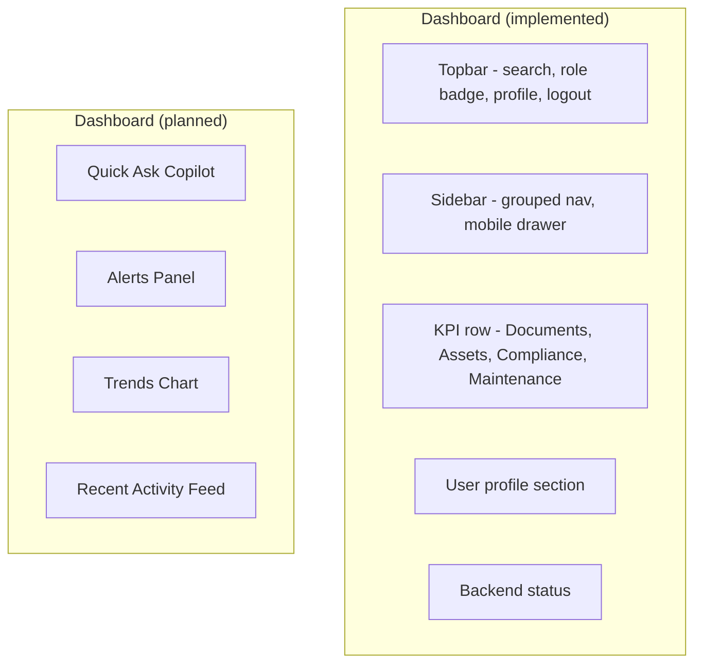

| Region | Content | Status |
| --- | --- | --- |
| Sidebar | Grouped navigation (future links disabled) | ✅ |
| Topbar | Search field, role badge, profile menu, logout | ✅ |
| KPI row | Documents, Assets, Compliance, Maintenance Tasks | ✅ (placeholders) |
| User profile | Name, email, role from session | ✅ |
| Quick Ask | Inline Copilot input | Planned |
| Alerts | Overdue compliance, critical incidents | Planned |
| Trends | Ingestion & query volume | Planned |
| Activity | Recent uploads/queries | Planned |

| Principle | Detail |
| --- | --- |
| 12-column grid | Responsive, consistent gutters |
| Z-pattern | Most important info top-left |
| Breathing room | Generous spacing between modules |

---

## 6. Cards

Cards are the primary content container — used for KPIs, assets, alerts, and grouped data.

| Card Type | Contents |
| --- | --- |
| KPI Card | Metric value, label, delta indicator, sparkline |
| Asset Card | Tag, type, status badge, location, quick actions |
| Alert Card | Severity icon, message, CTA |
| Citation Card | Document title, page, snippet, open action |
| Insight Card | AI-generated summary with source links |

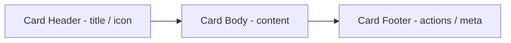

| Property | Spec |
| --- | --- |
| Radius | 12–16px rounded corners |
| Elevation | Soft shadow; glass effect on overlays |
| Padding | 16–24px |
| States | Hover lift, focus ring, loading skeleton |

---

## 7. Tables

Industrial data is table-heavy (maintenance, inspections, compliance, documents). Tables are
designed for scanning and action.

| Feature | Behavior |
| --- | --- |
| Sorting | Per-column, clear sort indicators |
| Filtering | Column filters + global search |
| Pagination | Server-side for large sets |
| Row actions | Inline menu (view, open source) |
| Status cells | Color-coded badges |
| Density | Comfortable / compact toggle |
| Sticky header | Header stays on scroll |
| Empty/loading | Skeleton rows + empty states |

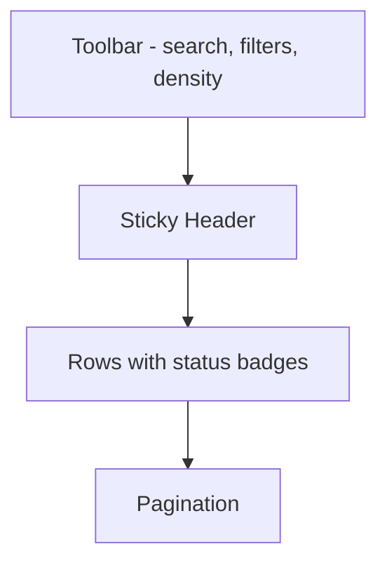

| Principle | Detail |
| --- | --- |
| Scannability | Tabular numerals, aligned columns |
| Progressive disclosure | Expandable rows for detail |
| Traceability | Source/citation link per record |

---

## 8. Charts

| Chart | Use |
| --- | --- |
| KPI sparkline | Compact trend inside KPI cards |
| Line / area | Ingestion and query volume over time |
| Donut | Compliance status distribution |
| Bar | Incidents by severity / assets by type |
| Timeline | Asset maintenance & incident history |

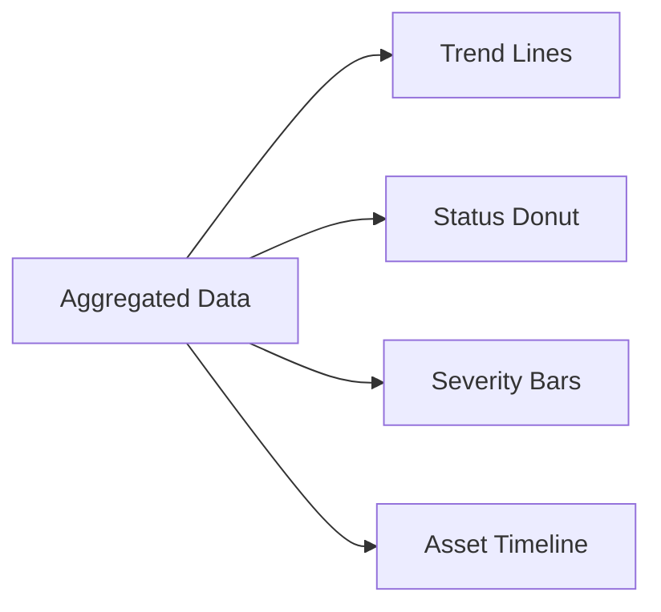

| Principle | Detail |
| --- | --- |
| Minimal chrome | Remove non-essential gridlines/labels |
| Semantic color | Reuse status palette for consistency |
| Accessible | Color + label/pattern, never color alone |
| Responsive | Charts reflow and simplify on small screens |
| Interactive | Tooltips, hover, drill-down where useful |

---

## 9. Animations

Motion is **purposeful and subtle** — it guides attention and conveys system state without
distraction.

> **Implemented:** ~200ms hover/focus transitions on buttons, nav items, and cards.
> Loading uses static skeleton placeholders (no shimmer loop yet). Auth bootstrap shows
> full-page skeleton via `AuthLoadingScreen`.

| Animation | Use | Duration | Status |
| --- | --- | --- | --- |
| Hover/focus transitions | Buttons, sidebar links, KPI cards | ~200ms | ✅ |
| Skeleton loading | Auth bootstrap, dashboard, backend status | — | ✅ |
| Page transitions | Soft fade/slide between routes | 150–250ms | Planned |
| Token streaming | Copilot text appears progressively | continuous | Planned |
| Graph layout | Smooth node positioning | 300–500ms | Planned |

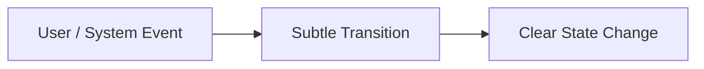

| Principle | Detail |
| --- | --- |
| Purposeful | Motion communicates, never decorates only |
| Fast | Keep under ~300ms for UI transitions |
| Easing | Natural ease-in-out curves |
| Reduced motion | Respect `prefers-reduced-motion` |

---

## 10. Glassmorphism

> **Not used in current implementation (Milestone 2).** The live UI uses solid industrial
> surfaces (`#111827`, `#1F2937`) with subtle borders — no backdrop blur. Glassmorphism
> remains a **planned** treatment for future Copilot overlays, command palette, and modals.

Glassmorphism is intended for **selectively** elevated/overlay surfaces to create depth and a
modern, premium feel — never on dense data tables where it would hurt readability.

| Where Used (planned) | Effect |
| --- | --- |
| Top bar | Frosted translucent background |
| Command palette | Blurred backdrop overlay |
| Copilot panel | Subtle glass on AI surfaces |
| Modals / drawers | Frosted backdrop with blur |
| Floating cards | Light translucency over imagery |

| Property | Spec |
| --- | --- |
| Background | Semi-transparent surface color |
| Blur | `backdrop-filter: blur(12–20px)` |
| Border | 1px subtle translucent border |
| Shadow | Soft, diffuse |
| Contrast | Maintain readable text contrast over glass |

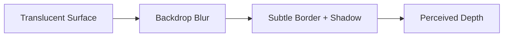

> Used sparingly: glass for **overlays and AI surfaces**, solid surfaces for **data-dense
> regions** to preserve legibility.

---

## 11. Mobile Responsiveness

> **Implemented:** Auth pages stack vertically on small screens; brand panel hidden below
> `lg`. Dashboard sidebar becomes a slide-out drawer with overlay on mobile. KPI grid:
> 1 column → 2 columns (`sm`) → 4 columns (`lg`).

| Breakpoint | Adaptation | Status |
| --- | --- | --- |
| `< 640px` | Auth single column; sidebar drawer; KPI 1-col | ✅ |
| `≥ 768px` | KPI 2-col grid | ✅ |
| `≥ 1024px` | Auth split panel; full sidebar; KPI 4-col | ✅ |
| `≥ 1280px` | Side-by-side panels (chat + source) | Planned |

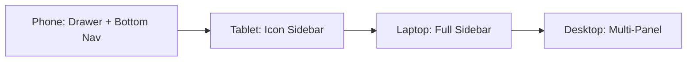

| Principle | Detail |
| --- | --- |
| Mobile-first | Base styles for small screens, enhance upward |
| Touch-friendly | ≥44px targets, swipe-friendly drawers |
| Content priority | Most critical info first on small screens |
| Performance | Defer heavy graph/chart rendering on mobile |

---

## 12. Enterprise UI Principles

| Principle | Description |
| --- | --- |
| **Consistency** | Unified design tokens, spacing, and components everywhere |
| **Information density** | Show meaningful data without overwhelming |
| **Trust & transparency** | Always show sources, timestamps, and provenance |
| **Accessibility** | WCAG AA, keyboard navigation, screen-reader labels |
| **Performance** | Fast loads, skeletons, optimistic UI |
| **Error resilience** | Clear empty/error states with recovery actions |
| **Role-awareness** | UI adapts to user role and permissions |
| **Auditability** | Surfaced history and traceable actions |
| **Internationalization-ready** | Layouts tolerate longer strings |
| **Scalable design system** | Components compose predictably as platform grows |

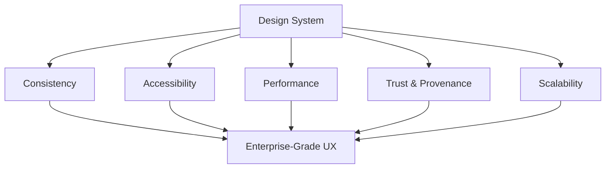

---

## 13. References

- [`05_FRONTEND_ARCHITECTURE.md`](05_FRONTEND_ARCHITECTURE.md)
- [`02_PRODUCT_REQUIREMENTS.md`](02_PRODUCT_REQUIREMENTS.md)
- shadcn/ui — https://ui.shadcn.com/
- TailwindCSS — https://tailwindcss.com/docs
- WCAG 2.1 — https://www.w3.org/TR/WCAG21/
- Inter Typeface — https://rsms.me/inter/
- Material & enterprise design references (general UX guidance).
