# TRACE — AI Architecture

### Technical Records & Asset Compliance Engine · Problem Statement 8

---

## Table of Contents

1. [Overview](#1-overview)
2. [Design Philosophy](#2-design-philosophy)
3. [AI Stack Overview](#3-ai-stack-overview)
4. [LLM](#4-llm)
5. [Embeddings](#5-embeddings)
6. [Retriever](#6-retriever)
7. [Vector Database](#7-vector-database)
8. [Knowledge Graph](#8-knowledge-graph)
9. [Prompt Flow](#9-prompt-flow)
10. [Confidence Score](#10-confidence-score)
11. [Memory](#11-memory)
12. [Hallucination Prevention](#12-hallucination-prevention)
13. [References](#13-references)

---

## 1. Overview

The AI layer is the **reasoning core** of TRACE. It transforms ingested industrial documents
into grounded, auditable intelligence — not open-ended chat. Every AI operation is anchored
to **source documents, asset context, and compliance obligations**.

TRACE does not behave like ChatGPT. It behaves like an **industrial operating system**:
deterministic where possible, evidence-backed always, and role-aware in every response.

| Principle | Meaning |
| --- | --- |
| **Grounded by default** | No answer without retrieved evidence |
| **Asset-centric** | Reasoning is scoped to assets, tags, and procedures |
| **Auditable** | Every claim is traceable to a source |
| **Agentic, not chatty** | Multi-step planning, not single-shot generation |
| **Fail safely** | Decline or flag when evidence is insufficient |

---

## 2. Design Philosophy

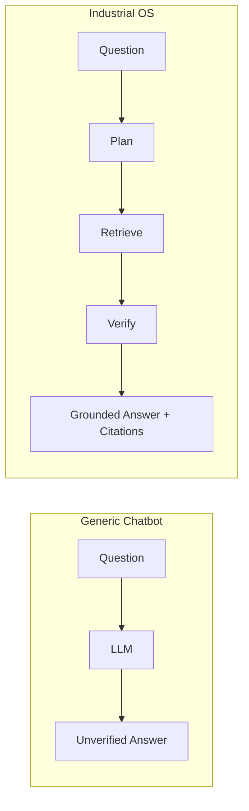

| Dimension | Generic LLM Chat | TRACE Industrial OS |
| --- | --- | --- |
| Knowledge source | Model weights | Ingested documents + graph |
| Answer style | Conversational | Operational, procedural |
| Provenance | None | Mandatory citations |
| Scope | Open domain | Industrial assets & compliance |
| Failure mode | Hallucinate | Decline / flag uncertainty |
| Memory | Session chat | Structured operational memory |

---

## 3. AI Stack Overview

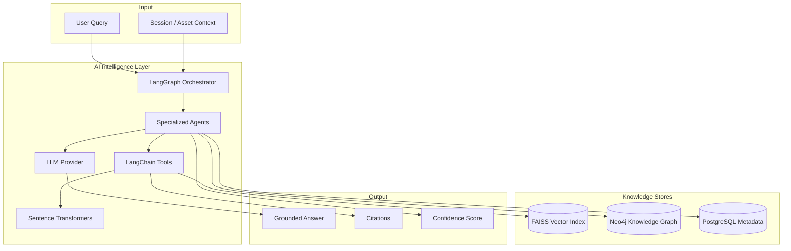

| Component | Technology | Role |
| --- | --- | --- |
| Orchestration | LangGraph | Stateful multi-step agent workflows |
| Tooling | LangChain | Retrievers, chains, tool bindings |
| Embeddings | Sentence Transformers | Semantic vector generation |
| Vector search | FAISS | Similarity retrieval at scale |
| Graph reasoning | Neo4j | Asset/procedure/incident relationships |
| Metadata | PostgreSQL | Document, chunk, audit references |
| Generation | LLM | Synthesis grounded in retrieved context |

---

## 4. LLM

The LLM is the **synthesis engine** — it generates language from retrieved context. It is
never the primary knowledge source.

### Role in TRACE

| Function | Description |
| --- | --- |
| Answer synthesis | Compose grounded responses from retrieved chunks |
| Query decomposition | Break complex questions into sub-queries |
| Entity interpretation | Normalize tags, asset names, procedure references |
| Summarization | Condense multi-document evidence |
| Verification | Self-check claims against provided context |

### LLM constraints

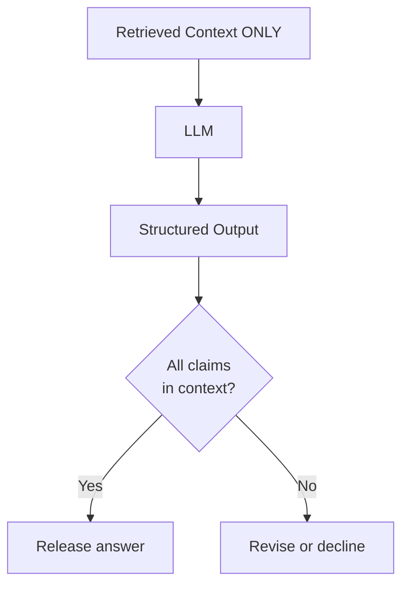

| Constraint | Enforcement |
| --- | --- |
| Context-only generation | System prompt forbids external knowledge |
| Structured output | JSON schema for answers, citations, confidence |
| Temperature control | Low temperature for factual/procedural answers |
| Token budget | Context window managed by retriever |
| Role conditioning | Prompts scoped to industrial domain |

### LLM selection criteria

| Criterion | Requirement |
| --- | --- |
| Context window | Sufficient for multi-chunk retrieval |
| Instruction following | Strong adherence to system prompts |
| Structured output | JSON / function-calling support |
| Self-hostable option | Data privacy for enterprise deployment |
| Latency | Supports streaming for Copilot UX |

---

## 5. Embeddings

Embeddings convert text chunks into dense vectors that capture **semantic meaning**, enabling
similarity search beyond keyword matching.

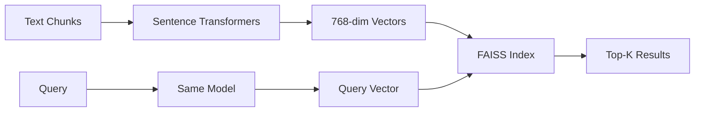

| Aspect | Specification |
| --- | --- |
| Model | Sentence Transformers (e.g. `all-MiniLM-L6-v2` or domain-fine-tuned) |
| Dimension | Model-dependent (typically 384–768) |
| Normalization | L2-normalized for cosine similarity |
| Batch size | Configurable for ingestion throughput |
| Caching | Content-hash keyed embedding cache |

### Embedding lifecycle

| Stage | Action |
| --- | --- |
| Ingestion | Embed every chunk after parsing |
| Query time | Embed user question with same model |
| Re-embedding | Triggered on model upgrade |
| Invalidation | On document re-ingestion or revision |

---

## 6. Retriever

The retriever is a **hybrid search engine** combining vector similarity, knowledge-graph
traversal, and metadata filtering.

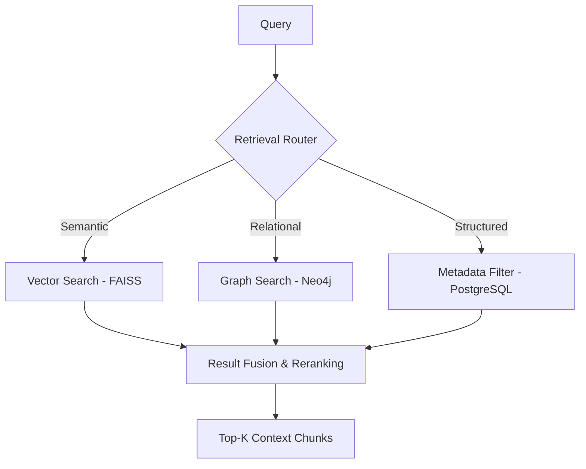

| Retrieval mode | Source | Use case |
| --- | --- | --- |
| Semantic | FAISS | "What is the procedure for pump maintenance?" |
| Graph | Neo4j | "What incidents are linked to P-101?" |
| Metadata | PostgreSQL | "All inspection reports from 2024" |
| Hybrid | All three | "Safety steps for P-101 considering past incidents" |

### Reranking strategy

| Step | Description |
| --- | --- |
| Initial retrieval | Top-K from each source (K=20–50) |
| Deduplication | Remove overlapping chunks |
| Reranking | Cross-encoder or LLM-based relevance scoring |
| Context assembly | Select top-N (N=5–10) within token budget |
| Source tracking | Preserve chunk IDs for citation |

---

## 7. Vector Database

FAISS serves as TRACE's **vector database** — a high-performance, in-process similarity index
optimized for industrial-scale corpora.

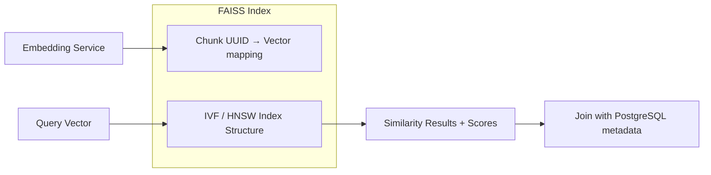

| Property | Design |
| --- | --- |
| Engine | FAISS (Facebook AI Similarity Search) |
| Index type | IVF or HNSW depending on corpus size |
| ID mapping | Chunk UUID (shared with PostgreSQL) |
| Sharding | Partition by document type or facility |
| Persistence | Index serialized to disk; rebuilt on demand |
| Updates | Incremental add on ingestion; rebuild on major changes |

### FAISS vs alternatives

| Option | Pros | Cons | TRACE choice |
| --- | --- | --- | --- |
| FAISS | Fast, self-hosted, no dependency | Manual persistence | **Selected** |
| pgvector | SQL-native, transactional | Slower at scale | Future option |
| Pinecone | Managed, scalable | External dependency, data egress | Not selected |

---

## 8. Knowledge Graph

The knowledge graph (Neo4j) models **relationships** that vector search alone cannot capture:
which assets reference which procedures, which incidents caused which failures, which
standards govern which equipment.

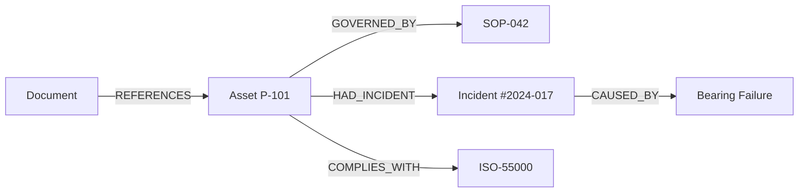

| Role | Description |
| --- | --- |
| Relationship traversal | Multi-hop queries across entities |
| Asset-centric views | Aggregate all knowledge for one asset |
| Compliance linking | Connect standards to assets and evidence |
| Reasoning input | Graph context fed to agents alongside vectors |
| Entity disambiguation | Resolve tag/name conflicts via graph |

> Full graph design: see [`11_KNOWLEDGE_GRAPH.md`](11_KNOWLEDGE_GRAPH.md)

---

## 9. Prompt Flow

Every AI interaction follows a structured prompt pipeline — not a free-form chat template.

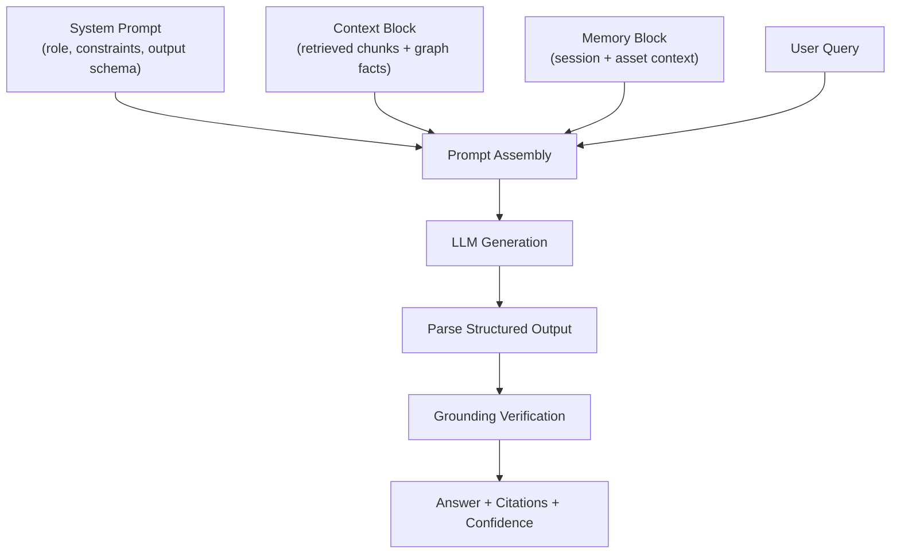

### Prompt layers

| Layer | Content | Purpose |
| --- | --- | --- |
| System | Role, domain, constraints, output schema | Set behavior boundaries |
| Context | Retrieved chunks with source IDs | Ground the answer |
| Graph facts | Relevant Neo4j triples | Add relational context |
| Memory | Session history, active asset | Maintain continuity |
| User | The actual question | Drive the response |

### System prompt principles

| Rule | Enforcement |
| --- | --- |
| Answer ONLY from provided context | Explicit instruction |
| Cite every factual claim | Output schema requires source IDs |
| Decline if insufficient evidence | Explicit fallback instruction |
| Use industrial terminology | Domain-conditioned language |
| Structured JSON output | Schema-validated response |

---

## 10. Confidence Score

Every answer carries a **confidence score** reflecting how well the retrieved evidence
supports the generated response.

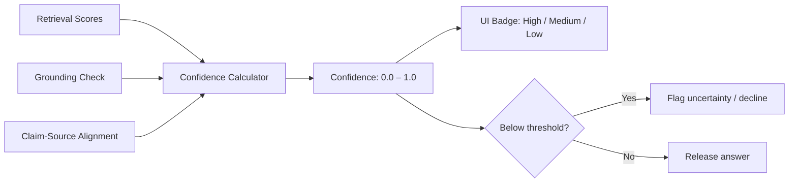

| Factor | Weight | Description |
| --- | --- | --- |
| Retrieval relevance | 40% | Mean similarity score of top chunks |
| Source coverage | 25% | % of answer claims with matching sources |
| Graph support | 15% | Graph facts corroborating the answer |
| Source diversity | 10% | Multiple independent sources vs single |
| Claim specificity | 10% | Specific claims vs vague generalizations |

| Score range | Label | UI treatment |
| --- | --- | --- |
| 0.85 – 1.00 | High | Green badge, full answer |
| 0.60 – 0.84 | Medium | Amber badge, answer with caveat |
| 0.00 – 0.59 | Low | Red badge, decline or "insufficient evidence" |

---

## 11. Memory

TRACE memory is **structured and operational** — not open-ended conversation history.

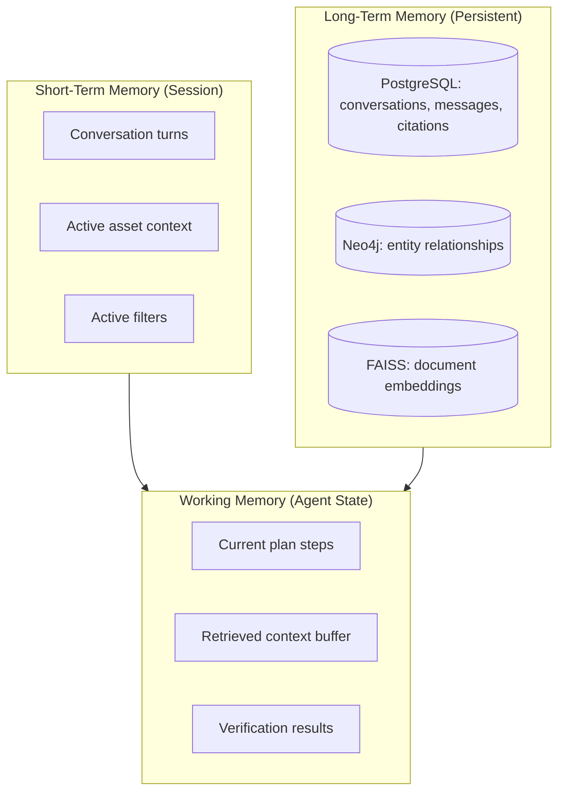

| Memory type | Scope | Storage | TTL |
| --- | --- | --- | --- |
| Session memory | Current conversation | In-memory / Redis | Session duration |
| Asset context | Active asset being viewed | Session state | Until navigation |
| Conversation history | Past Q&A with citations | PostgreSQL | Persistent |
| Agent working memory | Plan, retrieval, verification | LangGraph state | Per request |
| Knowledge memory | All ingested documents | FAISS + Neo4j + PG | Permanent |

### Memory rules

| Rule | Description |
| --- | --- |
| No parametric memory | LLM weights are not the knowledge store |
| Session isolation | Users cannot see other users' sessions |
| Asset scoping | When viewing an asset, retrieval is pre-filtered |
| History for continuity | Multi-turn questions use prior turns as context |
| No memory of declined answers | Failed/low-confidence attempts are not cached as facts |

---

## 12. Hallucination Prevention

Hallucination prevention is a **multi-layer defense**, not a single prompt trick.

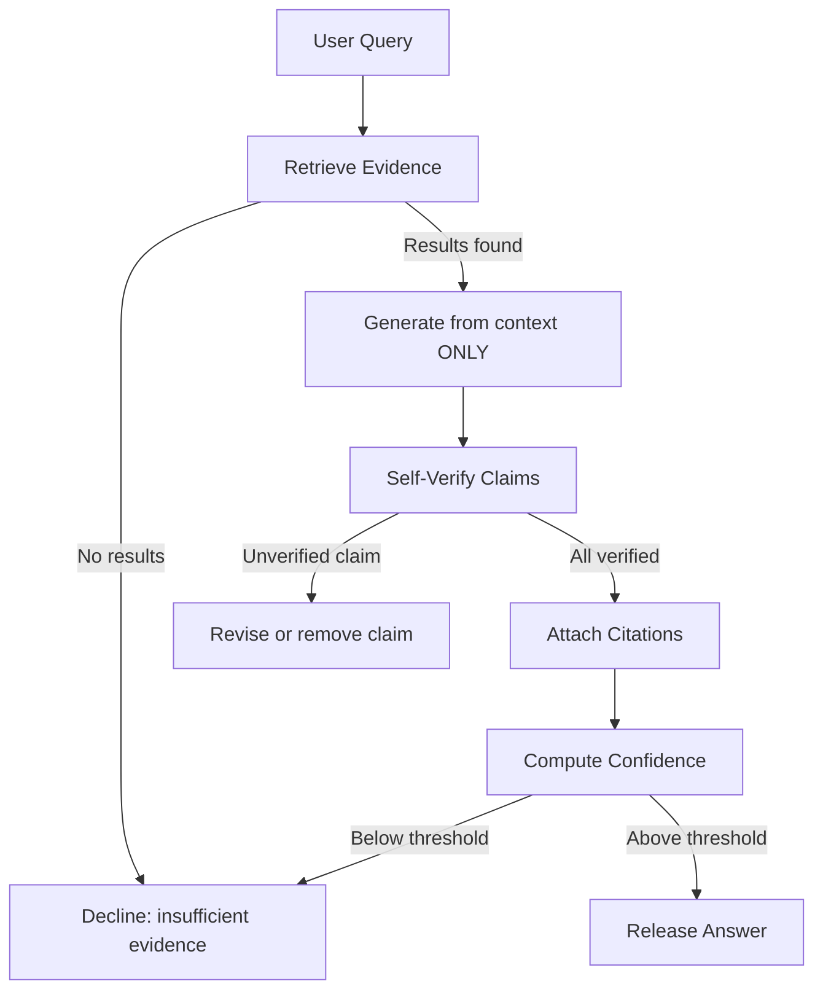

| Layer | Mechanism |
| --- | --- |
| **Retrieval-first** | No generation without retrieved context |
| **Context-only prompt** | System prompt forbids external knowledge |
| **Structured output** | JSON schema requires source IDs per claim |
| **Self-verification** | Agent checks each claim against sources |
| **Confidence gating** | Low-confidence answers are blocked |
| **Citation requirement** | Every factual statement must cite a chunk |
| **Decline protocol** | Explicit "I don't have sufficient evidence" response |
| **Human feedback loop** | Thumbs down triggers review and re-indexing |
| **Audit trail** | Full retrieval + generation log for post-hoc review |

### Decline response template

When evidence is insufficient, TRACE responds with:

> "I don't have sufficient evidence in the ingested documents to answer this question
> confidently. Here is what I found that may be related: [partial results with citations].
> Consider uploading additional documents or refining your query."

This is fundamentally different from ChatGPT, which would generate a plausible-sounding
but unverified answer.

---

## 13. References

- [`03_SYSTEM_ARCHITECTURE.md`](03_SYSTEM_ARCHITECTURE.md)
- [`09_AGENT_ARCHITECTURE.md`](09_AGENT_ARCHITECTURE.md)
- [`10_RAG_PIPELINE.md`](10_RAG_PIPELINE.md)
- [`11_KNOWLEDGE_GRAPH.md`](11_KNOWLEDGE_GRAPH.md)
- [`12_DOCUMENT_PIPELINE.md`](12_DOCUMENT_PIPELINE.md)
- Lewis, P. et al. *Retrieval-Augmented Generation for Knowledge-Intensive NLP Tasks*, NeurIPS 2020.
- LangGraph — https://langchain-ai.github.io/langgraph/
- LangChain — https://python.langchain.com/
- Sentence Transformers — https://www.sbert.net/
- FAISS — https://faiss.ai/
- Neo4j — https://neo4j.com/docs/
