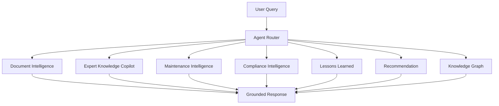
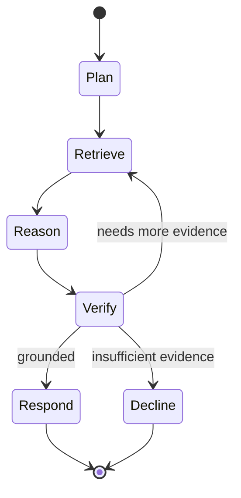
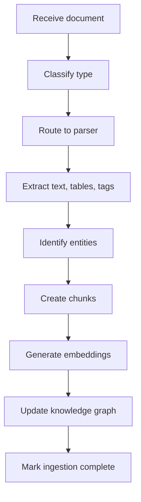
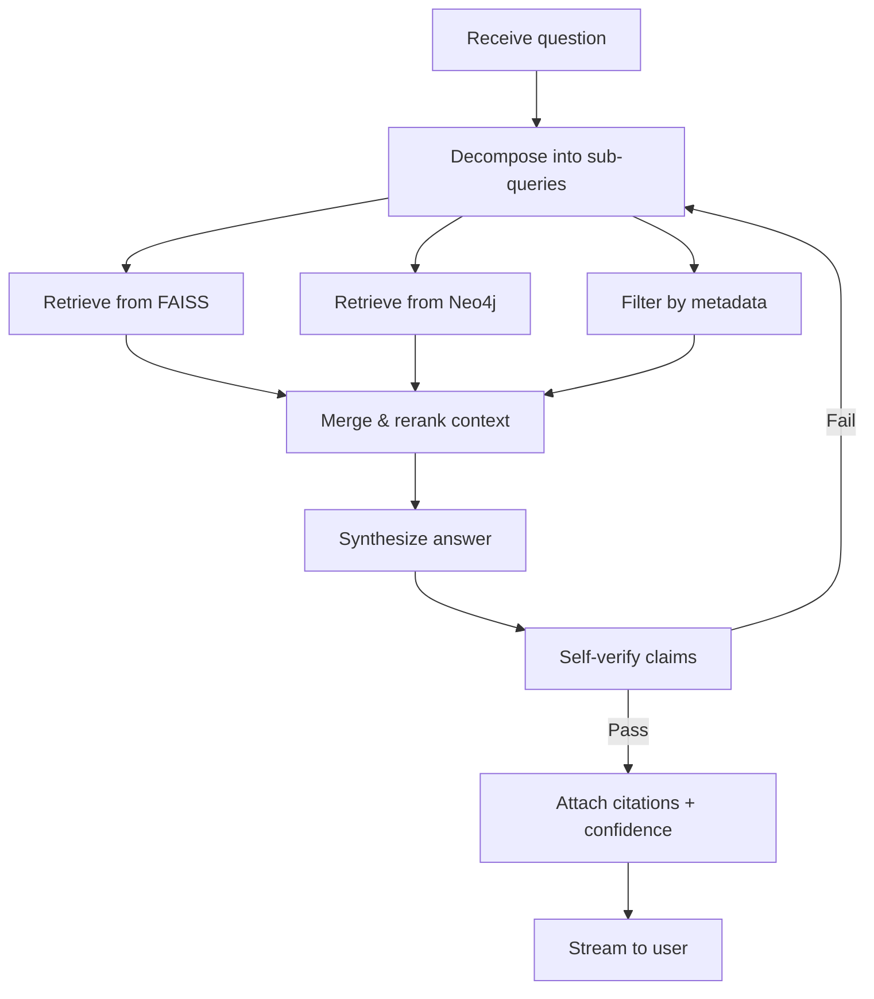
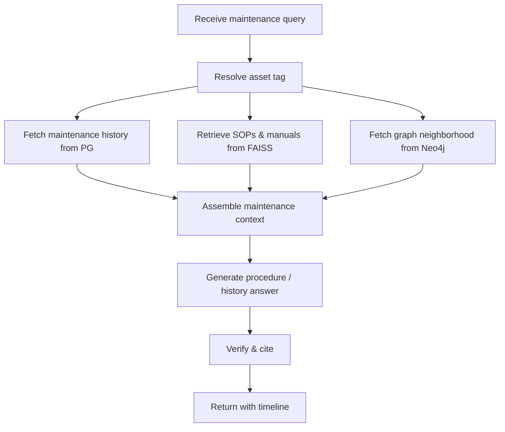
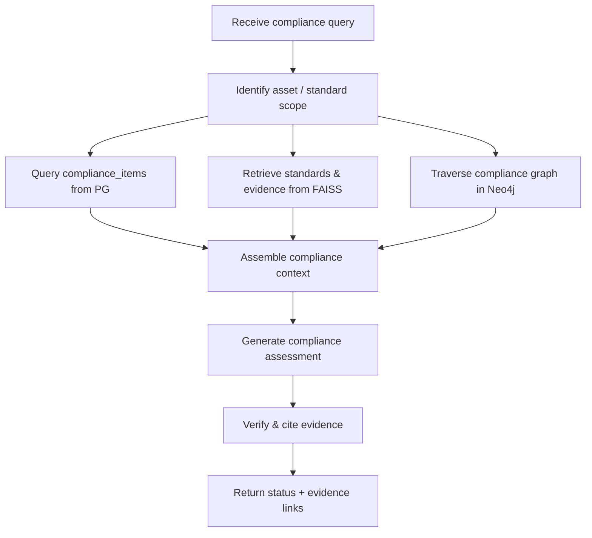
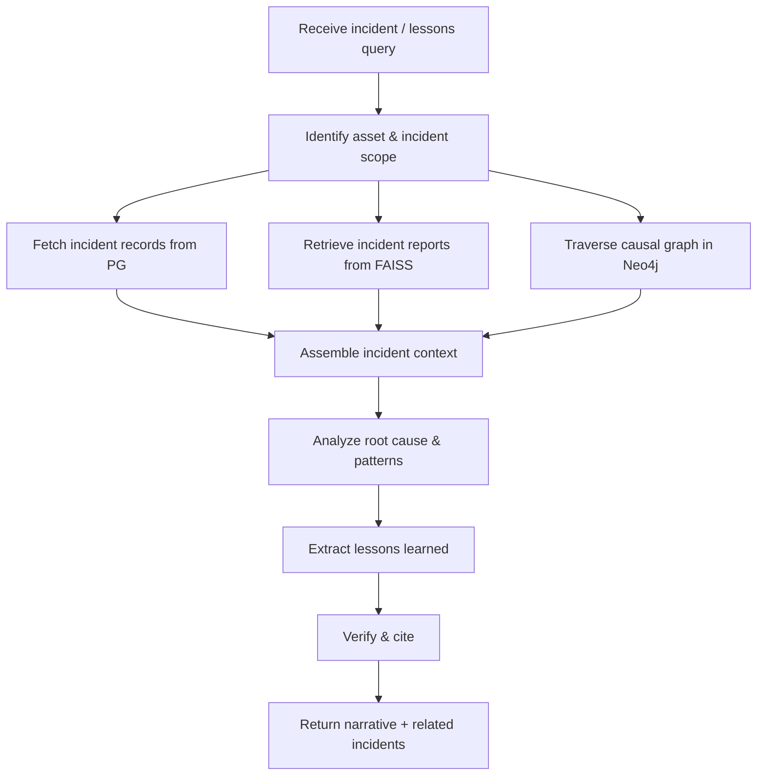
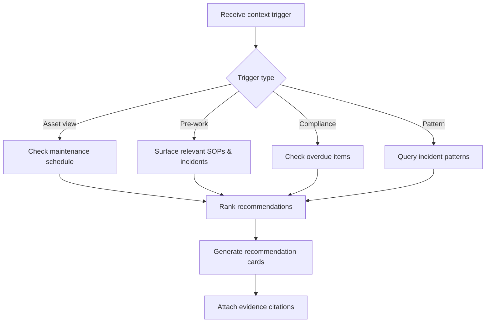
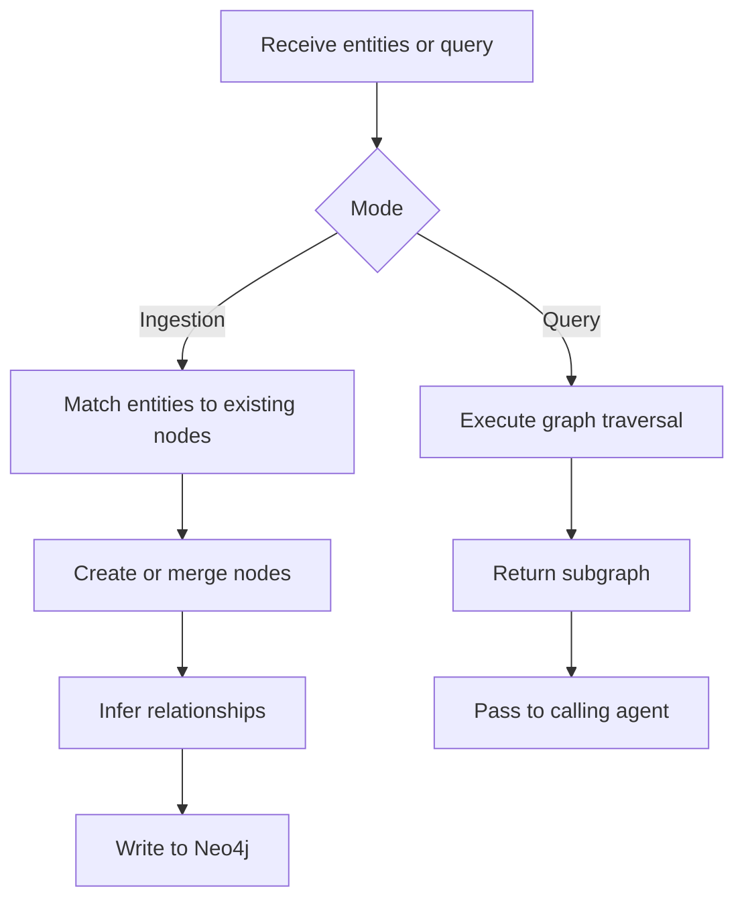
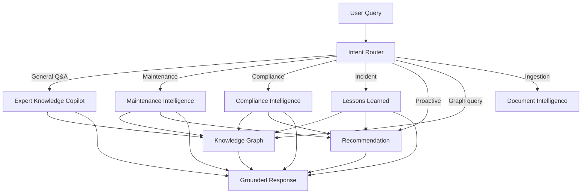

# TRACE — Agent Architecture

### Technical Records & Asset Compliance Engine · Problem Statement 8

---

## Table of Contents

1. [Overview](#1-overview)
2. [Agent Framework](#2-agent-framework)
3. [Document Intelligence Agent](#3-document-intelligence-agent)
4. [Expert Knowledge Copilot](#4-expert-knowledge-copilot)
5. [Maintenance Intelligence Agent](#5-maintenance-intelligence-agent)
6. [Compliance Intelligence Agent](#6-compliance-intelligence-agent)
7. [Lessons Learned Agent](#7-lessons-learned-agent)
8. [Recommendation Agent](#8-recommendation-agent)
9. [Knowledge Graph Agent](#9-knowledge-graph-agent)
10. [Agent Orchestration](#10-agent-orchestration)
11. [References](#11-references)

---

## 1. Overview

TRACE agents are **specialized, goal-directed reasoning units** orchestrated by LangGraph.
Each agent owns a domain of industrial knowledge and follows a structured workflow: plan →
retrieve → reason → verify → respond. Agents do not chat — they **operate**.

| Agent | Domain |
| --- | --- |
| Document Intelligence | Parse, classify, extract from documents |
| Expert Knowledge Copilot | General industrial Q&A with citations |
| Maintenance Intelligence | Maintenance history, procedures, schedules |
| Compliance Intelligence | Standards, requirements, audit evidence |
| Lessons Learned | Incident analysis, root cause, prevention |
| Recommendation | Proactive suggestions based on context |
| Knowledge Graph | Entity linking, relationship traversal |

---

## 2. Agent Framework

All agents share a common LangGraph state machine:

| State field | Type | Description |
| --- | --- | --- |
| query | string | Original user question |
| plan | list | Decomposed sub-tasks |
| retrieved_context | list | Chunks + graph facts |
| reasoning | string | Agent's working analysis |
| answer | string | Final synthesized response |
| citations | list | Source chunk IDs + scores |
| confidence | float | 0.0 – 1.0 |
| status | enum | planning, retrieving, reasoning, verified, declined |

---

## 3. Document Intelligence Agent

### Purpose

Classify, parse, and extract structured knowledge from uploaded industrial documents during
ingestion. This agent runs in the **ingestion pipeline**, not at query time.

### Inputs

| Input | Source |
| --- | --- |
| Raw document file | Object store |
| Document metadata | Upload request (title, type, source) |
| OCR output | OCR engine |
| Parsed structure | Document parsers |

### Outputs

| Output | Destination |
| --- | --- |
| Document classification | PostgreSQL `documents.doc_type` |
| Extracted text & tables | PostgreSQL `chunks` |
| Equipment tags & entities | Neo4j nodes + PostgreSQL |
| Document-asset links | PostgreSQL `document_assets` |
| Ingestion status | PostgreSQL `ingestion_jobs` |

### Workflow

### Prompt

> You are the Document Intelligence Agent for TRACE. Given the extracted text and metadata
> of an industrial document, classify its type (drawing, P&ID, SOP, log, report, manual,
> etc.), identify all equipment tags and asset references, extract key entities (people,
> dates, locations, standards), and produce structured metadata. Output JSON only.

### Memory

| Type | Content |
| --- | --- |
| Working | Current document being processed |
| Reference | Known asset tag patterns for the facility |
| Persistent | Ingestion job state in PostgreSQL |

### Failure Recovery

| Failure | Recovery |
| --- | --- |
| OCR failure | Retry with alternate OCR engine; flag for manual review |
| Classification uncertain | Default to `unknown`; queue for admin review |
| Entity extraction incomplete | Partial extraction; mark job as `partial` |
| Embedding failure | Retry batch; skip chunk if persistent failure |

### Tools

| Tool | Function |
| --- | --- |
| `classify_document` | Determine document type |
| `extract_entities` | Pull tags, names, dates, standards |
| `extract_tables` | Parse tabular data |
| `create_chunks` | Semantic chunking |
| `generate_embeddings` | Sentence Transformer encoding |
| `upsert_graph_nodes` | Write entities to Neo4j |

---

## 4. Expert Knowledge Copilot

### Purpose

The primary user-facing agent. Answers natural-language questions about any industrial
topic by retrieving evidence across the full knowledge base and synthesizing grounded,
cited responses.

### Inputs

| Input | Source |
| --- | --- |
| User question | Copilot UI |
| Conversation history | Session memory |
| Active asset context | UI navigation state |
| User role | Auth token |

### Outputs

| Output | Destination |
| --- | --- |
| Grounded answer | Copilot UI (streamed) |
| Citations | Message record in PostgreSQL |
| Confidence score | UI badge |
| Follow-up suggestions | UI chips |

### Workflow

### Prompt

> You are the Expert Knowledge Copilot for TRACE, an industrial knowledge platform. Answer
> the user's question using ONLY the provided context. Cite every factual claim with the
> source chunk ID. If the context is insufficient, say so explicitly. Use industrial
> terminology. Output structured JSON with fields: answer, citations, confidence, follow_ups.

### Memory

| Type | Content |
| --- | --- |
| Session | Current conversation turns |
| Asset context | Active asset tag if user is viewing an asset |
| Persistent | Full conversation history in PostgreSQL |

### Failure Recovery

| Failure | Recovery |
| --- | --- |
| No retrieval results | Decline with "insufficient evidence" message |
| Low confidence after verify | Decline or present partial results with caveat |
| LLM timeout | Retry once; return cached partial if available |
| Streaming interruption | Resume from last token |

### Tools

| Tool | Function |
| --- | --- |
| `vector_search` | FAISS similarity retrieval |
| `graph_search` | Neo4j relationship traversal |
| `metadata_filter` | PostgreSQL structured queries |
| `rerank_results` | Cross-encoder relevance scoring |
| `verify_claims` | Check answer against sources |
| `compute_confidence` | Calculate confidence score |

---

## 5. Maintenance Intelligence Agent

### Purpose

Specialized agent for maintenance-related queries: procedures, history, schedules, parts,
and technician notes for specific assets.

### Inputs

| Input | Source |
| --- | --- |
| Asset tag / ID | User query or UI context |
| Maintenance question | Copilot UI |
| Maintenance records | PostgreSQL `maintenance_records` |
| Related SOPs & manuals | FAISS + Neo4j |

### Outputs

| Output | Destination |
| --- | --- |
| Maintenance procedure steps | Copilot UI |
| Historical maintenance timeline | Asset detail view |
| Recommended actions | Recommendation Agent (optional) |
| Source citations | Message record |

### Workflow

### Prompt

> You are the Maintenance Intelligence Agent for TRACE. Given an asset tag and maintenance
> question, retrieve all relevant maintenance records, SOPs, and OEM manual sections.
> Provide step-by-step procedures where applicable. Include maintenance history timeline.
> Cite all sources. Output JSON.

### Memory

| Type | Content |
| --- | --- |
| Working | Current asset and query |
| Reference | Asset maintenance schedule patterns |
| Persistent | Maintenance records in PostgreSQL |

### Failure Recovery

| Failure | Recovery |
| --- | --- |
| Asset tag not found | Suggest similar tags from graph |
| No maintenance records | Return available SOPs/manuals only |
| Conflicting procedures | Present all versions with dates; flag conflict |

### Tools

| Tool | Function |
| --- | --- |
| `resolve_asset` | Lookup asset by tag |
| `fetch_maintenance_history` | Query maintenance_records |
| `retrieve_sops` | FAISS search for procedures |
| `fetch_graph_neighbors` | Neo4j asset relationships |
| `build_timeline` | Chronological maintenance view |

---

## 6. Compliance Intelligence Agent

### Purpose

Answers compliance-related questions: applicable standards, requirement status, audit
evidence, and overdue items for assets and processes.

### Inputs

| Input | Source |
| --- | --- |
| Compliance question | Copilot UI or Compliance dashboard |
| Asset / process context | UI or query |
| Compliance items | PostgreSQL `compliance_items` |
| Standards | PostgreSQL `compliance_standards` |
| Evidence documents | FAISS + Neo4j |

### Outputs

| Output | Destination |
| --- | --- |
| Compliance status summary | Compliance dashboard / Copilot |
| Applicable standards list | UI |
| Evidence links | Citations |
| Overdue / non-compliant alerts | Dashboard alerts |

### Workflow

### Prompt

> You are the Compliance Intelligence Agent for TRACE. Given a compliance question, identify
> applicable standards, check compliance status for the specified asset or process, and
> provide evidence from ingested documents. Flag any non-compliant or overdue items.
> Cite all evidence. Output JSON.

### Memory

| Type | Content |
| --- | --- |
| Working | Current compliance scope |
| Reference | Known standards catalog |
| Persistent | Compliance items and audit logs |

### Failure Recovery

| Failure | Recovery |
| --- | --- |
| Standard not in system | Suggest uploading relevant standard document |
| Missing evidence | Flag item as `pending`; recommend document upload |
| Conflicting compliance status | Present both statuses with source dates |

### Tools

| Tool | Function |
| --- | --- |
| `query_compliance_items` | PostgreSQL compliance queries |
| `fetch_standards` | Standards catalog lookup |
| `retrieve_evidence` | FAISS search for evidence docs |
| `traverse_compliance_graph` | Neo4j compliance relationships |
| `check_overdue` | Date-based overdue detection |

---

## 7. Lessons Learned Agent

### Purpose

Analyzes incident history, root causes, and corrective actions to extract **lessons learned**
and prevent recurrence. Surfaces relevant past incidents when users ask about procedures or
assets.

### Inputs

| Input | Source |
| --- | --- |
| Incident-related question | Copilot UI |
| Asset / procedure context | Query or UI |
| Incident records | PostgreSQL `incidents` |
| Incident reports | FAISS |
| Causal graph | Neo4j |

### Outputs

| Output | Destination |
| --- | --- |
| Incident summary & root cause | Copilot UI |
| Lessons learned narrative | Copilot UI |
| Related incidents list | Asset detail / Copilot |
| Preventive recommendations | Recommendation Agent |

### Workflow

### Prompt

> You are the Lessons Learned Agent for TRACE. Given an incident-related question, retrieve
> all relevant incident records and reports. Analyze root causes, identify patterns across
> similar incidents, and extract actionable lessons learned. Cite all sources. Output JSON
> with fields: summary, root_cause, lessons, related_incidents, citations.

### Memory

| Type | Content |
| --- | --- |
| Working | Current incident scope |
| Reference | Known incident patterns for facility |
| Persistent | Incident records and causal graph |

### Failure Recovery

| Failure | Recovery |
| --- | --- |
| No incidents found | Return "no recorded incidents" with related near-misses if any |
| Incomplete root cause data | Present available analysis; flag gaps |
| Pattern detection uncertain | Present individual incidents without pattern claim |

### Tools

| Tool | Function |
| --- | --- |
| `fetch_incidents` | Query incident records |
| `retrieve_incident_reports` | FAISS search |
| `traverse_causal_graph` | Neo4j cause-effect traversal |
| `detect_patterns` | Cross-incident similarity analysis |
| `extract_lessons` | LLM-based lesson extraction |

---

## 8. Recommendation Agent

### Purpose

Proactively suggests actions based on context: upcoming maintenance, compliance gaps,
relevant procedures before work, and preventive measures from incident history.

### Inputs

| Input | Source |
| --- | --- |
| Current user context | Active asset, page, role |
| Maintenance schedule | PostgreSQL |
| Compliance status | PostgreSQL |
| Incident patterns | Neo4j + Lessons Learned Agent |
| User query (optional) | Copilot UI |

### Outputs

| Output | Destination |
| --- | --- |
| Proactive recommendations | Dashboard alerts, Copilot suggestions |
| Priority-ranked action list | UI cards |
| Supporting evidence | Citations |

### Workflow

### Prompt

> You are the Recommendation Agent for TRACE. Based on the provided context (asset, role,
> maintenance schedule, compliance status, incident history), generate prioritized
> recommendations. Each recommendation must include: action, rationale, priority (high/medium/low),
> and supporting evidence citations. Output JSON array.

### Memory

| Type | Content |
| --- | --- |
| Working | Current context snapshot |
| Reference | Recommendation templates by role |
| Persistent | Recommendation history (avoid repeats) |

### Failure Recovery

| Failure | Recovery |
| --- | --- |
| No actionable context | Return empty recommendations gracefully |
| Stale schedule data | Flag data freshness; recommend refresh |
| Conflicting recommendations | Present all with priority ranking |

### Tools

| Tool | Function |
| --- | --- |
| `check_maintenance_schedule` | Upcoming/overdue maintenance |
| `check_compliance_gaps` | Non-compliant / pending items |
| `surface_relevant_sops` | Pre-work procedure lookup |
| `query_incident_patterns` | Recent similar incidents |
| `rank_recommendations` | Priority scoring |

---

## 9. Knowledge Graph Agent

### Purpose

Manages entity extraction, relationship discovery, and graph traversal. Runs during ingestion
(entity linking) and at query time (relationship-aware retrieval).

### Inputs

| Input | Source |
| --- | --- |
| Extracted entities | Document Intelligence Agent |
| Existing graph | Neo4j |
| Traversal query | Other agents or direct UI |
| Document text | Parsed chunks |

### Outputs

| Output | Destination |
| --- | --- |
| New/updated nodes | Neo4j |
| New/updated relationships | Neo4j |
| Graph traversal results | Calling agent |
| Entity disambiguation | PostgreSQL + Neo4j |

### Workflow

### Prompt

> You are the Knowledge Graph Agent for TRACE. Given extracted entities from a document,
> match them to existing graph nodes (assets, standards, procedures) or create new nodes.
> Infer relationships (REFERENCES, GOVERNED_BY, HAD_INCIDENT, COMPLIES_WITH) based on
> document context. Output JSON with nodes and edges.

### Memory

| Type | Content |
| --- | --- |
| Working | Current entity batch or traversal state |
| Reference | Full Neo4j graph (queried on demand) |
| Persistent | Neo4j graph store |

### Failure Recovery

| Failure | Recovery |
| --- | --- |
| Entity ambiguity | Create provisional node; flag for admin merge |
| Relationship inference uncertain | Create with low confidence; mark for review |
| Graph write failure | Retry with backoff; queue for batch retry |
| Traversal timeout | Return partial subgraph with depth limit |

### Tools

| Tool | Function |
| --- | --- |
| `match_entity` | Fuzzy match to existing nodes |
| `create_node` | Add new graph node |
| `create_relationship` | Add edge between nodes |
| `traverse_graph` | Multi-hop Cypher query |
| `merge_duplicates` | Deduplicate similar nodes |
| `get_neighborhood` | Asset-centric subgraph |

---

## 10. Agent Orchestration

| Orchestration rule | Description |
| --- | --- |
| Intent routing | Classify query → dispatch to specialist agent |
| Agent collaboration | Agents can invoke Knowledge Graph Agent and each other |
| Shared verification | All agents pass through grounding verification |
| Unified output | All agents produce same JSON schema (answer, citations, confidence) |
| Decline protocol | Any agent can decline; router does not override |

---

## 11. References

- [`08_AI_ARCHITECTURE.md`](08_AI_ARCHITECTURE.md)
- [`10_RAG_PIPELINE.md`](10_RAG_PIPELINE.md)
- [`11_KNOWLEDGE_GRAPH.md`](11_KNOWLEDGE_GRAPH.md)
- [`12_DOCUMENT_PIPELINE.md`](12_DOCUMENT_PIPELINE.md)
- LangGraph — https://langchain-ai.github.io/langgraph/
- LangChain — https://python.langchain.com/
