# TRACE — RAG Pipeline

### Technical Records & Asset Compliance Engine · Problem Statement 8

---

## Table of Contents

1. [Overview](#1-overview)
2. [Pipeline Stages](#2-pipeline-stages)
3. [Upload](#3-upload)
4. [OCR](#4-ocr)
5. [Cleaning](#5-cleaning)
6. [Chunking](#6-chunking)
7. [Metadata](#7-metadata)
8. [Embeddings](#8-embeddings)
9. [Retrieval](#9-retrieval)
10. [Prompt Construction](#10-prompt-construction)
11. [Answer Generation](#11-answer-generation)
12. [Source Citation](#12-source-citation)
13. [End-to-End Flow](#13-end-to-end-flow)
14. [References](#14-references)

---

## 1. Overview

The RAG (Retrieval-Augmented Generation) pipeline is the **core intelligence loop** of TRACE.
It transforms raw industrial documents into searchable, retrievable knowledge and uses that
knowledge to generate **grounded, cited answers** — never free-form LLM responses.

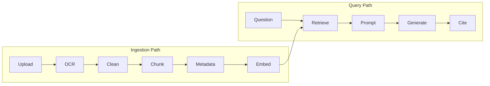

| Path | Trigger | Outcome |
| --- | --- | --- |
| Ingestion | Document upload | Indexed, searchable knowledge |
| Query | User question | Grounded answer with citations |

---

## 2. Pipeline Stages

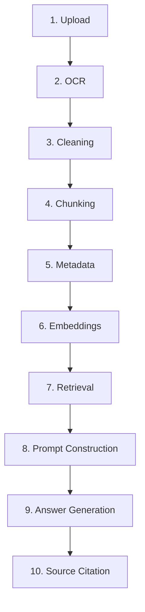

| Stage | Phase | Store Updated |
| --- | --- | --- |
| Upload | Ingestion | Object Store, PostgreSQL |
| OCR | Ingestion | — |
| Cleaning | Ingestion | — |
| Chunking | Ingestion | PostgreSQL `chunks` |
| Metadata | Ingestion | PostgreSQL, Neo4j |
| Embeddings | Ingestion | FAISS |
| Retrieval | Query | — |
| Prompt Construction | Query | — |
| Answer Generation | Query | PostgreSQL `messages` |
| Source Citation | Query | PostgreSQL `citations` |

---

## 3. Upload

Documents enter TRACE through the upload interface or batch ingestion API.


| Aspect | Specification |
| --- | --- |
| Supported formats | PDF, PNG, JPG, TIFF, XLSX, CSV, EML, MSG, DWG (export) |
| Max file size | Configurable (default 100 MB) |
| Batch upload | Folder/zip ingestion supported |
| Validation | MIME type check, virus scan, duplicate detection (checksum) |
| Storage | S3-compatible object store; URI stored in PostgreSQL |
| Job tracking | `ingestion_jobs` table with status progression |

| Document type | Detection method |
| --- | --- |
| PDF (native) | MIME + text layer presence |
| PDF (scanned) | MIME + no text layer → OCR route |
| Image | MIME type |
| Excel | MIME + extension |
| Email | MIME (.eml, .msg) |
| Drawing/P&ID | Filename pattern + content heuristics |

---

## 4. OCR

Optical Character Recognition converts scanned documents and images into machine-readable text.

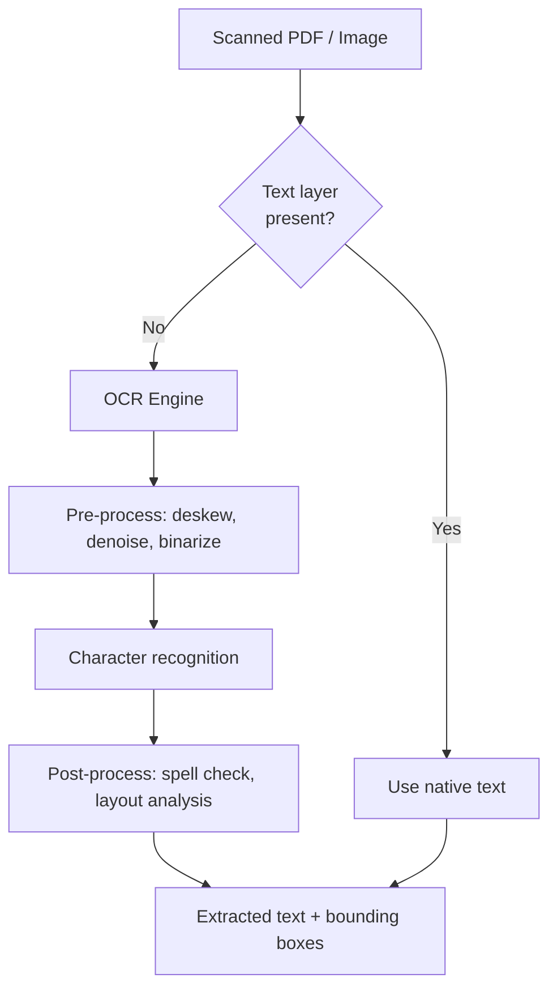

| Aspect | Specification |
| --- | --- |
| Engine | Tesseract / PaddleOCR / cloud OCR (configurable) |
| Pre-processing | Deskew, denoise, contrast enhancement |
| Layout analysis | Detect columns, tables, headers |
| Output | Text + page-level bounding boxes |
| Handwriting | Best-effort; flagged as low-confidence |
| Languages | English primary; multi-language configurable |

| Input type | OCR strategy |
| --- | --- |
| Scanned PDF | Page-by-page OCR |
| Photograph | Full image OCR |
| Engineering drawing | OCR for tags/labels; diagram extraction separate |
| Handwritten log | OCR with low-confidence flag |

---

## 5. Cleaning

Raw extracted text is cleaned and normalized before chunking.

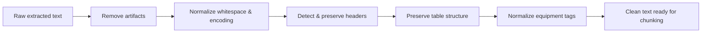

| Cleaning step | Action |
| --- | --- |
| Artifact removal | Strip OCR noise, page numbers, watermarks |
| Whitespace normalization | Collapse multiple spaces/newlines |
| Encoding fix | UTF-8 normalization, special character handling |
| Header detection | Identify section headers for chunk boundaries |
| Table preservation | Keep table structure as markdown/structured text |
| Tag normalization | Standardize equipment tags (e.g. `P-101`, `P101` → `P-101`) |
| Boilerplate removal | Remove repeated headers/footers across pages |

| Rule | Rationale |
| --- | --- |
| Preserve structure | Headers and tables carry semantic meaning |
| Normalize tags | Enable consistent asset linking |
| Don't over-clean | Industrial docs have meaningful formatting |

---

## 6. Chunking

Documents are split into **semantic chunks** optimized for retrieval — not arbitrary
fixed-size splits.

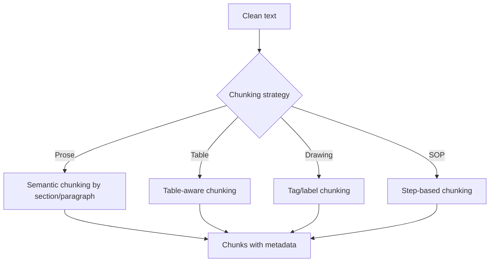

| Strategy | Applied to | Chunk boundary |
| --- | --- | --- |
| Semantic | SOPs, manuals, reports | Section headers, paragraphs |
| Table-aware | Inspection logs, Excel | Row groups, table sections |
| Tag-based | P&IDs, drawings | Equipment tag + surrounding context |
| Step-based | Procedures | Individual steps or step groups |
| Page-based | Fallback for unstructured | Page boundaries |

| Parameter | Value |
| --- | --- |
| Target chunk size | 256–512 tokens |
| Overlap | 50–100 tokens between adjacent chunks |
| Min chunk size | 50 tokens (merge tiny fragments) |
| Max chunk size | 1024 tokens (split large sections) |

| Chunk metadata | Stored in |
| --- | --- |
| chunk_index | PostgreSQL `chunks.chunk_index` |
| page_no | PostgreSQL `chunks.page_no` |
| section_title | PostgreSQL `chunks.metadata` (JSONB) |
| source_document_id | PostgreSQL `chunks.document_version_id` |
| equipment_tags | PostgreSQL `chunks.metadata` + Neo4j links |

---

## 7. Metadata

Rich metadata is attached to every chunk and document for filtering, linking, and provenance.

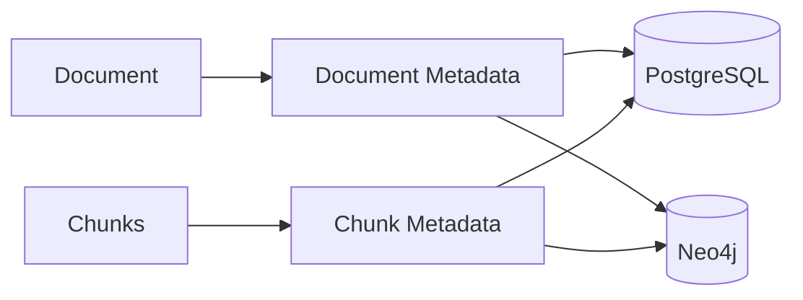

### Document-level metadata

| Field | Example | Store |
| --- | --- | --- |
| title | "Pump P-101 Maintenance SOP" | PostgreSQL |
| doc_type | sop | PostgreSQL |
| source | "Shared Drive / Maintenance" | PostgreSQL |
| uploaded_by | user UUID | PostgreSQL |
| created_date | 2024-03-15 | PostgreSQL |
| asset_tags | ["P-101"] | PostgreSQL + Neo4j |
| standards | ["ISO-55000"] | Neo4j |

### Chunk-level metadata

| Field | Example | Store |
| --- | --- | --- |
| page_no | 3 | PostgreSQL |
| section | "Safety Precautions" | PostgreSQL JSONB |
| equipment_tags | ["P-101", "V-203"] | PostgreSQL JSONB |
| bbox | {x, y, w, h} | PostgreSQL JSONB |
| confidence | 0.95 (OCR) | PostgreSQL JSONB |

---

## 8. Embeddings

Each chunk is converted to a dense vector for semantic search.

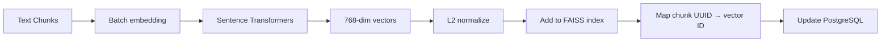

| Aspect | Specification |
| --- | --- |
| Model | Sentence Transformers (domain-tuned preferred) |
| Input | Chunk text (cleaned, with section context prepended) |
| Output | Fixed-dimension vector (384 or 768) |
| Normalization | L2-normalized for cosine similarity |
| Batch size | 32–128 chunks per batch |
| Index update | Incremental add to FAISS on ingestion |
| Caching | Content-hash keyed; skip re-embedding identical text |

| Embedding input format | Example |
| --- | --- |
| With context | `"[SOP: Pump Maintenance] Safety Precautions: Before starting..."` |
| Bare chunk | Used only when no section context available |

---

## 9. Retrieval

At query time, the retriever finds the most relevant chunks using hybrid search.

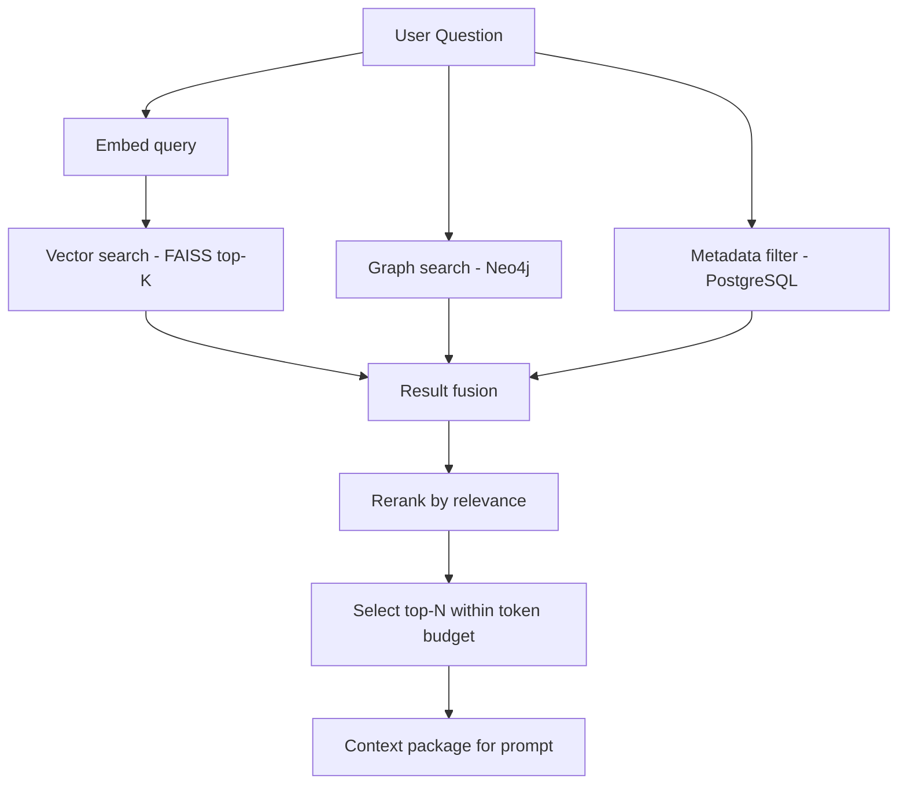

| Step | Detail |
| --- | --- |
| Query embedding | Same Sentence Transformer model as ingestion |
| Vector search | FAISS top-K (K=20–50) by cosine similarity |
| Graph search | Neo4j traversal for asset-linked documents |
| Metadata filter | Pre-filter by doc_type, asset, date range |
| Fusion | Merge results, deduplicate overlapping chunks |
| Reranking | Cross-encoder or LLM-based relevance scoring |
| Selection | Top-N (5–10) chunks within LLM context window |

| Retrieval mode | When used |
| --- | --- |
| Pure semantic | General knowledge questions |
| Asset-scoped | User is viewing a specific asset |
| Graph-augmented | Questions about relationships/incidents |
| Metadata-filtered | "All inspection reports from 2024" |
| Hybrid | Complex multi-faceted questions |

---

## 10. Prompt Construction

Retrieved context is assembled into a structured prompt for the LLM.

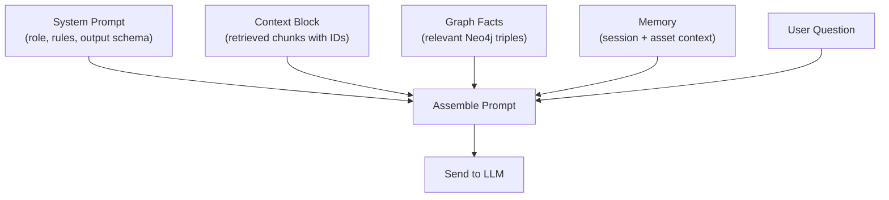

### Prompt template structure

| Block | Content | Token budget |
| --- | --- | --- |
| System | Agent role, constraints, JSON output schema | ~500 tokens |
| Context | Retrieved chunks with `[chunk_id]` prefixes | ~3000 tokens |
| Graph facts | Relevant triples (asset → procedure → standard) | ~500 tokens |
| Memory | Last 3 conversation turns | ~500 tokens |
| User | The question | ~200 tokens |

### Context block format

Each retrieved chunk is formatted as:

```
[chunk_id: <UUID>] [source: <doc_title>, page <N>]
<chunk_text>
---
```

This format enables the LLM to cite specific chunk IDs in its response.

---

## 11. Answer Generation

The LLM generates a structured answer from the assembled prompt.

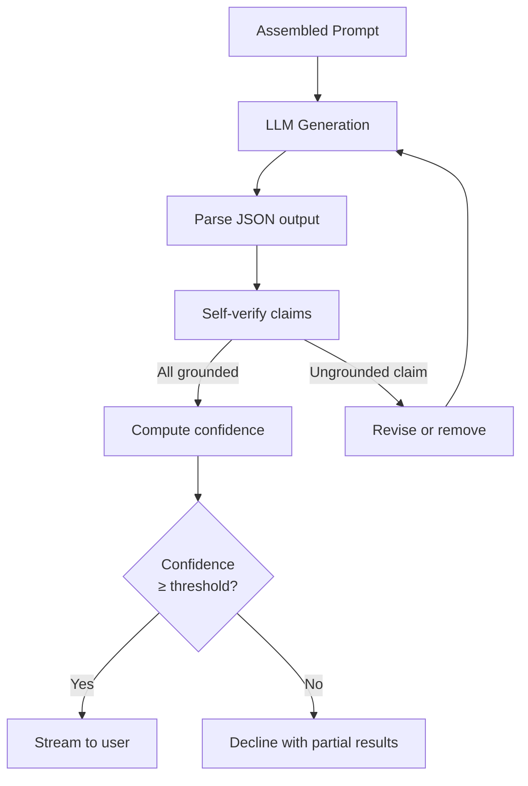

| Output field | Type | Description |
| --- | --- | --- |
| answer | string | The synthesized response |
| citations | array | [{chunk_id, relevance_score}] |
| confidence | float | 0.0 – 1.0 |
| follow_ups | array | Suggested follow-up questions |
| status | enum | answered, partial, declined |

| Generation rule | Enforcement |
| --- | --- |
| Context-only | System prompt forbids external knowledge |
| Cite everything | Output schema requires citations array |
| Decline when weak | Explicit instruction + confidence gating |
| Stream tokens | SSE for responsive Copilot UX |
| Low temperature | 0.1–0.3 for factual accuracy |

---

## 12. Source Citation

Every factual claim in the answer is linked back to its source document and page.

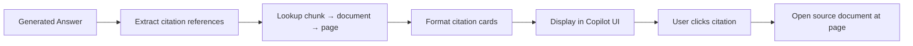

| Citation element | Source | Display |
| --- | --- | --- |
| Document title | PostgreSQL `documents.title` | Citation card header |
| Page number | PostgreSQL `chunks.page_no` | "Page 3" |
| Relevance score | Retrieval score | Hidden / tooltip |
| Snippet | Chunk text (truncated) | Preview in citation card |
| Deep link | Document URI + page anchor | Opens document viewer |

| Citation rule | Description |
| --- | --- |
| Mandatory | Every factual claim must have ≥1 citation |
| Multiple sources | Cross-document claims cite all sources |
| No orphan claims | Claims without citations are removed |
| Persisted | Citations stored in PostgreSQL `citations` table |
| Auditable | Full citation chain available for compliance review |

---

## 13. End-to-End Flow

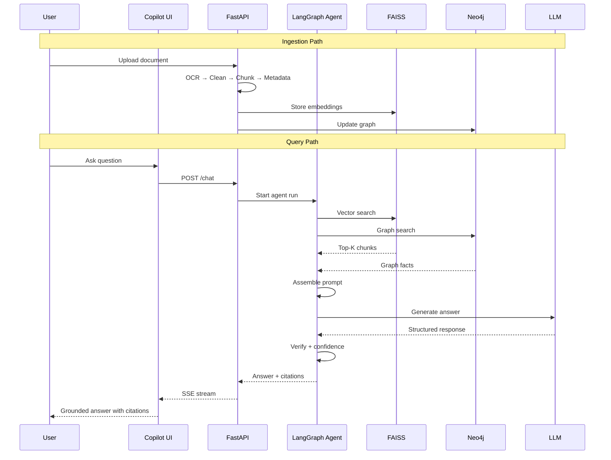

---

## 14. References

- [`08_AI_ARCHITECTURE.md`](08_AI_ARCHITECTURE.md)
- [`09_AGENT_ARCHITECTURE.md`](09_AGENT_ARCHITECTURE.md)
- [`11_KNOWLEDGE_GRAPH.md`](11_KNOWLEDGE_GRAPH.md)
- [`12_DOCUMENT_PIPELINE.md`](12_DOCUMENT_PIPELINE.md)
- Lewis, P. et al. *Retrieval-Augmented Generation for Knowledge-Intensive NLP Tasks*, NeurIPS 2020.
- Sentence Transformers — https://www.sbert.net/
- FAISS — https://faiss.ai/
