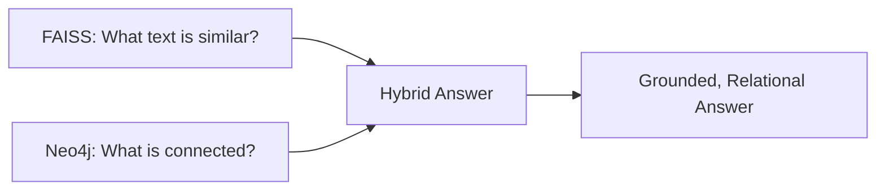
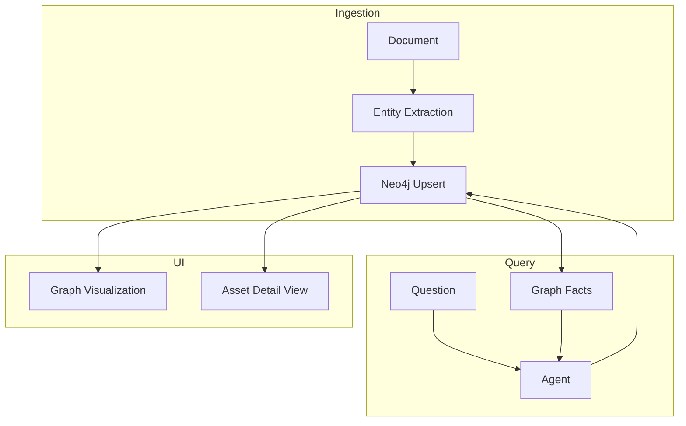
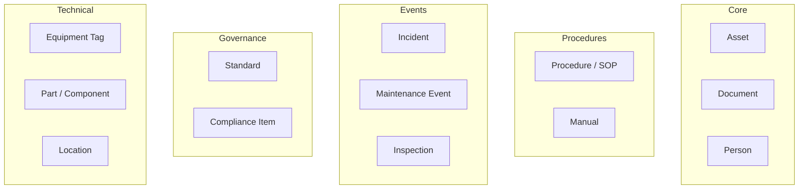
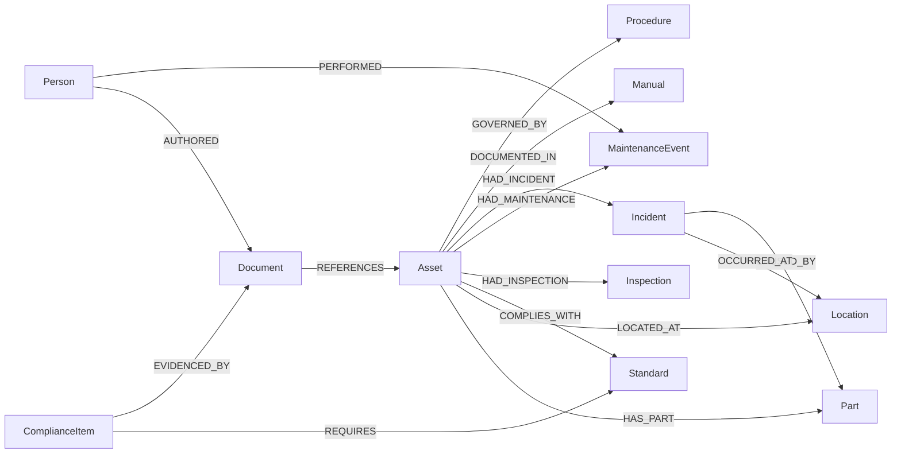
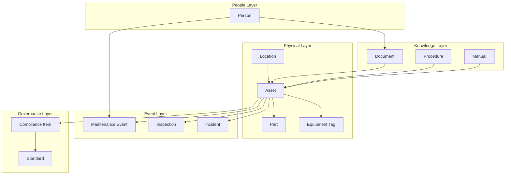
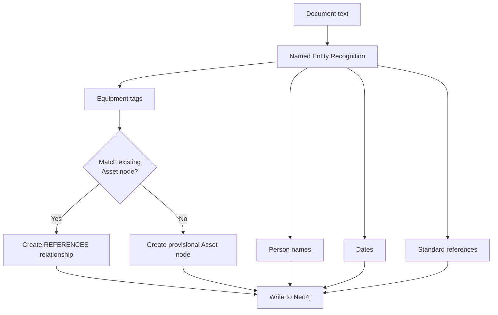
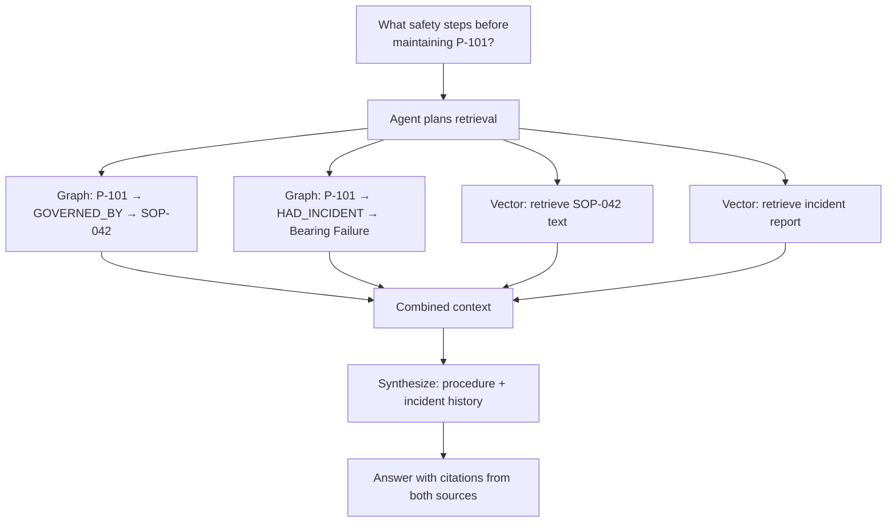
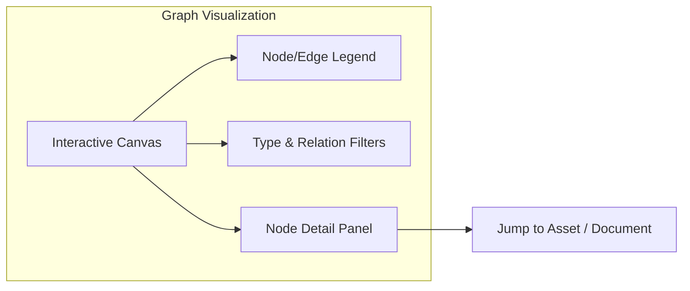
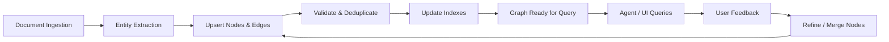

# TRACE — Knowledge Graph Architecture (Neo4j)

### Technical Records & Asset Compliance Engine · Problem Statement 8

---

## Table of Contents

1. [Overview](#1-overview)
2. [Graph Role in TRACE](#2-graph-role-in-trace)
3. [Nodes](#3-nodes)
4. [Relationships](#4-relationships)
5. [Ontology](#5-ontology)
6. [Cypher Queries](#6-cypher-queries)
7. [Entity Extraction](#7-entity-extraction)
8. [Reasoning](#8-reasoning)
9. [Visualization](#9-visualization)
10. [Graph Lifecycle](#10-graph-lifecycle)
11. [References](#11-references)

---

## 1. Overview

The Neo4j knowledge graph is TRACE's **relationship engine**. While FAISS handles semantic
similarity ("find text like this"), the graph handles structural reasoning ("what is connected
to P-101, and how?"). Together they enable TRACE to answer questions that no single document
can answer alone.



| Capability | Vector (FAISS) | Graph (Neo4j) |
| --- | --- | --- |
| Semantic similarity | Yes | No |
| Relationship traversal | No | Yes |
| Multi-hop reasoning | No | Yes |
| Asset-centric views | Limited | Native |
| Compliance linking | No | Yes |
| Incident causality | No | Yes |

---

## 2. Graph Role in TRACE



| Use case | Graph operation |
| --- | --- |
| "What SOPs govern P-101?" | Traverse GOVERNED_BY from Asset |
| "What incidents involved P-101?" | Traverse HAD_INCIDENT from Asset |
| "What assets comply with ISO-55000?" | Reverse traverse COMPLIES_WITH |
| "What caused the bearing failure?" | Multi-hop CAUSE → EFFECT |
| Asset detail page | Neighborhood subgraph |

---

## 3. Nodes

Every entity in the industrial domain is a **node** with a label, properties, and a stable UUID
(shared with PostgreSQL).



### Node specifications

| Label | Key properties | Example |
| --- | --- | --- |
| `Asset` | id, tag, name, type, status, location | P-101, Centrifugal Pump |
| `Document` | id, title, doc_type, source | "Pump Maintenance SOP" |
| `Procedure` | id, name, version, steps_count | "SOP-042: Pump Maintenance" |
| `Manual` | id, title, manufacturer, model | "Grundfos CR Manual" |
| `Incident` | id, date, severity, summary | "Bearing failure 2024-03" |
| `MaintenanceEvent` | id, date, description, technician | "2024-01-15: Bearing replaced" |
| `Inspection` | id, date, result, inspector | "2024-06: Annual inspection" |
| `Standard` | id, code, title | "ISO-55000" |
| `ComplianceItem` | id, requirement, status, due_date | "Annual inspection due" |
| `EquipmentTag` | id, tag, normalized_tag | "P-101" |
| `Part` | id, name, part_number | "Bearing SKF 6205" |
| `Location` | id, name, area, unit | "Unit 3, Pump House" |
| `Person` | id, name, role | "John Smith, Technician" |

| Property rule | Description |
| --- | --- |
| `id` | UUID, shared with PostgreSQL |
| Labels | One primary label; optional secondary labels |
| Indexes | On `tag`, `id`, `code` for fast lookup |
| Constraints | UNIQUE on `id`, `tag` (Asset), `code` (Standard) |

---

## 4. Relationships

Relationships are **typed edges** with direction and optional properties.



### Relationship catalog

| Relationship | From → To | Properties | Meaning |
| --- | --- | --- | --- |
| `REFERENCES` | Document → Asset | page, confidence | Document mentions asset |
| `GOVERNED_BY` | Asset → Procedure | version, effective_date | Asset governed by SOP |
| `DOCUMENTED_IN` | Asset → Manual | section, page | Asset covered in manual |
| `HAD_INCIDENT` | Asset → Incident | date, severity | Asset involved in incident |
| `HAD_MAINTENANCE` | Asset → MaintenanceEvent | date | Maintenance performed |
| `HAD_INSPECTION` | Asset → Inspection | date, result | Inspection performed |
| `COMPLIES_WITH` | Asset → Standard | status, evidence_id | Compliance relationship |
| `LOCATED_AT` | Asset → Location | — | Physical location |
| `HAS_PART` | Asset → Part | quantity, critical | Component of asset |
| `CAUSED_BY` | Incident → Part/Event | confidence | Root cause |
| `OCCURRED_AT` | Incident → Location | — | Where incident happened |
| `EVIDENCED_BY` | ComplianceItem → Document | page | Evidence document |
| `REQUIRES` | ComplianceItem → Standard | — | Standard requirement |
| `PERFORMED` | Person → MaintenanceEvent | — | Who did the work |
| `AUTHORED` | Person → Document | — | Document author |
| `RELATED_TO` | Any → Any | type, confidence | Generic association |
| `SUPERSEDES` | Document → Document | date | Version chain |
| `SIMILAR_TO` | Asset → Asset | score | Similar assets |

---

## 5. Ontology

The TRACE ontology defines the **industrial domain model** — what entities exist and how
they relate.



| Layer | Entities | Purpose |
| --- | --- | --- |
| Physical | Location, Asset, Part, Tag | What exists in the facility |
| Knowledge | Document, Procedure, Manual | What is documented |
| Events | Maintenance, Inspection, Incident | What happened |
| Governance | Standard, ComplianceItem | What is required |
| People | Person | Who did what |

### Ontology rules

| Rule | Description |
| --- | --- |
| Every Asset has a unique tag | Enforced by constraint |
| Documents REFERENCE Assets | Extracted during ingestion |
| Incidents link to Assets and Locations | Required for root cause analysis |
| ComplianceItems link to Standards and Assets | Required for audit |
| Procedures GOVERN Assets | Extracted from SOPs |

---

## 6. Cypher Queries

Common Cypher patterns used by TRACE agents and the API.

### Asset neighborhood

```cypher
MATCH (a:Asset {tag: $tag})
OPTIONAL MATCH (a)-[r]-(connected)
RETURN a, r, connected
LIMIT 50
```

### SOPs governing an asset

```cypher
MATCH (a:Asset {tag: $tag})-[:GOVERNED_BY]->(s:Procedure)
RETURN s.name, s.version, s.id
ORDER BY s.version DESC
```

### Incident history for an asset

```cypher
MATCH (a:Asset {tag: $tag})-[:HAD_INCIDENT]->(i:Incident)
RETURN i.date, i.severity, i.summary
ORDER BY i.date DESC
```

### Compliance status

```cypher
MATCH (a:Asset {tag: $tag})-[:COMPLIES_WITH]->(s:Standard)
RETURN s.code, s.title, a.compliance_status
```

### Root cause chain

```cypher
MATCH path = (i:Incident)-[:CAUSED_BY*1..3]->(cause)
WHERE i.id = $incident_id
RETURN path
```

### Cross-asset incident pattern

```cypher
MATCH (i:Incident)-[:CAUSED_BY]->(cause:Part)
WITH cause, count(i) AS incident_count
WHERE incident_count > 1
RETURN cause.name, incident_count
ORDER BY incident_count DESC
```

| Query pattern | Used by |
| --- | --- |
| Asset neighborhood | Asset detail page, Graph Agent |
| SOP lookup | Maintenance Intelligence Agent |
| Incident history | Lessons Learned Agent |
| Compliance status | Compliance Intelligence Agent |
| Root cause chain | Lessons Learned Agent |
| Cross-asset patterns | Recommendation Agent |

---

## 7. Entity Extraction

Entities are extracted from documents during ingestion and linked to the graph.



| Extraction type | Method | Output |
| --- | --- | --- |
| Equipment tags | Regex + NER (P-101, V-203, T-501) | Asset nodes + REFERENCES |
| Person names | NER | Person nodes + AUTHORED/PERFORMED |
| Dates | Date parsing | Event node properties |
| Standard codes | Regex (ISO-*, ISA-*) | Standard nodes + COMPLIES_WITH |
| Procedure references | Pattern matching (SOP-*) | Procedure nodes + GOVERNED_BY |
| Locations | NER + facility dictionary | Location nodes + LOCATED_AT |

| Extraction rule | Description |
| --- | --- |
| Tag normalization | `P101` → `P-101` before matching |
| Fuzzy matching | Levenshtein distance for near-matches |
| Provisional nodes | Unknown entities created with `provisional: true` |
| Admin review | Provisional nodes queued for merge/confirm |
| Confidence scoring | Each extraction carries a confidence score |

---

## 8. Reasoning

Graph reasoning enables multi-hop inference that vector search cannot provide.



| Reasoning pattern | Graph operation | Example |
| --- | --- | --- |
| Direct lookup | Single-hop traverse | "SOPs for P-101" |
| Multi-hop | 2–3 hop traverse | "Root cause of incident" |
| Pattern detection | Aggregation query | "Assets with repeated bearing failures" |
| Path finding | Shortest path | "How is P-101 related to V-203?" |
| Subgraph extraction | Neighborhood query | Asset detail page |
| Inference | Rule-based on graph | "Non-compliant if no recent inspection" |

| Reasoning rule | Description |
| --- | --- |
| Graph facts supplement vectors | Never replace vector retrieval |
| Multi-hop limit | Max 3 hops to prevent explosion |
| Confidence from path length | Shorter paths = higher confidence |
| Temporal awareness | Prefer recent events/versions |

---

## 9. Visualization

The knowledge graph is visualized in the TRACE UI for exploration and asset intelligence.



| Visual element | Representation |
| --- | --- |
| Asset nodes | Blue circles, sized by connection count |
| Document nodes | Gray rectangles |
| Incident nodes | Red diamonds |
| Procedure nodes | Green hexagons |
| Standard nodes | Purple shields |
| Person nodes | Small orange circles |
| Location nodes | Brown squares |
| Edges | Colored by relationship type, labeled |

| Interaction | Behavior |
| --- | --- |
| Click node | Open detail panel with metadata |
| Double-click | Expand neighborhood (1-hop) |
| Drag | Reposition node |
| Scroll | Zoom in/out |
| Filter | Show/hide node types and edge types |
| Search | Highlight matching nodes |
| Export | Export subgraph as image/JSON |

| View mode | Scope |
| --- | --- |
| Asset neighborhood | All nodes within 2 hops of selected asset |
| Incident causal chain | Path from incident to root cause |
| Compliance map | Asset → Standard → Evidence |
| Facility overview | All assets in a location/unit |

---

## 10. Graph Lifecycle



| Lifecycle stage | Action |
| --- | --- |
| Creation | Entities extracted during document ingestion |
| Update | New documents add/update nodes and edges |
| Deduplication | Admin merges provisional/duplicate nodes |
| Validation | Constraint checks, orphan detection |
| Indexing | Index on tag, id, code for query performance |
| Archival | Decommissioned assets marked inactive, not deleted |
| Rebuild | Full graph rebuild from PostgreSQL if needed |

| Maintenance task | Frequency |
| --- | --- |
| Orphan node detection | Weekly |
| Duplicate merge review | On-demand (admin queue) |
| Index optimization | Monthly |
| Graph statistics refresh | Daily |
| Full consistency check | On major ingestion batch |

---

## 11. References

- [`08_AI_ARCHITECTURE.md`](08_AI_ARCHITECTURE.md)
- [`09_AGENT_ARCHITECTURE.md`](09_AGENT_ARCHITECTURE.md)
- [`10_RAG_PIPELINE.md`](10_RAG_PIPELINE.md)
- [`12_DOCUMENT_PIPELINE.md`](12_DOCUMENT_PIPELINE.md)
- [`04_DATABASE_ARCHITECTURE.md`](04_DATABASE_ARCHITECTURE.md)
- Neo4j Documentation — https://neo4j.com/docs/
- Cypher Query Language — https://neo4j.com/docs/cypher-manual/
- ISA-5.1 — Instrumentation Symbols and Identification.
- ISO 55000 — Asset Management.
