# TRACE — Document Pipeline

### Technical Records & Asset Compliance Engine · Problem Statement 8

---

## Table of Contents

1. [Overview](#1-overview)
2. [Pipeline Architecture](#2-pipeline-architecture)
3. [OCR](#3-ocr)
4. [PDF Parsing](#4-pdf-parsing)
5. [Table Extraction](#5-table-extraction)
6. [Image Extraction](#6-image-extraction)
7. [Diagram Extraction](#7-diagram-extraction)
8. [Metadata Extraction](#8-metadata-extraction)
9. [Entity Recognition](#9-entity-recognition)
10. [Knowledge Graph Update](#10-knowledge-graph-update)
11. [Embedding Generation](#11-embedding-generation)
12. [Pipeline Monitoring](#12-pipeline-monitoring)
13. [References](#13-references)

---

## 1. Overview

The document pipeline is TRACE's **ingestion engine** — the path from raw industrial files
to searchable, graph-linked, embedded knowledge. Every document type follows a specialized
route through the pipeline, but all converge on the same output: indexed chunks, graph entities,
and vector embeddings.

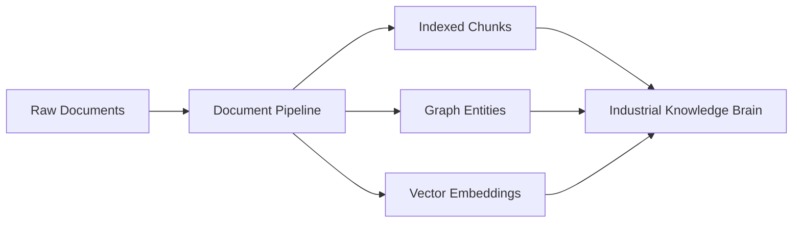

| Input | Output |
| --- | --- |
| PDFs, images, Excel, emails, drawings | Searchable chunks + graph nodes + vectors |

---

## 2. Pipeline Architecture

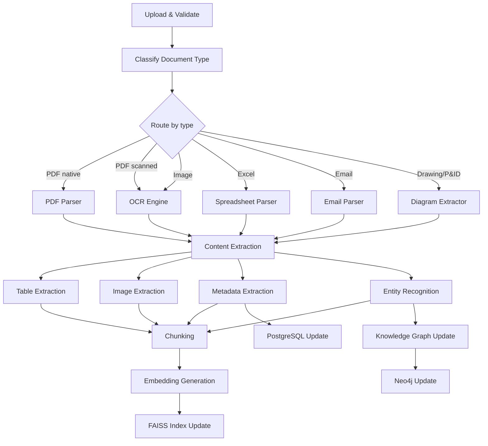

| Stage | Runs on | Output store |
| --- | --- | --- |
| Upload & validate | All types | Object Store, PostgreSQL |
| Classify & route | All types | PostgreSQL |
| Parse / OCR | Type-specific | — |
| Extract content | All types | — |
| Chunk | All types | PostgreSQL |
| Embed | All types | FAISS |
| Entity recognition | All types | Neo4j |
| Metadata | All types | PostgreSQL |

---

## 3. OCR

OCR is the entry point for any document without a native text layer.

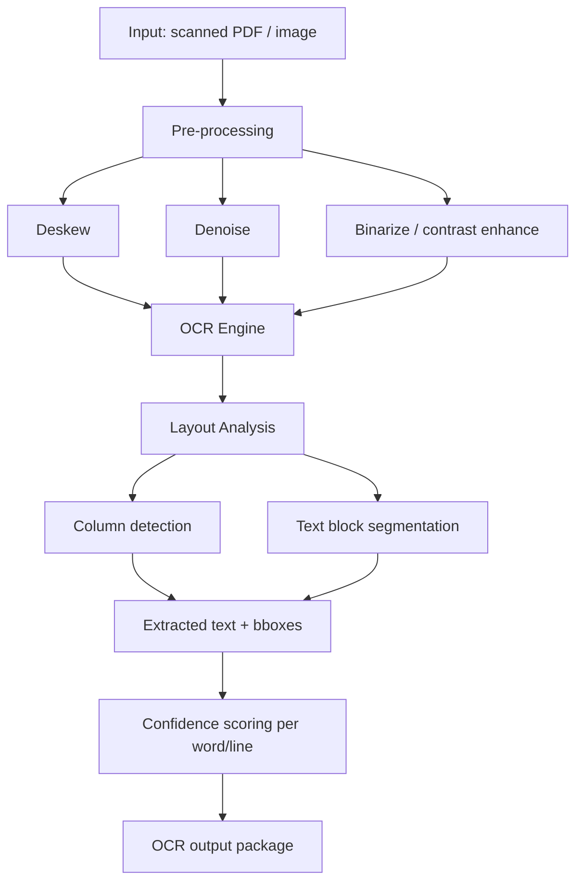

| Aspect | Specification |
| --- | --- |
| Engine | Tesseract / PaddleOCR (configurable) |
| Pre-processing | Deskew, denoise, adaptive binarization |
| Layout analysis | Multi-column, table region, header/footer detection |
| Output | Text + bounding boxes + confidence per region |
| Handwriting | Best-effort with low-confidence flag |
| Multi-page | Page-by-page with page number tracking |

| Document type | OCR approach |
| --- | --- |
| Scanned SOP | Full-page OCR, preserve section structure |
| Scanned log | Table-aware OCR |
| Photograph of label | Region-focused OCR for tags |
| Handwritten notes | OCR with confidence threshold; flag for review |
| Engineering drawing | OCR for tags/labels only; diagram extraction separate |

| Quality gate | Action |
| --- | --- |
| Confidence ≥ 0.85 | Accept |
| Confidence 0.60–0.84 | Accept with review flag |
| Confidence < 0.60 | Flag for manual review |

---

## 4. PDF Parsing

Native PDFs (with text layers) are parsed directly without OCR.

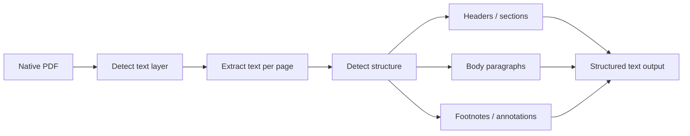

| Extraction target | Method |
| --- | --- |
| Text content | PDF text layer extraction |
| Page boundaries | Page-level segmentation |
| Section headers | Font size/weight heuristics |
| Tables | Table detection + cell extraction |
| Images | Embedded image extraction |
| Annotations | PDF annotation layer |
| Bookmarks | PDF outline/bookmark tree |
| Metadata | PDF info dictionary (author, title, dates) |

| PDF subtype | Parser route |
| --- | --- |
| Text-based SOP | Full text + structure extraction |
| Text-based report | Text + table extraction |
| Mixed (text + scanned pages) | Hybrid: parse text pages, OCR scanned pages |
| CAD-exported PDF | Text tags + diagram extraction |
| Form PDF | Field extraction + text |

---

## 5. Table Extraction

Tables are prevalent in inspection logs, maintenance records, and Excel exports.

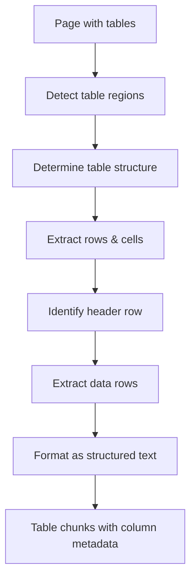

| Aspect | Specification |
| --- | --- |
| Detection | Layout analysis + line/grid detection |
| Structure | Row/column count, header identification |
| Output format | Markdown table or structured JSON |
| Merged cells | Handled with span metadata |
| Multi-page tables | Continuation detection across pages |
| Nested tables | Flattened with hierarchy metadata |

| Source | Table extraction method |
| --- | --- |
| PDF tables | Layout-based detection |
| Excel files | Direct cell reading (openpyxl) |
| Scanned tables | OCR + grid detection |
| Inspection reports | Template-aware extraction |

| Output metadata | Stored in |
| --- | --- |
| Column names | Chunk metadata (JSONB) |
| Row count | Chunk metadata |
| Source page | `chunks.page_no` |
| Table index | Chunk metadata |

---

## 6. Image Extraction

Images embedded in documents are extracted and processed separately.

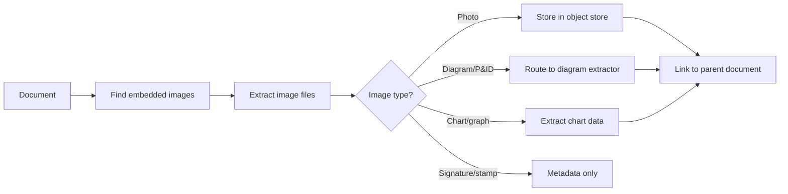

| Image type | Processing |
| --- | --- |
| Equipment photos | Store + link to asset |
| P&IDs / diagrams | Route to diagram extraction |
| Charts / graphs | Data extraction attempt |
| Signatures / stamps | Metadata capture only |
| Logos / watermarks | Strip from OCR; metadata only |

| Output | Store |
| --- | --- |
| Image file | Object store |
| Image metadata | PostgreSQL `chunks.metadata` (JSONB) |
| Parent link | Document → image relationship |
| OCR text (if applicable) | Chunk text |

---

## 7. Diagram Extraction

Engineering drawings and P&IDs require specialized extraction beyond text OCR.

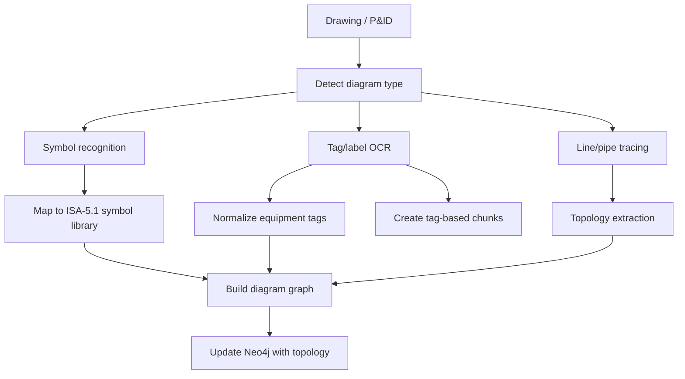

| Extraction target | Method | Output |
| --- | --- | --- |
| Equipment tags | OCR + pattern matching | Asset nodes in Neo4j |
| Instrument symbols | Symbol recognition (ISA-5.1) | Symbol nodes |
| Pipe lines | Line detection + tracing | CONNECTS_TO relationships |
| Flow direction | Arrow detection | Directed edges |
| Title block | OCR + template | Document metadata |
| Revision info | OCR + template | Version metadata |

| Diagram type | Extraction depth |
| --- | --- |
| P&ID | Full: tags, symbols, topology |
| General arrangement | Tags + major equipment |
| Electrical schematic | Tags + connections |
| Simple sketch | Tags only (OCR) |

| Limitation | Mitigation |
| --- | --- |
| Hand-drawn sketches | Tag OCR only; no topology |
| Low-resolution scans | Flag for manual review |
| Non-standard symbols | Best-effort; flag unknowns |

---

## 8. Metadata Extraction

Metadata is extracted at both document and chunk levels.

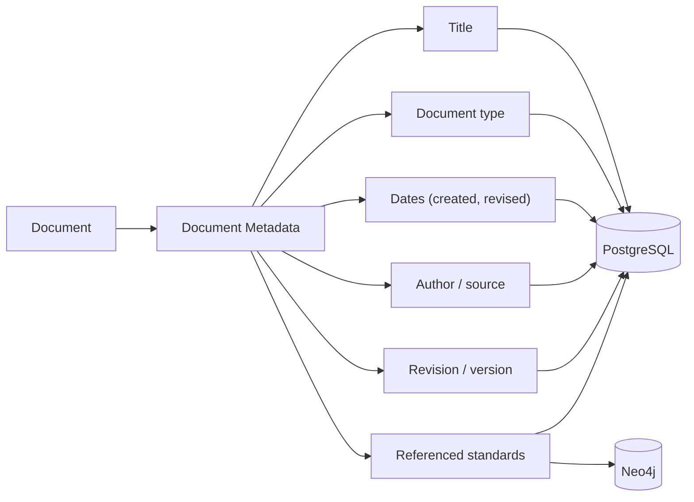

### Document metadata fields

| Field | Extraction source | Example |
| --- | --- | --- |
| title | PDF info / first heading / filename | "Pump P-101 Maintenance SOP" |
| doc_type | Classification agent | sop |
| created_date | PDF metadata / content | 2024-03-15 |
| revised_date | Revision block / content | 2024-06-01 |
| author | PDF metadata / signature | "Maintenance Dept" |
| revision | Revision block | Rev. 3 |
| page_count | Parser | 12 |
| language | Detection | en |
| standards | Regex + NER | ["ISO-55000", "ISA-5.1"] |
| facility | Template / content | "Unit 3" |

### Chunk metadata fields

| Field | Source | Example |
| --- | --- | --- |
| page_no | Parser | 3 |
| section | Header detection | "Safety Precautions" |
| chunk_index | Chunker | 7 |
| equipment_tags | NER | ["P-101"] |
| bbox | OCR/layout | {x, y, w, h} |
| ocr_confidence | OCR engine | 0.92 |
| table_columns | Table extractor | ["Date", "Finding", "Action"] |

---

## 9. Entity Recognition

Named entities are extracted from all document types and linked to the knowledge graph.

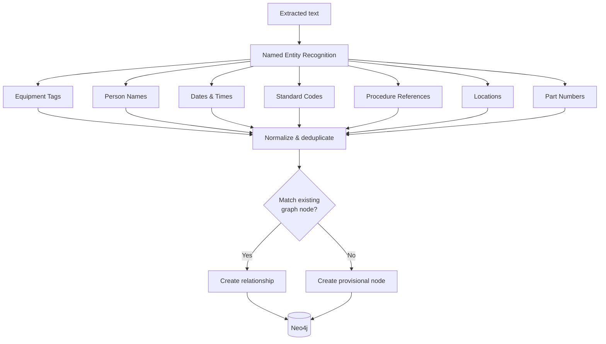

| Entity type | Recognition method | Graph node |
| --- | --- | --- |
| Equipment tag | Regex + facility dictionary | Asset |
| Person name | NER model | Person |
| Date/time | Date parser | Event property |
| Standard code | Regex (ISO-*, ISA-*, API-*) | Standard |
| Procedure ref | Pattern (SOP-*, PROC-*) | Procedure |
| Location | NER + facility dictionary | Location |
| Part number | Regex + manufacturer catalog | Part |

| Extraction rule | Description |
| --- | --- |
| Tag normalization | `P101`, `P 101`, `P-101` → `P-101` |
| Fuzzy matching | Match within edit distance 1–2 |
| Confidence threshold | ≥ 0.80 for auto-link; below → provisional |
| Provisional nodes | Created with `provisional: true`; admin review queue |
| Cross-document linking | Same tag in multiple docs → same Asset node |

---

## 10. Knowledge Graph Update

After entity extraction, the graph is updated with new nodes and relationships.

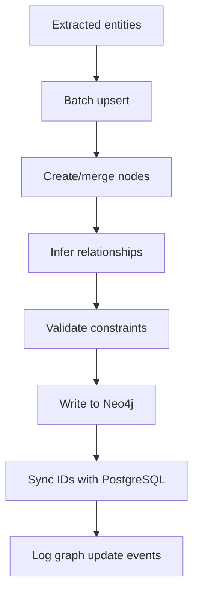

| Update operation | Trigger | Graph effect |
| --- | --- | --- |
| Node create | New entity not in graph | New node with UUID |
| Node merge | Entity matches existing | Merge properties |
| Relationship create | Document references asset | REFERENCES edge |
| Relationship infer | SOP governs asset | GOVERNED_BY edge |
| Relationship infer | Incident on asset | HAD_INCIDENT edge |
| Node deactivate | Asset decommissioned | status = inactive |

| Consistency rule | Enforcement |
| --- | --- |
| UUID sync | Graph node id = PostgreSQL entity id |
| No orphan edges | Both endpoints must exist |
| Idempotent upsert | Re-ingestion does not duplicate |
| Provisional review | Admin queue for low-confidence entities |

---

## 11. Embedding Generation

The final pipeline stage converts chunks into vectors for semantic search.

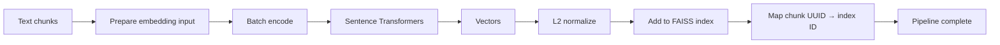

| Aspect | Specification |
| --- | --- |
| Model | Sentence Transformers (same as query time) |
| Input format | `"[{section}] {chunk_text}"` with section context |
| Batch size | 32–128 chunks |
| Normalization | L2-normalized |
| Index type | FAISS IVF or HNSW |
| ID mapping | Chunk UUID = FAISS vector ID |
| Incremental | New chunks added without full rebuild |

| Pipeline completion | Status update |
| --- | --- |
| All chunks embedded | `ingestion_jobs.status = succeeded` |
| Partial failure | `ingestion_jobs.status = partial` |
| Full failure | `ingestion_jobs.status = failed` |

---

## 12. Pipeline Monitoring

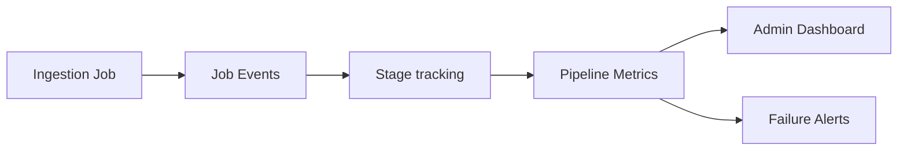

| Metric | Description |
| --- | --- |
| Jobs queued | Pending ingestion jobs |
| Jobs running | Currently processing |
| Success rate | % succeeded vs failed |
| Avg processing time | Per document type |
| OCR confidence (avg) | Quality indicator |
| Entities extracted | Per job |
| Chunks created | Per job |
| Pipeline stage | Current stage per job |

| Job event types | Logged in |
| --- | --- |
| stage_start | `job_events` |
| stage_end | `job_events` |
| error | `job_events` + `ingestion_jobs.error` |
| partial | `job_events` |

### End-to-end pipeline sequence

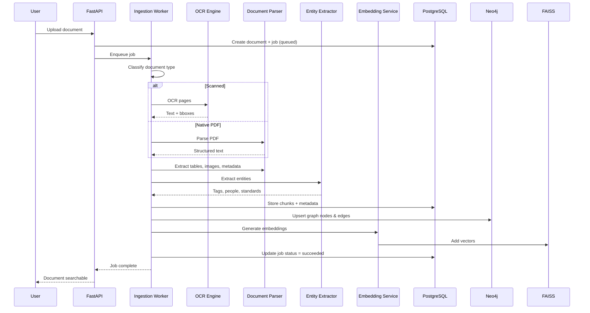

---

## 13. References

- [`08_AI_ARCHITECTURE.md`](08_AI_ARCHITECTURE.md)
- [`09_AGENT_ARCHITECTURE.md`](09_AGENT_ARCHITECTURE.md)
- [`10_RAG_PIPELINE.md`](10_RAG_PIPELINE.md)
- [`11_KNOWLEDGE_GRAPH.md`](11_KNOWLEDGE_GRAPH.md)
- [`04_DATABASE_ARCHITECTURE.md`](04_DATABASE_ARCHITECTURE.md)
- [`06_BACKEND_ARCHITECTURE.md`](06_BACKEND_ARCHITECTURE.md)
- ISA-5.1 — Instrumentation Symbols and Identification.
- Tesseract OCR — https://github.com/tesseract-ocr/tesseract
- Sentence Transformers — https://www.sbert.net/
- FAISS — https://faiss.ai/
- Neo4j — https://neo4j.com/docs/
