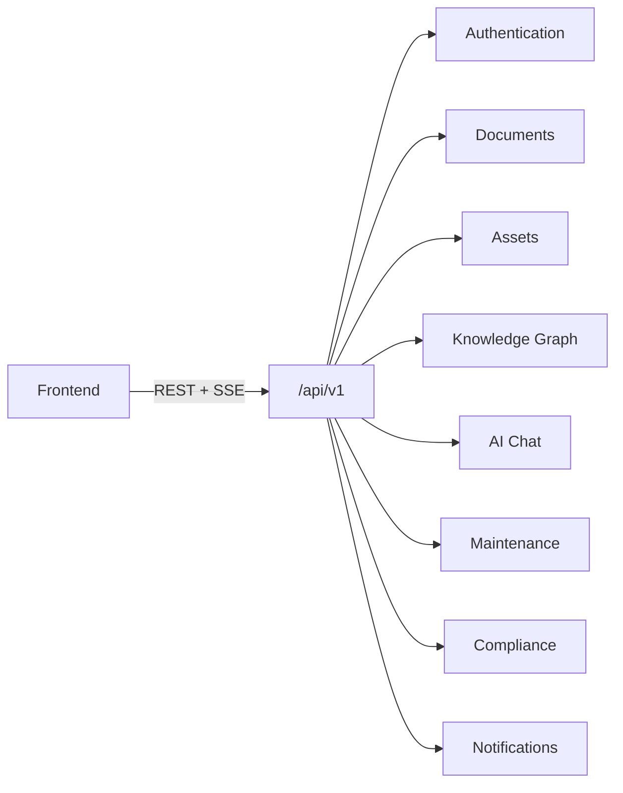

# TRACE — API Specification

### Technical Records & Asset Compliance Engine · Problem Statement 8

---

## Table of Contents

1. [Overview](#1-overview)
2. [Conventions](#2-conventions)
3. [Authentication](#3-authentication)
4. [Documents](#4-documents)
5. [Assets](#5-assets)
6. [Knowledge Graph](#6-knowledge-graph)
7. [AI Chat](#7-ai-chat)
8. [Search](#8-search)
9. [Maintenance](#9-maintenance)
10. [Compliance](#10-compliance)
11. [Notifications](#11-notifications)
12. [Admin](#12-admin)
13. [Health & System](#13-health--system)
14. [Error Reference](#14-error-reference)
15. [References](#15-references)

---

## 1. Overview

TRACE exposes a **REST API** via FastAPI. All endpoints (except auth login/refresh/register
and health) require a valid JWT access token. Copilot chat additionally supports **Server-Sent Events (SSE)**
for streaming responses.

### Implementation status (Milestones 1–2)

| Endpoint | Status |
| --- | --- |
| `GET /api/health` | ✅ Implemented |
| `POST /api/auth/register` | ✅ Implemented |
| `POST /api/auth/login` | ✅ Implemented |
| `POST /api/auth/refresh` | ✅ Implemented (refresh token rotation) |
| `POST /api/auth/logout` | ✅ Implemented |
| `GET /api/auth/me` | ✅ Implemented |
| All other endpoints below | ☐ Planned |

> **Note:** The running API uses base path `/api`. The target specification uses `/api/v1`;
> versioning will be introduced without breaking current clients during early development.

| Property | Value |
| --- | --- |
| Base URL (implemented) | `/api` |
| Base URL (target) | `/api/v1` |
| Format | JSON (`application/json`) |
| Auth | Bearer JWT in `Authorization` header |
| Streaming | SSE (`text/event-stream`) for `/chat` *(planned)* |
| IDs | UUID v4 |
| Timestamps | ISO 8601 UTC (`TIMESTAMPTZ`) |



---

## 2. Conventions

### Request headers

| Header | Required | Description |
| --- | --- | --- |
| `Authorization` | Yes (protected routes) | `Bearer <access_token>` |
| `Content-Type` | Yes (POST/PUT/PATCH) | `application/json` or `multipart/form-data` |
| `X-Request-ID` | No | Client correlation id (echoed in response) |

### Response envelope

Successful responses return the resource directly or a paginated wrapper:

```json
{
  "data": [ ... ],
  "meta": {
    "page": 1,
    "page_size": 20,
    "total": 142
  }
}
```

Error responses use a consistent envelope (see [Error Reference](#14-error-reference)).

### Pagination query parameters

| Parameter | Type | Default | Description |
| --- | --- | --- | --- |
| `page` | integer | 1 | Page number (1-based) |
| `page_size` | integer | 20 | Items per page (max 100) |
| `sort_by` | string | varies | Field to sort by |
| `sort_order` | string | `desc` | `asc` or `desc` |

### Roles

| Role (implemented, seeded) | Scope |
| --- | --- |
| `Admin` | Full access including admin routes *(when implemented)* |
| `Engineer` | Documents, assets, chat, maintenance *(when implemented)* |
| `Operator` | Read + chat *(when implemented)* |
| `Viewer` | Read-only; default role for self-registration |

| Role (planned, extended RBAC) | Scope |
| --- | --- |
| `inspector` | Read + inspections + compliance |
| `compliance_officer` | Read + compliance + audit |

---

## 3. Authentication

Base path: `/api/auth` *(implemented)* · `/api/v1/auth` *(target)*

> ✅ **Implemented** — All auth endpoints below are live except where noted as target-only.

### POST `/auth/register` ✅

Register a new user. New accounts receive the default **Viewer** role.

**Auth:** Public

**Request**

```json
{
  "email": "user@example.com",
  "password": "securePassword123",
  "full_name": "Jane Operator"
}
```

**Response `201 Created`**

```json
{
  "message": "Registration successful"
}
```

**Errors**

| Status | Condition |
| --- | --- |
| 409 | Email already registered |
| 422 | Validation error (password min 8 chars, invalid email) |

---

### POST `/auth/login` ✅

Authenticate a user and receive tokens.

**Auth:** Public

**Request**

```json
{
  "email": "engineer@trace.local",
  "password": "securePassword123"
}
```

**Response `200 OK` (implemented)**

```json
{
  "access_token": "eyJhbGciOiJIUzI1NiIs...",
  "refresh_token": "eyJhbGciOiJIUzI1NiIs...",
  "token_type": "bearer"
}
```

**Response `200 OK` (target — includes user envelope)**

```json
{
  "access_token": "eyJhbGciOiJIUzI1NiIs...",
  "refresh_token": "eyJhbGciOiJIUzI1NiIs...",
  "token_type": "bearer",
  "expires_in": 3600,
  "user": {
    "id": "550e8400-e29b-41d4-a716-446655440000",
    "email": "engineer@trace.local",
    "full_name": "Jane Engineer",
    "roles": ["engineer"]
  }
}
```

**Errors**

| Status | Code | Condition |
| --- | --- | --- |
| 401 | `INVALID_CREDENTIALS` | Wrong email or password |
| 403 | `ACCOUNT_INACTIVE` | User account disabled |
| 422 | `VALIDATION_ERROR` | Missing or invalid fields |

---

### POST `/auth/refresh` ✅

Obtain new tokens using a refresh token. **Implements refresh token rotation** — the old
refresh token is revoked and a new pair is issued.

**Auth:** Public (requires valid refresh token)

**Request**

```json
{
  "refresh_token": "eyJhbGciOiJIUzI1NiIs..."
}
```

**Response `200 OK` (implemented — returns full token pair)**

```json
{
  "access_token": "eyJhbGciOiJIUzI1NiIs...",
  "refresh_token": "eyJhbGciOiJIUzI1NiIs...",
  "token_type": "bearer"
}
```

**Response `200 OK` (target — access only)**

```json
{
  "access_token": "eyJhbGciOiJIUzI1NiIs...",
  "token_type": "bearer",
  "expires_in": 3600
}
```

**Errors**

| Status | Code | Condition |
| --- | --- | --- |
| 401 | `INVALID_REFRESH_TOKEN` | Token expired or revoked |
| 422 | `VALIDATION_ERROR` | Missing refresh token |

---

### POST `/auth/logout` ✅

Invalidate the current session by revoking the refresh token.

**Auth:** Required (Bearer access token)

**Request**

```json
{
  "refresh_token": "eyJhbGciOiJIUzI1NiIs..."
}
```

**Response `200 OK` (implemented)**

```json
{
  "message": "Logout successful"
}
```

**Response `204 No Content` (target)**

**Errors**

| Status | Code | Condition |
| --- | --- | --- |
| 401 | `UNAUTHORIZED` | Missing or invalid access token |

---

### GET `/auth/me` ✅

Return the authenticated user's profile.

**Auth:** Required

**Response `200 OK` (implemented)**

```json
{
  "id": "550e8400-e29b-41d4-a716-446655440000",
  "email": "engineer@trace.local",
  "full_name": "Jane Engineer",
  "role": "Engineer",
  "is_active": true,
  "created_at": "2026-06-27T06:30:00Z"
}
```

**Response `200 OK` (target — multi-role)**

```json
{
  "id": "550e8400-e29b-41d4-a716-446655440000",
  "email": "engineer@trace.local",
  "full_name": "Jane Engineer",
  "roles": ["engineer"],
  "is_active": true,
  "last_login_at": "2026-06-27T06:30:00Z"
}
```

**Errors**

| Status | Code | Condition |
| --- | --- | --- |
| 401 | `UNAUTHORIZED` | Missing or invalid token |

---

## 4. Documents

> ☐ **Planned** — Not yet implemented.

Base path: `/api/v1/documents`

### POST `/documents`

Upload a document for ingestion.

**Auth:** Required (`engineer`, `admin`)

**Request:** `multipart/form-data`

| Field | Type | Required | Description |
| --- | --- | --- | --- |
| `file` | file | Yes | Document file (PDF, image, Excel, email) |
| `title` | string | No | Override title (defaults to filename) |
| `doc_type` | string | No | drawing, pid, sop, log, inspection, incident, manual, safety, excel, image, email |
| `source` | string | No | Origin system or folder |

**Response `201 Created`**

```json
{
  "id": "660e8400-e29b-41d4-a716-446655440001",
  "title": "Pump P-101 Maintenance SOP",
  "doc_type": "sop",
  "source": "Shared Drive / Maintenance",
  "mime_type": "application/pdf",
  "status": "queued",
  "job_id": "770e8400-e29b-41d4-a716-446655440002",
  "uploaded_by": "550e8400-e29b-41d4-a716-446655440000",
  "created_at": "2026-06-27T06:35:00Z"
}
```

**Errors**

| Status | Code | Condition |
| --- | --- | --- |
| 400 | `UNSUPPORTED_FILE_TYPE` | File type not allowed |
| 413 | `FILE_TOO_LARGE` | Exceeds size limit |
| 409 | `DUPLICATE_DOCUMENT` | Checksum matches existing document |
| 401 | `UNAUTHORIZED` | Not authenticated |
| 403 | `FORBIDDEN` | Insufficient role |

---

### POST `/documents/batch`

Upload multiple documents in one request.

**Auth:** Required (`engineer`, `admin`)

**Request:** `multipart/form-data` with multiple `files[]`

**Response `202 Accepted`**

```json
{
  "batch_id": "880e8400-e29b-41d4-a716-446655440003",
  "total": 5,
  "queued": 5,
  "documents": [
    {
      "id": "660e8400-e29b-41d4-a716-446655440001",
      "title": "SOP-042.pdf",
      "status": "queued",
      "job_id": "770e8400-e29b-41d4-a716-446655440002"
    }
  ]
}
```

**Errors**

| Status | Code | Condition |
| --- | --- | --- |
| 400 | `BATCH_EMPTY` | No files provided |
| 413 | `BATCH_TOO_LARGE` | Combined size exceeds limit |

---

### GET `/documents`

List documents with filtering and pagination.

**Auth:** Required

**Query parameters**

| Parameter | Type | Description |
| --- | --- | --- |
| `doc_type` | string | Filter by document type |
| `status` | string | queued, processing, indexed, failed |
| `asset_tag` | string | Filter by linked asset tag |
| `search` | string | Title search |
| `page`, `page_size` | integer | Pagination |

**Response `200 OK`**

```json
{
  "data": [
    {
      "id": "660e8400-e29b-41d4-a716-446655440001",
      "title": "Pump P-101 Maintenance SOP",
      "doc_type": "sop",
      "status": "indexed",
      "page_count": 12,
      "asset_tags": ["P-101"],
      "uploaded_by": "Jane Engineer",
      "created_at": "2026-06-27T06:35:00Z"
    }
  ],
  "meta": { "page": 1, "page_size": 20, "total": 142 }
}
```

---

### GET `/documents/{document_id}`

Get document details.

**Auth:** Required

**Response `200 OK`**

```json
{
  "id": "660e8400-e29b-41d4-a716-446655440001",
  "title": "Pump P-101 Maintenance SOP",
  "doc_type": "sop",
  "source": "Shared Drive / Maintenance",
  "mime_type": "application/pdf",
  "status": "indexed",
  "page_count": 12,
  "current_version": {
    "id": "990e8400-e29b-41d4-a716-446655440004",
    "version_no": 1,
    "checksum": "a1b2c3d4..."
  },
  "asset_tags": ["P-101"],
  "metadata": { "author": "Maintenance Dept", "revision": "Rev. 3" },
  "uploaded_by": "550e8400-e29b-41d4-a716-446655440000",
  "created_at": "2026-06-27T06:35:00Z",
  "updated_at": "2026-06-27T06:40:00Z"
}
```

**Errors**

| Status | Code | Condition |
| --- | --- | --- |
| 404 | `DOCUMENT_NOT_FOUND` | Invalid document ID |

---

### GET `/documents/{document_id}/status`

Get ingestion job status for a document.

**Auth:** Required

**Response `200 OK`**

```json
{
  "document_id": "660e8400-e29b-41d4-a716-446655440001",
  "job_id": "770e8400-e29b-41d4-a716-446655440002",
  "status": "running",
  "stage": "embedding",
  "progress": 75,
  "events": [
    { "event_type": "stage_end", "message": "OCR complete", "created_at": "2026-06-27T06:36:00Z" },
    { "event_type": "stage_start", "message": "Generating embeddings", "created_at": "2026-06-27T06:38:00Z" }
  ],
  "started_at": "2026-06-27T06:35:05Z",
  "finished_at": null
}
```

---

### GET `/documents/{document_id}/content`

Get document content URL or extracted text preview.

**Auth:** Required

**Query parameters**

| Parameter | Type | Description |
| --- | --- | --- |
| `page` | integer | Specific page number |
| `format` | string | `url` (default) or `text` |

**Response `200 OK`**

```json
{
  "document_id": "660e8400-e29b-41d4-a716-446655440001",
  "format": "url",
  "url": "https://storage.trace.local/documents/660e8400.../v1.pdf",
  "expires_in": 3600
}
```

---

### DELETE `/documents/{document_id}`

Soft-delete a document.

**Auth:** Required (`admin`)

**Response `204 No Content`**

**Errors**

| Status | Code | Condition |
| --- | --- | --- |
| 404 | `DOCUMENT_NOT_FOUND` | Invalid ID |
| 403 | `FORBIDDEN` | Non-admin user |

---

## 5. Assets

Base path: `/api/v1/assets`

### GET `/assets`

List assets with filtering.

**Auth:** Required

**Query parameters**

| Parameter | Type | Description |
| --- | --- | --- |
| `tag` | string | Filter by tag (partial match) |
| `asset_type` | string | pump, valve, vessel, motor, etc. |
| `status` | string | active, inactive, decommissioned |
| `location` | string | Filter by location |
| `search` | string | Tag or name search |

**Response `200 OK`**

```json
{
  "data": [
    {
      "id": "aa0e8400-e29b-41d4-a716-446655440010",
      "tag": "P-101",
      "name": "Centrifugal Pump P-101",
      "asset_type": "pump",
      "status": "active",
      "location": "Unit 3, Pump House",
      "document_count": 8,
      "last_maintenance": "2026-01-15T00:00:00Z"
    }
  ],
  "meta": { "page": 1, "page_size": 20, "total": 256 }
}
```

---

### GET `/assets/{asset_id}`

Get full asset details.

**Auth:** Required

**Response `200 OK`**

```json
{
  "id": "aa0e8400-e29b-41d4-a716-446655440010",
  "tag": "P-101",
  "name": "Centrifugal Pump P-101",
  "asset_type": "pump",
  "status": "active",
  "location": "Unit 3, Pump House",
  "metadata": { "manufacturer": "Grundfos", "model": "CR 32-2" },
  "summary": {
    "document_count": 8,
    "maintenance_count": 12,
    "inspection_count": 4,
    "incident_count": 2,
    "compliance_status": "compliant"
  },
  "created_at": "2026-01-01T00:00:00Z",
  "updated_at": "2026-06-27T06:00:00Z"
}
```

**Errors**

| Status | Code | Condition |
| --- | --- | --- |
| 404 | `ASSET_NOT_FOUND` | Invalid asset ID |

---

### GET `/assets/{asset_id}/documents`

List documents linked to an asset.

**Auth:** Required

**Response `200 OK`**

```json
{
  "data": [
    {
      "id": "660e8400-e29b-41d4-a716-446655440001",
      "title": "Pump P-101 Maintenance SOP",
      "doc_type": "sop",
      "relation": "governs",
      "created_at": "2026-06-27T06:35:00Z"
    }
  ],
  "meta": { "page": 1, "page_size": 20, "total": 8 }
}
```

---

### GET `/assets/{asset_id}/history`

Get maintenance, inspection, and incident history for an asset.

**Auth:** Required

**Query parameters**

| Parameter | Type | Description |
| --- | --- | --- |
| `type` | string | maintenance, inspection, incident (default: all) |
| `from_date` | date | Start date filter |
| `to_date` | date | End date filter |

**Response `200 OK`**

```json
{
  "asset_id": "aa0e8400-e29b-41d4-a716-446655440010",
  "maintenance": [
    {
      "id": "bb0e8400-e29b-41d4-a716-446655440020",
      "performed_at": "2026-01-15T00:00:00Z",
      "description": "Bearing replacement",
      "technician": "John Smith",
      "source_document_id": "660e8400-e29b-41d4-a716-446655440001"
    }
  ],
  "inspections": [
    {
      "id": "cc0e8400-e29b-41d4-a716-446655440030",
      "inspected_at": "2026-06-01T00:00:00Z",
      "result": "pass",
      "findings": "No issues detected",
      "inspector": "Sarah Inspector"
    }
  ],
  "incidents": [
    {
      "id": "dd0e8400-e29b-41d4-a716-446655440040",
      "occurred_at": "2024-03-10T00:00:00Z",
      "severity": "high",
      "summary": "Bearing failure during operation"
    }
  ]
}
```

---

### GET `/assets/by-tag/{tag}`

Lookup asset by equipment tag.

**Auth:** Required

**Response `200 OK`**

Same schema as `GET /assets/{asset_id}`.

**Errors**

| Status | Code | Condition |
| --- | --- | --- |
| 404 | `ASSET_NOT_FOUND` | Tag not found |

---

## 6. Knowledge Graph

Base path: `/api/v1/graph`

### GET `/graph/asset/{asset_id}`

Get the knowledge graph neighborhood for an asset.

**Auth:** Required

**Query parameters**

| Parameter | Type | Default | Description |
| --- | --- | --- | --- |
| `depth` | integer | 2 | Traversal depth (max 3) |
| `node_types` | string | all | Comma-separated filter |

**Response `200 OK`**

```json
{
  "root": {
    "id": "aa0e8400-e29b-41d4-a716-446655440010",
    "label": "Asset",
    "properties": { "tag": "P-101", "name": "Centrifugal Pump P-101" }
  },
  "nodes": [
    { "id": "660e8400-e29b-41d4-a716-446655440001", "label": "Document", "properties": { "title": "Pump P-101 Maintenance SOP" } },
    { "id": "ee0e8400-e29b-41d4-a716-446655440050", "label": "Procedure", "properties": { "name": "SOP-042" } },
    { "id": "dd0e8400-e29b-41d4-a716-446655440040", "label": "Incident", "properties": { "severity": "high", "summary": "Bearing failure" } }
  ],
  "edges": [
    { "from": "660e8400-e29b-41d4-a716-446655440001", "to": "aa0e8400-e29b-41d4-a716-446655440010", "type": "REFERENCES" },
    { "from": "aa0e8400-e29b-41d4-a716-446655440010", "to": "ee0e8400-e29b-41d4-a716-446655440050", "type": "GOVERNED_BY" },
    { "from": "aa0e8400-e29b-41d4-a716-446655440010", "to": "dd0e8400-e29b-41d4-a716-446655440040", "type": "HAD_INCIDENT" }
  ]
}
```

---

### POST `/graph/query`

Execute a structured graph query.

**Auth:** Required

**Request**

```json
{
  "query_type": "incident_chain",
  "params": {
    "incident_id": "dd0e8400-e29b-41d4-a716-446655440040",
    "max_depth": 3
  }
}
```

**Response `200 OK`**

```json
{
  "query_type": "incident_chain",
  "nodes": [ ... ],
  "edges": [ ... ],
  "execution_ms": 45
}
```

**Errors**

| Status | Code | Condition |
| --- | --- | --- |
| 400 | `INVALID_QUERY_TYPE` | Unknown query type |
| 404 | `NODE_NOT_FOUND` | Referenced node does not exist |

---

### GET `/graph/search`

Search graph nodes by label or property.

**Auth:** Required

**Query parameters**

| Parameter | Type | Description |
| --- | --- | --- |
| `q` | string | Search term |
| `label` | string | Node label filter (Asset, Document, Incident, etc.) |
| `limit` | integer | Max results (default 20) |

**Response `200 OK`**

```json
{
  "data": [
    {
      "id": "aa0e8400-e29b-41d4-a716-446655440010",
      "label": "Asset",
      "properties": { "tag": "P-101", "name": "Centrifugal Pump P-101" },
      "match_score": 0.95
    }
  ]
}
```

---

## 7. AI Chat

Base path: `/api/v1/chat`

### POST `/chat`

Send a message to the Copilot and receive a streamed response.

**Auth:** Required

**Request**

```json
{
  "message": "What are the safety steps before maintaining Pump P-101?",
  "conversation_id": "ff0e8400-e29b-41d4-a716-446655440060",
  "context": {
    "asset_tag": "P-101",
    "agent": "maintenance"
  }
}
```

| Field | Required | Description |
| --- | --- | --- |
| `message` | Yes | User question |
| `conversation_id` | No | Existing conversation (creates new if omitted) |
| `context.asset_tag` | No | Scope retrieval to asset |
| `context.agent` | No | Force specific agent (auto-routed if omitted) |

**Response `200 OK` (SSE stream)**

```
event: token
data: {"content": "Before maintaining"}

event: token
data: {"content": " Pump P-101, you must:"}

event: citation
data: {"chunk_id": "110e8400...", "document_title": "Pump P-101 Maintenance SOP", "page": 3, "score": 0.92}

event: done
data: {"conversation_id": "ff0e8400...", "message_id": "220e8400...", "confidence": 0.91, "status": "answered", "follow_ups": ["What tools are needed?", "Show incident history for P-101"]}
```

**Response `200 OK` (non-streaming, `Accept: application/json`)**

```json
{
  "conversation_id": "ff0e8400-e29b-41d4-a716-446655440060",
  "message_id": "220e8400-e29b-41d4-a716-446655440070",
  "role": "assistant",
  "content": "Before maintaining Pump P-101, you must: 1. Lock out and tag out...",
  "citations": [
    {
      "chunk_id": "110e8400-e29b-41d4-a716-446655440080",
      "document_id": "660e8400-e29b-41d4-a716-446655440001",
      "document_title": "Pump P-101 Maintenance SOP",
      "page": 3,
      "snippet": "Safety Precautions: Before starting any maintenance...",
      "score": 0.92
    }
  ],
  "confidence": 0.91,
  "status": "answered",
  "follow_ups": ["What tools are needed?", "Show incident history for P-101"]
}
```

**Errors**

| Status | Code | Condition |
| --- | --- | --- |
| 400 | `EMPTY_MESSAGE` | Message is empty |
| 404 | `CONVERSATION_NOT_FOUND` | Invalid conversation ID |
| 503 | `AI_SERVICE_UNAVAILABLE` | LLM or retrieval service down |

---

### GET `/chat/conversations`

List user's conversations.

**Auth:** Required

**Response `200 OK`**

```json
{
  "data": [
    {
      "id": "ff0e8400-e29b-41d4-a716-446655440060",
      "title": "P-101 maintenance safety",
      "message_count": 4,
      "created_at": "2026-06-27T07:00:00Z",
      "updated_at": "2026-06-27T07:05:00Z"
    }
  ],
  "meta": { "page": 1, "page_size": 20, "total": 12 }
}
```

---

### GET `/chat/conversations/{conversation_id}`

Get conversation with full message history.

**Auth:** Required (owner only)

**Response `200 OK`**

```json
{
  "id": "ff0e8400-e29b-41d4-a716-446655440060",
  "title": "P-101 maintenance safety",
  "messages": [
    {
      "id": "220e8400-e29b-41d4-a716-446655440070",
      "role": "user",
      "content": "What are the safety steps before maintaining Pump P-101?",
      "created_at": "2026-06-27T07:00:00Z"
    },
    {
      "id": "330e8400-e29b-41d4-a716-446655440090",
      "role": "assistant",
      "content": "Before maintaining Pump P-101, you must...",
      "citations": [ ... ],
      "confidence": 0.91,
      "created_at": "2026-06-27T07:00:05Z"
    }
  ]
}
```

---

### POST `/chat/feedback`

Submit feedback on an assistant message.

**Auth:** Required

**Request**

```json
{
  "message_id": "330e8400-e29b-41d4-a716-446655440090",
  "rating": "positive",
  "comment": "Accurate and well-cited"
}
```

**Response `201 Created`**

```json
{
  "id": "440e8400-e29b-41d4-a716-446655440100",
  "message_id": "330e8400-e29b-41d4-a716-446655440090",
  "rating": "positive",
  "created_at": "2026-06-27T07:10:00Z"
}
```

---

## 8. Search

Base path: `/api/v1/search`

### POST `/search`

Semantic search across the knowledge base.

**Auth:** Required

**Request**

```json
{
  "query": "bearing replacement procedure",
  "filters": {
    "doc_type": ["sop", "manual"],
    "asset_tag": "P-101",
    "date_from": "2024-01-01"
  },
  "limit": 10
}
```

**Response `200 OK`**

```json
{
  "query": "bearing replacement procedure",
  "results": [
    {
      "chunk_id": "110e8400-e29b-41d4-a716-446655440080",
      "document_id": "660e8400-e29b-41d4-a716-446655440001",
      "document_title": "Pump P-101 Maintenance SOP",
      "page": 7,
      "snippet": "Step 4: Remove bearing housing bolts...",
      "score": 0.94,
      "doc_type": "sop"
    }
  ],
  "total": 3,
  "execution_ms": 120
}
```

---

## 9. Maintenance

Base path: `/api/v1/maintenance`

### GET `/maintenance`

List maintenance records.

**Auth:** Required

**Query parameters**

| Parameter | Type | Description |
| --- | --- | --- |
| `asset_id` | UUID | Filter by asset |
| `asset_tag` | string | Filter by tag |
| `from_date` | date | Start date |
| `to_date` | date | End date |
| `technician` | string | Filter by technician |

**Response `200 OK`**

```json
{
  "data": [
    {
      "id": "bb0e8400-e29b-41d4-a716-446655440020",
      "asset_id": "aa0e8400-e29b-41d4-a716-446655440010",
      "asset_tag": "P-101",
      "performed_at": "2026-01-15T00:00:00Z",
      "description": "Bearing replacement",
      "technician": "John Smith",
      "source_document_id": "660e8400-e29b-41d4-a716-446655440001"
    }
  ],
  "meta": { "page": 1, "page_size": 20, "total": 48 }
}
```

---

### GET `/maintenance/{record_id}`

Get a single maintenance record.

**Auth:** Required

**Response `200 OK`**

```json
{
  "id": "bb0e8400-e29b-41d4-a716-446655440020",
  "asset_id": "aa0e8400-e29b-41d4-a716-446655440010",
  "asset_tag": "P-101",
  "performed_at": "2026-01-15T00:00:00Z",
  "description": "Bearing replacement. Removed old SKF 6205 bearing, installed new unit. Alignment checked.",
  "technician": "John Smith",
  "source_document_id": "660e8400-e29b-41d4-a716-446655440001",
  "metadata": { "parts_used": ["SKF 6205"], "duration_hours": 4 },
  "created_at": "2026-01-15T00:00:00Z"
}
```

---

### GET `/maintenance/schedule`

Get upcoming and overdue maintenance.

**Auth:** Required

**Query parameters**

| Parameter | Type | Description |
| --- | --- | --- |
| `status` | string | upcoming, overdue, all |
| `asset_tag` | string | Filter by asset |

**Response `200 OK`**

```json
{
  "data": [
    {
      "asset_id": "aa0e8400-e29b-41d4-a716-446655440010",
      "asset_tag": "P-101",
      "next_due": "2026-07-15T00:00:00Z",
      "status": "upcoming",
      "procedure": "SOP-042: Pump Maintenance",
      "days_until_due": 18
    }
  ]
}
```

---

## 10. Compliance

Base path: `/api/v1/compliance`

### GET `/compliance/standards`

List compliance standards.

**Auth:** Required

**Response `200 OK`**

```json
{
  "data": [
    {
      "id": "550e8400-e29b-41d4-a716-446655440200",
      "code": "ISO-55000",
      "title": "Asset Management",
      "description": "International standard for asset management systems"
    }
  ]
}
```

---

### GET `/compliance/items`

List compliance items with status.

**Auth:** Required

**Query parameters**

| Parameter | Type | Description |
| --- | --- | --- |
| `asset_id` | UUID | Filter by asset |
| `status` | string | compliant, non_compliant, pending |
| `standard_code` | string | Filter by standard |

**Response `200 OK`**

```json
{
  "data": [
    {
      "id": "660e8400-e29b-41d4-a716-446655440210",
      "standard_code": "ISO-55000",
      "asset_tag": "P-101",
      "requirement": "Annual inspection required",
      "status": "compliant",
      "due_date": "2026-12-31",
      "evidence_document_id": "660e8400-e29b-41d4-a716-446655440001"
    }
  ],
  "meta": { "page": 1, "page_size": 20, "total": 34 }
}
```

---

### GET `/compliance/summary`

Compliance overview for dashboard.

**Auth:** Required

**Response `200 OK`**

```json
{
  "total_items": 34,
  "compliant": 28,
  "non_compliant": 2,
  "pending": 4,
  "overdue": 1,
  "by_standard": [
    { "code": "ISO-55000", "compliant": 15, "non_compliant": 1, "pending": 2 }
  ]
}
```

---

### GET `/compliance/items/{item_id}`

Get compliance item detail with evidence.

**Auth:** Required

**Response `200 OK`**

```json
{
  "id": "660e8400-e29b-41d4-a716-446655440210",
  "standard": { "code": "ISO-55000", "title": "Asset Management" },
  "asset": { "tag": "P-101", "name": "Centrifugal Pump P-101" },
  "requirement": "Annual inspection required",
  "status": "compliant",
  "due_date": "2026-12-31",
  "evidence": {
    "document_id": "660e8400-e29b-41d4-a716-446655440001",
    "document_title": "P-101 Annual Inspection Report 2026",
    "page": 1
  },
  "audit_trail": [
    { "action": "status_updated", "from": "pending", "to": "compliant", "at": "2026-06-01T00:00:00Z" }
  ]
}
```

---

## 11. Notifications

Base path: `/api/v1/notifications`

### GET `/notifications`

List user notifications.

**Auth:** Required

**Query parameters**

| Parameter | Type | Description |
| --- | --- | --- |
| `unread_only` | boolean | Filter unread |
| `type` | string | compliance, maintenance, ingestion, system |
| `page`, `page_size` | integer | Pagination |

**Response `200 OK`**

```json
{
  "data": [
    {
      "id": "770e8400-e29b-41d4-a716-446655440300",
      "type": "compliance",
      "title": "Compliance item overdue",
      "message": "Annual inspection for P-101 is overdue by 5 days",
      "severity": "warning",
      "is_read": false,
      "link": "/compliance/items/660e8400-e29b-41d4-a716-446655440210",
      "created_at": "2026-06-27T06:00:00Z"
    }
  ],
  "meta": { "page": 1, "page_size": 20, "total": 5 },
  "unread_count": 3
}
```

---

### PATCH `/notifications/{notification_id}/read`

Mark a notification as read.

**Auth:** Required

**Response `200 OK`**

```json
{
  "id": "770e8400-e29b-41d4-a716-446655440300",
  "is_read": true,
  "read_at": "2026-06-27T07:15:00Z"
}
```

---

### POST `/notifications/read-all`

Mark all notifications as read.

**Auth:** Required

**Response `200 OK`**

```json
{
  "marked_read": 3
}
```

---

## 12. Admin

Base path: `/api/v1/admin`

### GET `/admin/users`

List all users.

**Auth:** Required (`admin`)

**Response `200 OK`**

```json
{
  "data": [
    {
      "id": "550e8400-e29b-41d4-a716-446655440000",
      "email": "engineer@trace.local",
      "full_name": "Jane Engineer",
      "roles": ["engineer"],
      "is_active": true,
      "last_login_at": "2026-06-27T06:30:00Z"
    }
  ],
  "meta": { "page": 1, "page_size": 20, "total": 8 }
}
```

---

### GET `/admin/ingestion`

Monitor ingestion pipeline.

**Auth:** Required (`admin`)

**Response `200 OK`**

```json
{
  "queued": 2,
  "running": 1,
  "succeeded_today": 15,
  "failed_today": 1,
  "avg_processing_seconds": 45,
  "recent_jobs": [
    {
      "job_id": "770e8400-e29b-41d4-a716-446655440002",
      "document_title": "SOP-042.pdf",
      "status": "running",
      "stage": "embedding",
      "started_at": "2026-06-27T06:35:05Z"
    }
  ]
}
```

---

### GET `/admin/audit-logs`

Query audit logs.

**Auth:** Required (`admin`, `compliance_officer`)

**Query parameters**

| Parameter | Type | Description |
| --- | --- | --- |
| `user_id` | UUID | Filter by user |
| `action` | string | login, query, upload, delete |
| `from_date` | date | Start date |
| `to_date` | date | End date |

**Response `200 OK`**

```json
{
  "data": [
    {
      "id": "880e8400-e29b-41d4-a716-446655440400",
      "user_id": "550e8400-e29b-41d4-a716-446655440000",
      "action": "query",
      "entity_type": "conversation",
      "entity_id": "ff0e8400-e29b-41d4-a716-446655440060",
      "details": { "query": "P-101 maintenance safety" },
      "created_at": "2026-06-27T07:00:00Z"
    }
  ],
  "meta": { "page": 1, "page_size": 20, "total": 500 }
}
```

---

## 13. Health & System

### GET `/health` ✅

Liveness check.

**Auth:** Public

**Implemented path:** `GET /api/health`

**Response `200 OK` (implemented)**

```json
{
  "status": "ok",
  "service": "TRACE Backend"
}
```

**Response `200 OK` (target spec)**

```json
{
  "status": "healthy",
  "version": "0.1.0",
  "timestamp": "2026-06-27T07:20:00Z"
}
```

---

### GET `/health/ready` ☐

Readiness check (includes dependency status). **Planned.**

**Auth:** Public

**Response `200 OK`**

```json
{
  "status": "ready",
  "dependencies": {
    "postgresql": "connected",
    "neo4j": "connected",
    "faiss_index": "loaded",
    "object_store": "connected"
  }
}
```

**Response `503 Service Unavailable`**

```json
{
  "status": "not_ready",
  "dependencies": {
    "postgresql": "connected",
    "neo4j": "disconnected",
    "faiss_index": "loaded",
    "object_store": "connected"
  }
}
```

---

## 14. Error Reference

All errors follow a consistent envelope:

```json
{
  "error": {
    "code": "DOCUMENT_NOT_FOUND",
    "message": "Document with id '660e8400-...' was not found",
    "details": {},
    "request_id": "req-abc123"
  }
}
```

### HTTP status codes

| Status | Meaning |
| --- | --- |
| 200 | Success |
| 201 | Created |
| 202 | Accepted (async processing) |
| 204 | No content (delete/logout) |
| 400 | Bad request / validation |
| 401 | Unauthorized |
| 403 | Forbidden (role insufficient) |
| 404 | Resource not found |
| 409 | Conflict (duplicate) |
| 413 | Payload too large |
| 422 | Validation error |
| 429 | Rate limit exceeded |
| 500 | Internal server error |
| 503 | Service unavailable (AI/dependency down) |

### Error codes catalog

| Code | Status | Description |
| --- | --- | --- |
| `UNAUTHORIZED` | 401 | Missing or invalid token |
| `FORBIDDEN` | 403 | Insufficient role |
| `VALIDATION_ERROR` | 422 | Invalid request body |
| `INVALID_CREDENTIALS` | 401 | Wrong login |
| `ACCOUNT_INACTIVE` | 403 | Disabled account |
| `INVALID_REFRESH_TOKEN` | 401 | Expired refresh token |
| `DOCUMENT_NOT_FOUND` | 404 | Document ID invalid |
| `ASSET_NOT_FOUND` | 404 | Asset ID/tag invalid |
| `CONVERSATION_NOT_FOUND` | 404 | Conversation ID invalid |
| `UNSUPPORTED_FILE_TYPE` | 400 | File type not allowed |
| `FILE_TOO_LARGE` | 413 | Exceeds size limit |
| `DUPLICATE_DOCUMENT` | 409 | Checksum match |
| `EMPTY_MESSAGE` | 400 | Chat message empty |
| `AI_SERVICE_UNAVAILABLE` | 503 | LLM/retrieval down |
| `INVALID_QUERY_TYPE` | 400 | Unknown graph query |
| `NODE_NOT_FOUND` | 404 | Graph node missing |
| `RATE_LIMIT_EXCEEDED` | 429 | Too many requests |
| `INTERNAL_ERROR` | 500 | Unexpected server error |

---

## 15. References

- [`06_BACKEND_ARCHITECTURE.md`](06_BACKEND_ARCHITECTURE.md)
- [`04_DATABASE_ARCHITECTURE.md`](04_DATABASE_ARCHITECTURE.md)
- [`08_AI_ARCHITECTURE.md`](08_AI_ARCHITECTURE.md)
- [`09_AGENT_ARCHITECTURE.md`](09_AGENT_ARCHITECTURE.md)
- FastAPI — https://fastapi.tiangolo.com/
