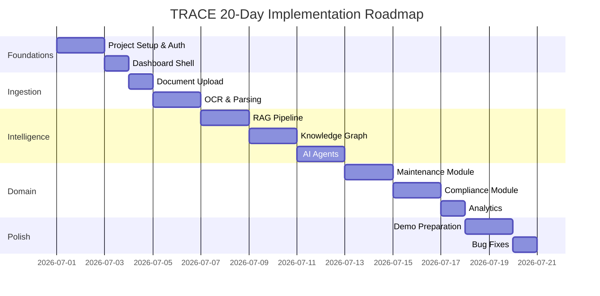

# TRACE — Implementation Roadmap

### Technical Records & Asset Compliance Engine · Problem Statement 8

---

## Table of Contents

1. [Overview](#1-overview)
2. [Roadmap Principles](#2-roadmap-principles)
3. [Phase Summary](#3-phase-summary)
4. [Daily Plan (20 Days)](#4-daily-plan-20-days)
5. [Milestone Checklist](#5-milestone-checklist)
6. [Risk Mitigation](#6-risk-mitigation)
7. [References](#7-references)

---

## 1. Overview

This roadmap covers a **20-day sprint** to build a working TRACE prototype suitable for
demonstration. Development is sequenced to deliver value incrementally: foundations first,
then ingestion and intelligence, then domain features, then polish and demo prep.

> **Deployment is intentionally deferred.** A working prototype and successful demo come
> first. Deployment documentation and infrastructure will be produced only after the
> application is fully functional.

---

## 2. Roadmap Principles

| Principle | Description |
| --- | --- |
| **Vertical slices** | Each day delivers a testable increment |
| **Demo-driven** | Prioritize features visible in the demo |
| **Backend-first for AI** | RAG/graph before Copilot UI polish |
| **Real data early** | Use sample industrial documents from Day 4 |
| **No premature deployment** | Deployment is optional Day 20+ only |
| **Document as you build** | Update API spec if endpoints change |

---

## 3. Phase Summary

| Phase | Days | Focus | Demo-ready output |
| --- | --- | --- | --- |
| Foundations | 1–3 | Setup, auth, dashboard shell | Login + empty dashboard |
| Ingestion | 4–6 | Upload, OCR, parsing | Documents ingested and stored |
| Intelligence | 7–12 | RAG, graph, agents | Grounded Copilot answers |
| Domain | 13–17 | Maintenance, compliance, analytics | Full feature set |
| Polish | 18–20 | Demo prep, bug fixes | Demo-ready prototype |

---

## 4. Daily Plan (20 Days)

### Day 1 — Project Setup & Scaffolding

| Task | Owner | Deliverable |
| --- | --- | --- |
| Initialize Next.js frontend (App Router, TypeScript, Tailwind, shadcn/ui) | Frontend | `frontend/` runnable |
| Initialize FastAPI backend (project structure, config, health endpoint) | Backend | `backend/` runnable |
| Initialize AI module structure (`ai/` folder, LangChain/LangGraph stubs) | AI | `ai/` scaffold |
| Set up PostgreSQL schema (users, roles, documents, assets) | Backend | Migrations applied |
| Configure local dev environment (env files, README dev section) | All | Dev setup documented |
| Seed initial roles (admin, engineer, operator, inspector, compliance_officer) | Backend | Roles in DB |

**Exit criteria:** Both frontend and backend start locally; health endpoint returns 200.

---

### Day 2 — Authentication

| Task | Owner | Deliverable |
| --- | --- | --- |
| Implement JWT auth (login, refresh, logout, `/auth/me`) | Backend | Auth endpoints working |
| Password hashing, user model, role-based dependencies | Backend | RBAC middleware |
| Login page UI with form validation | Frontend | `/login` page |
| Auth middleware (route protection, token refresh) | Frontend | Protected routes |
| Session persistence (httpOnly cookies or secure storage) | Frontend | Login persists across refresh |
| Seed demo users (admin, engineer) | Backend | Test accounts ready |

**Exit criteria:** User can log in, access protected routes, and log out.

---

### Day 3 — Dashboard Shell

| Task | Owner | Deliverable |
| --- | --- | --- |
| Dashboard layout (sidebar, top bar, breadcrumbs) | Frontend | Authenticated shell |
| Navigation links (Copilot, Search, Assets, Graph, Maintenance, Compliance, Documents) | Frontend | Full nav |
| Dashboard home page with placeholder KPI cards | Frontend | `/` dashboard |
| Responsive sidebar (drawer on mobile) | Frontend | Mobile nav |
| Theme setup (light/dark, CSS variables from UI/UX doc) | Frontend | Theming |
| API client library (typed fetch wrapper) | Frontend | `lib/api/` |

**Exit criteria:** Authenticated user sees dashboard shell with navigation; all routes reachable.

---

### Day 4 — Document Upload

| Task | Owner | Deliverable |
| --- | --- | --- |
| Document upload endpoint (`POST /documents`, batch upload) | Backend | Upload API |
| Object store integration (local filesystem for prototype) | Backend | File storage |
| Document list/detail endpoints | Backend | CRUD API |
| Ingestion job model and status tracking | Backend | Job queue stub |
| Document upload UI (drag-and-drop, progress) | Frontend | `/documents` page |
| Document list table with status badges | Frontend | Document management |
| Prepare sample industrial documents in `datasets/` | All | Demo corpus |

**Exit criteria:** User can upload a PDF; document appears in list with `queued` status.

---

### Day 5 — OCR & Document Parsing

| Task | Owner | Deliverable |
| --- | --- | --- |
| OCR engine integration (Tesseract or PaddleOCR) | AI | OCR module |
| PDF parser (native text extraction) | AI | PDF parser |
| Document type classification (SOP, manual, log, report) | AI | Classifier |
| Text cleaning and normalization pipeline | AI | Cleaning module |
| Background ingestion worker (async job processing) | Backend | Worker process |
| Job status API (`GET /documents/{id}/status`) | Backend | Status endpoint |
| Ingestion progress UI (stage indicator) | Frontend | Progress display |

**Exit criteria:** Uploaded PDF is OCR'd/parsed; extracted text stored in PostgreSQL.

---

### Day 6 — Chunking & Metadata Extraction

| Task | Owner | Deliverable |
| --- | --- | --- |
| Semantic chunking (section/paragraph boundaries) | AI | Chunker |
| Table-aware chunking for logs/reports | AI | Table chunker |
| Equipment tag extraction (regex + NER) | AI | Tag extractor |
| Document and chunk metadata storage | Backend | Metadata in PG |
| Entity extraction (tags, people, dates, standards) | AI | NER module |
| End-to-end ingestion test with 3+ sample documents | All | Verified pipeline |

**Exit criteria:** Documents are chunked with metadata; tags extracted and stored.

---

### Day 7 — Embeddings & FAISS Index

| Task | Owner | Deliverable |
| --- | --- | --- |
| Sentence Transformers integration | AI | Embedding service |
| FAISS index creation and incremental add | AI | Vector index |
| Chunk UUID → vector ID mapping | AI | ID mapping |
| Embedding generation in ingestion pipeline | Backend | Auto-embed on ingest |
| Embedding cache (content-hash keyed) | AI | Cache layer |
| Verify retrieval with test queries | AI | Retrieval smoke test |

**Exit criteria:** Ingested documents are searchable via vector similarity.

---

### Day 8 — RAG Retrieval & Search

| Task | Owner | Deliverable |
| --- | --- | --- |
| Hybrid retriever (FAISS + metadata filters) | AI | Retriever |
| Search endpoint (`POST /search`) | Backend | Search API |
| Result reranking | AI | Reranker |
| Search UI page with results and snippets | Frontend | `/search` page |
| Prompt template (system + context + user) | AI | Prompt module |
| Basic answer generation (non-streaming) | AI | Simple RAG answer |

**Exit criteria:** User can search and get relevant document snippets with scores.

---

### Day 9 — Knowledge Graph Setup

| Task | Owner | Deliverable |
| --- | --- | --- |
| Neo4j setup and connection | AI | Graph store connected |
| Node creation (Asset, Document, Procedure, Incident, Standard) | AI | Core nodes |
| Relationship creation during ingestion | AI | Graph edges |
| Entity-to-graph linking (tags → Asset nodes) | AI | Entity linker |
| Graph API (`GET /graph/asset/{id}`, `POST /graph/query`) | Backend | Graph endpoints |
| Graph update in ingestion pipeline | Backend | Auto-graph on ingest |

**Exit criteria:** Ingested documents create graph nodes/edges; asset neighborhood queryable.

---

### Day 10 — Knowledge Graph UI

| Task | Owner | Deliverable |
| --- | --- | --- |
| Graph visualization component (interactive canvas) | Frontend | Graph viewer |
| Node detail panel | Frontend | Node info |
| Graph page (`/graph`) with filters | Frontend | Graph page |
| Asset detail page with graph neighborhood tab | Frontend | Asset graph view |
| Graph search (`GET /graph/search`) | Backend | Graph search API |

**Exit criteria:** User can explore knowledge graph visually; click nodes for details.

---

### Day 11 — AI Agents (Core)

| Task | Owner | Deliverable |
| --- | --- | --- |
| LangGraph orchestrator setup | AI | Agent framework |
| Expert Knowledge Copilot agent | AI | Primary agent |
| Document Intelligence Agent (ingestion) | AI | Ingestion agent |
| Agent router (intent classification) | AI | Router |
| Chat endpoint with SSE streaming (`POST /chat`) | Backend | Streaming chat API |
| Copilot UI (chat window, message bubbles) | Frontend | `/copilot` page |

**Exit criteria:** User can ask a question and receive a streamed, grounded answer.

---

### Day 12 — AI Agents (Specialized)

| Task | Owner | Deliverable |
| --- | --- | --- |
| Maintenance Intelligence Agent | AI | Maintenance agent |
| Compliance Intelligence Agent | AI | Compliance agent |
| Lessons Learned Agent | AI | Incident agent |
| Recommendation Agent | AI | Recommendation agent |
| Knowledge Graph Agent | AI | Graph agent |
| Citation cards in Copilot UI | Frontend | Citations displayed |
| Confidence score badge | Frontend | Confidence UI |
| Conversation history (`GET /chat/conversations`) | Backend | History API |

**Exit criteria:** Specialized agents respond with domain-specific grounded answers.

---

### Day 13 — Assets Module

| Task | Owner | Deliverable |
| --- | --- | --- |
| Asset CRUD endpoints (`GET /assets`, `GET /assets/{id}`, by-tag lookup) | Backend | Asset API |
| Asset list page with filters | Frontend | `/assets` page |
| Asset detail page (header, tabs, summary) | Frontend | `/assets/[id]` page |
| Linked documents tab | Frontend | Asset documents |
| Asset history endpoint | Backend | History API |
| Seed sample assets (P-101, V-203, T-501, etc.) | Backend | Demo assets |

**Exit criteria:** User can browse assets and see linked documents and history.

---

### Day 14 — Maintenance Module

| Task | Owner | Deliverable |
| --- | --- | --- |
| Maintenance records endpoints | Backend | Maintenance API |
| Maintenance schedule endpoint | Backend | Schedule API |
| Maintenance list page with filters | Frontend | `/maintenance` page |
| Maintenance timeline on asset detail | Frontend | Asset maintenance tab |
| Maintenance Intelligence Agent integration | AI | Agent wired to maintenance data |
| Demo query: "What are the safety steps for P-101?" | All | End-to-end demo query |

**Exit criteria:** Maintenance records visible; Copilot answers maintenance questions with citations.

---

### Day 15 — Compliance Module

| Task | Owner | Deliverable |
| --- | --- | --- |
| Compliance standards and items endpoints | Backend | Compliance API |
| Compliance summary endpoint (dashboard data) | Backend | Summary API |
| Compliance page with status donut and items table | Frontend | `/compliance` page |
| Compliance tab on asset detail | Frontend | Asset compliance |
| Compliance Intelligence Agent integration | AI | Agent wired to compliance data |
| Overdue compliance notifications | Backend | Notification triggers |

**Exit criteria:** Compliance status visible; Copilot answers compliance questions with evidence.

---

### Day 16 — Notifications & Feedback

| Task | Owner | Deliverable |
| --- | --- | --- |
| Notification model and endpoints | Backend | Notification API |
| Notification bell in top bar | Frontend | Notification UI |
| Chat feedback endpoint (`POST /chat/feedback`) | Backend | Feedback API |
| Thumbs up/down on Copilot messages | Frontend | Feedback UI |
| Audit log recording for queries and uploads | Backend | Audit trail |
| Admin ingestion monitoring page | Frontend | `/admin` page |

**Exit criteria:** Notifications appear for overdue items; feedback captured on answers.

---

### Day 17 — Analytics & Dashboard KPIs

| Task | Owner | Deliverable |
| --- | --- | --- |
| Dashboard KPI endpoints (document count, asset count, compliance summary) | Backend | KPI API |
| KPI cards with real data on dashboard | Frontend | Live KPIs |
| Trend charts (ingestion volume, query volume) | Frontend | Charts |
| Activity feed (recent uploads, queries) | Frontend | Activity widget |
| Quick Ask Copilot on dashboard | Frontend | Inline Copilot |
| Alerts panel (overdue compliance, critical incidents) | Frontend | Alerts widget |

**Exit criteria:** Dashboard shows live KPIs, trends, and alerts from real data.

---

### Day 18 — Demo Preparation (Part 1)

| Task | Owner | Deliverable |
| --- | --- | --- |
| Ingest full demo document corpus (10+ documents) | All | Complete demo data |
| Verify all demo queries return grounded answers | AI | Query validation |
| Polish Copilot UI (streaming, citations, confidence) | Frontend | Polished Copilot |
| Polish asset detail and graph views | Frontend | Polished views |
| Record demo script walkthrough (dry run) | All | Script validated |
| Fix critical UI/UX issues | Frontend | UI polish |

**Exit criteria:** All demo scenarios work end-to-end with real data.

---

### Day 19 — Demo Preparation (Part 2)

| Task | Owner | Deliverable |
| --- | --- | --- |
| Prepare backup demo data (pre-loaded state) | All | Backup dataset |
| Test demo on clean environment (fresh DB + ingest) | All | Reproducible demo |
| Prepare presentation slides / talking points | All | Presentation ready |
| Practice demo timing (target: 10–15 minutes) | All | Timed rehearsal |
| Document known limitations for Q&A | All | Limitations doc |
| Final UI polish (loading states, empty states, error states) | Frontend | Complete UX |

**Exit criteria:** Demo runs smoothly in 10–15 minutes; backup plan tested.

---

### Day 20 — Bug Fixes & Stabilization

| Task | Owner | Deliverable |
| --- | --- | --- |
| Fix all P0/P1 bugs from demo rehearsal | All | Critical bugs fixed |
| Performance pass (query latency, ingestion speed) | All | Acceptable performance |
| Error handling review (graceful failures, user messages) | All | Robust errors |
| Final demo dry run (full script) | All | Demo confirmed |
| Code cleanup and documentation sync | All | Clean codebase |
| **Optional:** Begin deployment planning (post-demo only) | All | Deployment notes stub |

**Exit criteria:** Prototype is stable, demo-ready, and all P0 bugs resolved.

> **Note:** Deployment documentation, Docker configuration, and CI/CD pipelines will be
> generated **only after** the working prototype is complete and the demo is successful.

---

## 5. Milestone Checklist

| # | Milestone | Target Day | Verified |
| --- | --- | --- | --- |
| M1 | Auth working (login/logout/protected routes) | Day 2 | ☐ |
| M2 | Dashboard shell with navigation | Day 3 | ☐ |
| M3 | Document upload and ingestion pipeline | Day 6 | ☐ |
| M4 | Vector search returns relevant results | Day 7 | ☐ |
| M5 | RAG answers with citations | Day 8 | ☐ |
| M6 | Knowledge graph populated and visualized | Day 10 | ☐ |
| M7 | Copilot streaming with confidence scores | Day 11 | ☐ |
| M8 | All 7 agents operational | Day 12 | ☐ |
| M9 | Asset detail with full history | Day 13 | ☐ |
| M10 | Maintenance module complete | Day 14 | ☐ |
| M11 | Compliance module complete | Day 15 | ☐ |
| M12 | Dashboard KPIs and analytics live | Day 17 | ☐ |
| M13 | Demo script validated end-to-end | Day 19 | ☐ |
| M14 | Prototype stable and demo-ready | Day 20 | ☐ |

---

## 6. Risk Mitigation

| Risk | Impact | Mitigation |
| --- | --- | --- |
| OCR quality on scanned docs | Poor retrieval | Pre-process images; use high-quality sample docs |
| LLM latency | Slow demo | Stream responses; cache common queries |
| Neo4j setup complexity | Delayed graph features | Use Neo4j Desktop for prototype; simplify schema |
| FAISS index corruption | Search failure | Persist index to disk; rebuild script |
| Scope creep | Miss demo deadline | Strict daily scope; defer non-demo features |
| Sample data insufficient | Weak demo | Curate 10+ diverse industrial documents early (Day 4) |

---

## 7. References

- [`13_API_SPECIFICATION.md`](13_API_SPECIFICATION.md)
- [`05_FRONTEND_ARCHITECTURE.md`](05_FRONTEND_ARCHITECTURE.md)
- [`06_BACKEND_ARCHITECTURE.md`](06_BACKEND_ARCHITECTURE.md)
- [`08_AI_ARCHITECTURE.md`](08_AI_ARCHITECTURE.md)
- [`17_PRESENTATION_GUIDE.md`](17_PRESENTATION_GUIDE.md)
