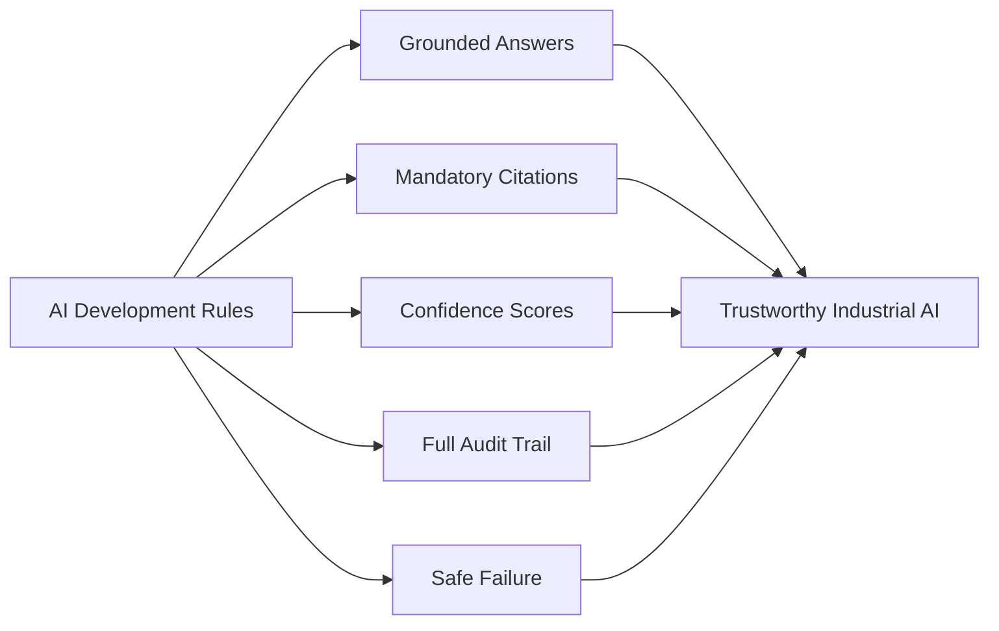
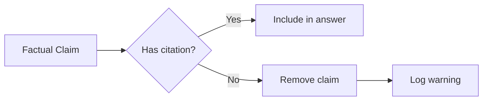
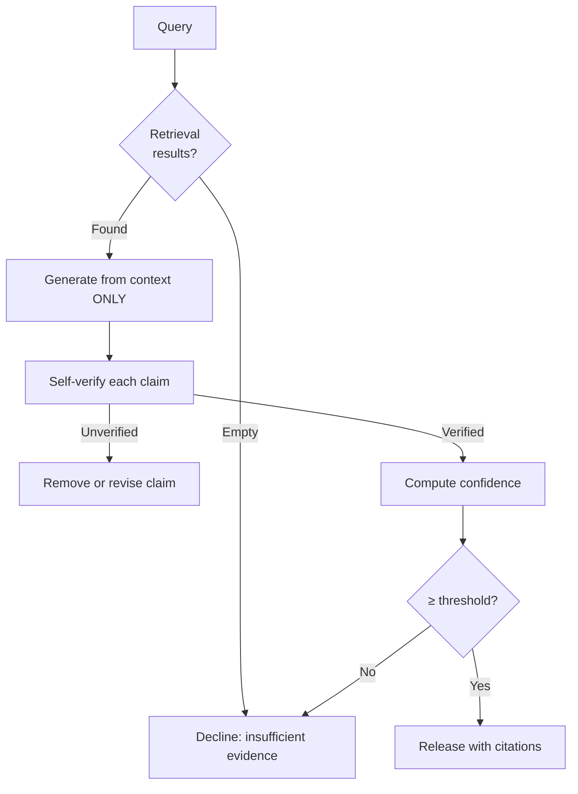
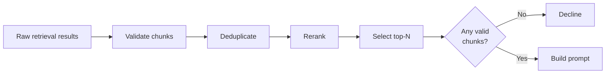
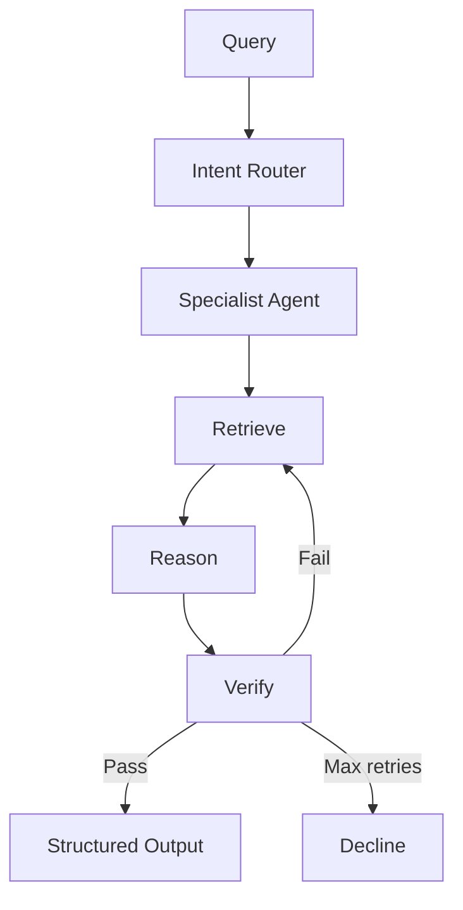

# TRACE — AI Development Rules

### Technical Records & Asset Compliance Engine · Problem Statement 8

---

## Table of Contents

1. [Overview](#1-overview)
2. [Core Principles](#2-core-principles)
3. [Grounding & Citations](#3-grounding--citations)
4. [Hallucination Prevention](#4-hallucination-prevention)
5. [Confidence & Uncertainty](#5-confidence--uncertainty)
6. [Retrieval Rules](#6-retrieval-rules)
7. [Prompt Engineering Rules](#7-prompt-engineering-rules)
8. [Agent Behavior Rules](#8-agent-behavior-rules)
9. [Logging & Auditability](#9-logging--auditability)
10. [Data Privacy & Security](#10-data-privacy--security)
11. [Testing & Evaluation Rules](#11-testing--evaluation-rules)
12. [Code & Architecture Rules](#12-code--architecture-rules)
13. [Rule Summary Card](#13-rule-summary-card)
14. [References](#14-references)

---

## 1. Overview

These rules govern all AI development in TRACE. They are **mandatory engineering standards**,
not suggestions. Every agent, retriever, prompt, and pipeline must comply.

> TRACE is an industrial operating system, not a chatbot. These rules ensure it behaves
> accordingly.



---

## 2. Core Principles

| # | Rule | Rationale |
| --- | --- | --- |
| R-01 | **Never hallucinate** | Industrial decisions depend on accurate information |
| R-02 | **Always cite documents** | Every factual claim must link to a source |
| R-03 | **Return confidence scores** | Users must know how reliable an answer is |
| R-04 | **Log all AI responses** | Audit trail for compliance and debugging |
| R-05 | **Validate retrieved context** | Do not pass unverified context to the LLM |
| R-06 | **Decline when uncertain** | A declined answer is better than a wrong one |
| R-07 | **Context-only generation** | LLM must not use parametric/world knowledge |
| R-08 | **Structured output always** | JSON schema, never free-form for production |
| R-09 | **Agent specialization** | Route to domain agents, not one generic prompt |
| R-10 | **Fail safely and visibly** | Errors must be clear, never silent failures |

---

## 3. Grounding & Citations

### Rule R-02: Always cite documents

Every factual statement in an AI response **must** include at least one citation referencing
a specific chunk ID, document title, and page number.

| Requirement | Enforcement |
| --- | --- |
| Citation per claim | Output schema requires `citations[]` array |
| No orphan claims | Claims without citations are stripped before response |
| Multiple sources | Cross-document claims cite all relevant sources |
| Persisted | Citations stored in PostgreSQL `citations` table |
| Clickable | Frontend renders citation cards linking to source document |



### Citation format

```
[chunk_id: <UUID>] [source: <document_title>, page <N>]
<relevant_text>
```

### Citation quality rules

| Rule | Description |
| --- | --- |
| Minimum relevance score | Citations with score < 0.5 are excluded |
| Source diversity preferred | Multiple independent sources increase confidence |
| Page accuracy | Page number must match chunk metadata |
| Snippet fidelity | Cited snippet must not be altered |

---

## 4. Hallucination Prevention

### Rule R-01: Never hallucinate

| Layer | Mechanism | Implementation |
| --- | --- | --- |
| Retrieval-first | No generation without retrieved context | Block LLM call if retrieval returns empty |
| Context-only prompt | System prompt forbids external knowledge | Explicit instruction in every prompt |
| Structured output | JSON schema with required citation fields | Pydantic validation on LLM output |
| Self-verification | Agent checks claims against sources | Verify step in LangGraph state machine |
| Confidence gating | Low-confidence answers blocked | Threshold check before release |
| Decline protocol | Explicit insufficient-evidence response | Template response, not fabrication |
| Human feedback | Thumbs down triggers review | Feedback stored and reviewed |



### Prohibited behaviors

| Behavior | Why prohibited |
| --- | --- |
| Answering without retrieval | Source of hallucination |
| Using LLM world knowledge | Unverifiable, unauditable |
| Inventing equipment tags | Could cause operational errors |
| Fabricating procedure steps | Safety risk |
| Guessing compliance status | Regulatory risk |
| Making up incident details | Integrity risk |

---

## 5. Confidence & Uncertainty

### Rule R-03: Return confidence scores

Every AI response **must** include a confidence score (0.0 – 1.0).

| Score range | Label | Action |
| --- | --- | --- |
| 0.85 – 1.00 | High | Release answer normally |
| 0.60 – 0.84 | Medium | Release with caveat badge |
| 0.00 – 0.59 | Low | Decline or partial answer only |

### Confidence calculation

| Factor | Weight |
| --- | --- |
| Mean retrieval relevance score | 40% |
| Percentage of claims with matching citations | 25% |
| Graph fact corroboration | 15% |
| Source diversity (multiple docs) | 10% |
| Claim specificity (specific vs vague) | 10% |

### Rule R-06: Decline when uncertain

When confidence is below threshold, the agent **must** respond with:

> "I don't have sufficient evidence in the ingested documents to answer this question
> confidently. Here is what I found that may be related: [partial results with citations].
> Consider uploading additional documents or refining your query."

Never fill gaps with plausible-sounding but unverified content.

---

## 6. Retrieval Rules

### Rule R-05: Validate retrieved context

| Validation | Check |
| --- | --- |
| Chunk exists | Chunk UUID resolves in PostgreSQL |
| Document active | Parent document not soft-deleted |
| Score threshold | Similarity score ≥ 0.3 (configurable) |
| Not stale | Document version is latest |
| Asset scope | If asset context set, chunks relate to that asset |
| Token budget | Total context fits within LLM window |



### Retrieval configuration

| Parameter | Default | Rule |
| --- | --- | --- |
| Top-K (initial) | 20 | Retrieve broadly, then rerank |
| Top-N (final) | 5–10 | Select within token budget |
| Min score | 0.3 | Below this, exclude from context |
| Max context tokens | 3000 | Leave room for system prompt + answer |
| Hybrid required | Yes | Always combine vector + metadata; graph when relevant |

---

## 7. Prompt Engineering Rules

| # | Rule | Description |
| --- | --- | --- |
| P-01 | System prompt on every call | Never send user message alone |
| P-02 | Explicit context-only instruction | "Answer ONLY from provided context" |
| P-03 | JSON output schema | Structured response, not free text |
| P-04 | Chunk ID prefixes | Every chunk prefixed with `[chunk_id: UUID]` |
| P-05 | Role conditioning | Agent role stated in system prompt |
| P-06 | Decline instruction | "If insufficient evidence, say so" |
| P-07 | No chain-of-thought in output | Reasoning is internal; output is clean |
| P-08 | Low temperature | 0.1–0.3 for factual/procedural answers |
| P-09 | Token budget management | Context truncated, not overflowed |
| P-10 | Version prompts | All prompts versioned and stored in code |

### Prompt template structure (mandatory)

```
1. System: role + constraints + output schema
2. Context: retrieved chunks with IDs
3. Graph facts: relevant Neo4j triples (if any)
4. Memory: session context (if multi-turn)
5. User: the question
```

---

## 8. Agent Behavior Rules

| # | Rule | Description |
| --- | --- | --- |
| A-01 | One agent per domain | Route to specialist, not generic |
| A-02 | Shared verification step | All agents pass through grounding check |
| A-03 | Unified output schema | Same JSON structure from every agent |
| A-04 | Agent cannot override decline | Router cannot force answer when agent declines |
| A-05 | Max 3 retrieval loops | Prevent infinite retrieve-retry cycles |
| A-06 | Timeout per agent run | 30 seconds max; fail gracefully |
| A-07 | Log agent selection | Record which agent handled each query |
| A-08 | Asset context respected | When asset is active, scope all retrieval |



---

## 9. Logging & Auditability

### Rule R-04: Log all AI responses

Every AI interaction **must** be logged with full traceability.

| Log field | Content |
| --- | --- |
| `request_id` | Correlation ID |
| `user_id` | Who asked |
| `query` | Original question |
| `agent` | Which agent handled it |
| `retrieved_chunks` | Chunk IDs and scores |
| `graph_facts` | Neo4j triples used |
| `prompt_hash` | Hash of assembled prompt |
| `response` | Full answer text |
| `citations` | Citation IDs and scores |
| `confidence` | Computed score |
| `status` | answered, partial, declined |
| `latency_ms` | Total processing time |
| `model` | LLM model used |
| `token_usage` | Input/output tokens |

| Storage | Retention |
| --- | --- |
| Application logs | 30 days (structured JSON) |
| PostgreSQL `audit_logs` | Permanent |
| PostgreSQL `messages` + `citations` | Permanent |

### What must never be logged

| Excluded | Reason |
| --- | --- |
| Passwords / tokens | Security |
| Full document content in query logs | Privacy (log chunk IDs only) |
| LLM API keys | Security |

---

## 10. Data Privacy & Security

| # | Rule | Description |
| --- | --- | --- |
| S-01 | No data leaves the enterprise | Self-hosted LLM preferred for production |
| S-02 | Role-based retrieval | Users only retrieve documents they can access |
| S-03 | No cross-user memory | Session memory isolated per user |
| S-04 | Prompt injection defense | Sanitize user input; never execute user content as instructions |
| S-05 | Output sanitization | Strip any system prompt leakage from responses |
| S-06 | Embedding data stays local | FAISS index on-premises |

---

## 11. Testing & Evaluation Rules

| # | Rule | Description |
| --- | --- | --- |
| T-01 | Golden query set | Maintain 20+ test queries with expected sources |
| T-02 | Citation accuracy test | Every test answer must cite correct document/page |
| T-03 | Decline test cases | Queries with no evidence must decline, not hallucinate |
| T-04 | Confidence calibration | High-confidence answers must be correct ≥95% |
| T-05 | Regression on prompt change | Any prompt edit re-runs golden query set |
| T-06 | Latency budget | Query path < 5 seconds for demo |
| T-07 | Ingestion smoke test | Every new parser/OCR change re-ingests sample docs |

> Full testing strategy: see [`16_TESTING_STRATEGY.md`](16_TESTING_STRATEGY.md)

---

## 12. Code & Architecture Rules

| # | Rule | Description |
| --- | --- | --- |
| C-01 | AI logic in `ai/` module | Never in routers or repositories |
| C-02 | Prompts as versioned files | Not inline strings scattered in code |
| C-03 | Configurable thresholds | Confidence, score, token limits in config |
| C-04 | Graceful degradation | If Neo4j down, fall back to vector-only |
| C-05 | Idempotent ingestion | Re-ingesting same document does not duplicate |
| C-06 | Type-safe schemas | Pydantic models for all AI inputs/outputs |
| C-07 | No direct LLM calls from routes | Always through agent service |

---

## 13. Rule Summary Card

Quick reference for all developers working on TRACE AI:

```
┌─────────────────────────────────────────────────────────┐
│                  TRACE AI RULES                          │
├─────────────────────────────────────────────────────────┤
│  1. NEVER hallucinate — retrieve first, generate second │
│  2. ALWAYS cite — every claim needs a source            │
│  3. RETURN confidence — 0.0 to 1.0 on every answer     │
│  4. LOG everything — full audit trail per query          │
│  5. VALIDATE context — check chunks before prompting     │
│  6. DECLINE when uncertain — better than wrong          │
│  7. CONTEXT ONLY — LLM uses retrieved docs, not weights  │
│  8. STRUCTURED output — JSON schema, always              │
│  9. SPECIALIST agents — route to domain expert           │
│ 10. FAIL safely — clear errors, never silent             │
└─────────────────────────────────────────────────────────┘
```

---

## 14. References

- [`08_AI_ARCHITECTURE.md`](08_AI_ARCHITECTURE.md)
- [`09_AGENT_ARCHITECTURE.md`](09_AGENT_ARCHITECTURE.md)
- [`10_RAG_PIPELINE.md`](10_RAG_PIPELINE.md)
- [`16_TESTING_STRATEGY.md`](16_TESTING_STRATEGY.md)
- Lewis, P. et al. *Retrieval-Augmented Generation for Knowledge-Intensive NLP Tasks*, NeurIPS 2020.
