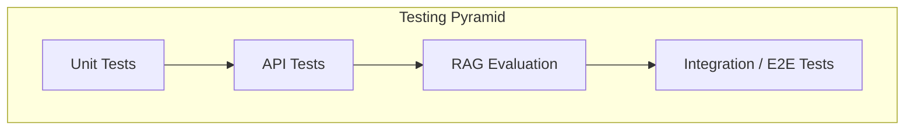
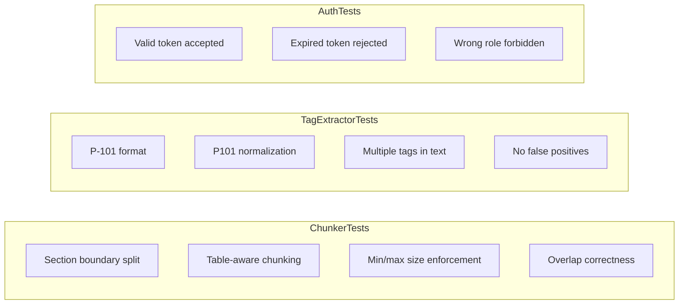
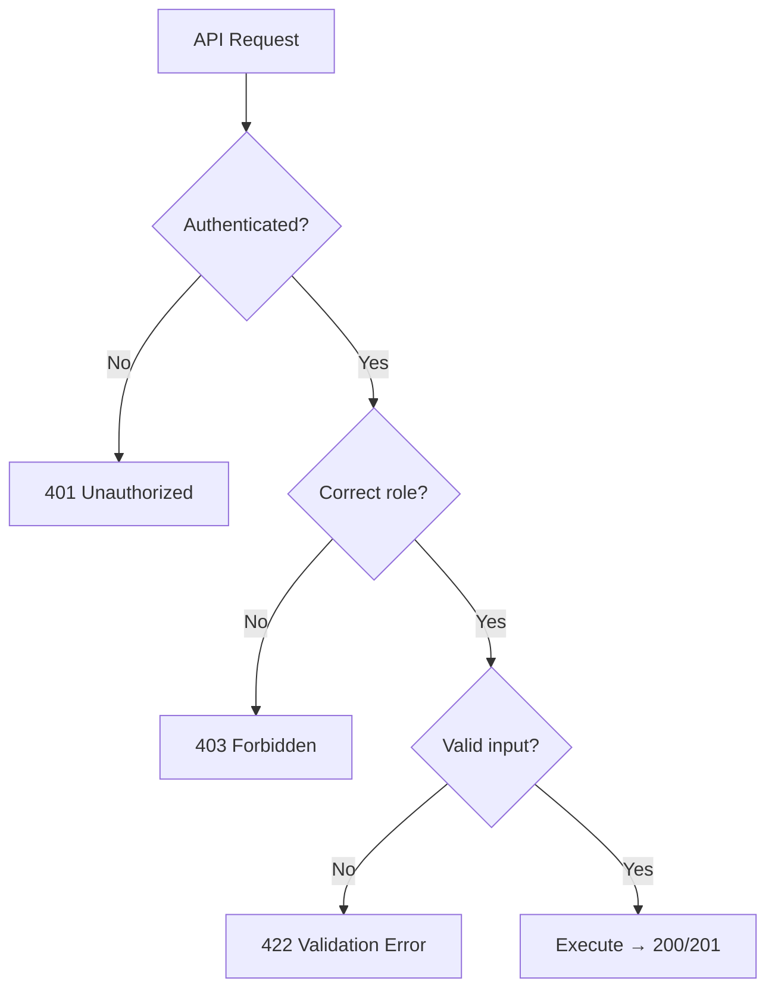
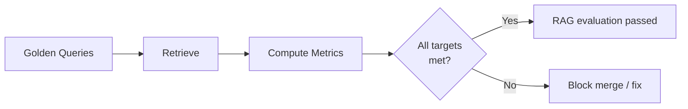
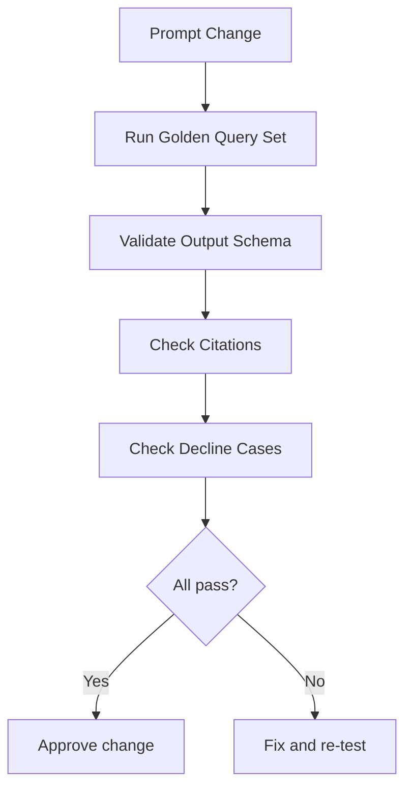
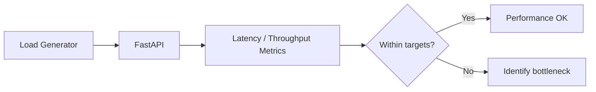
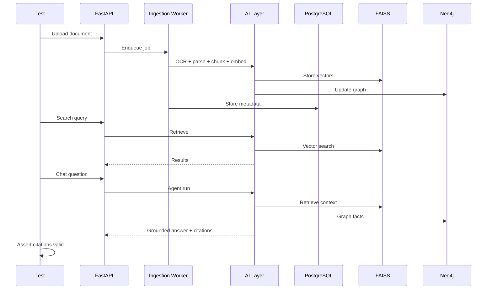

# TRACE — Testing Strategy

### Technical Records & Asset Compliance Engine · Problem Statement 8

---

## Table of Contents

1. [Overview](#1-overview)
2. [Testing Pyramid](#2-testing-pyramid)
3. [Unit Testing](#3-unit-testing)
4. [API Testing](#4-api-testing)
5. [RAG Evaluation](#5-rag-evaluation)
6. [Prompt Testing](#6-prompt-testing)
7. [Performance Testing](#7-performance-testing)
8. [Integration Testing](#8-integration-testing)
9. [Test Data Strategy](#9-test-data-strategy)
10. [Testing Performed to Date (Milestones 1–2)](#10-testing-performed-to-date-milestones-12)
11. [CI Integration (Future)](#11-ci-integration-future)
12. [References](#12-references)

---

## 1. Overview

TRACE requires rigorous testing across all layers — from individual functions to end-to-end
AI pipelines. Testing ensures the platform is **trustworthy, grounded, and performant** for
industrial use.

| Testing goal | Why it matters |
| --- | --- |
| Correctness | Wrong answers in industrial context are dangerous |
| Grounding | Every answer must be backed by real documents |
| Performance | Engineers need answers in seconds, not minutes |
| Reliability | System must handle edge cases gracefully |
| Auditability | Test results prove compliance readiness |

---

## 2. Testing Pyramid

| Layer | Scope | Tools | Frequency |
| --- | --- | --- | --- |
| Unit | Functions, parsers, chunkers, validators | pytest | Every commit |
| API | REST endpoints, auth, validation | pytest + httpx | Every commit |
| RAG Evaluation | Retrieval quality, answer grounding | Custom harness | Every AI change |
| Prompt Testing | Prompt versions, output schema | Golden query set | Every prompt change |
| Performance | Latency, throughput, index size | locust / custom | Weekly |
| Integration | Full pipeline end-to-end | pytest + test DB | Daily / pre-demo |

---

## 3. Unit Testing

### Scope

| Module | What to test |
| --- | --- |
| `ai/ocr/` | OCR output on sample images |
| `ai/parsers/` | PDF text extraction, table parsing |
| `ai/chunkers/` | Chunk boundaries, overlap, size limits |
| `ai/embeddings/` | Vector dimension, normalization |
| `ai/extractors/` | Tag extraction, entity recognition |
| `ai/retrievers/` | Score calculation, filtering, dedup |
| `ai/agents/` | State transitions, output schema |
| `backend/services/` | Business logic, error handling | AuthService manually verified ✅ |
| `backend/repositories/` | Query correctness | Auth repos manually verified ✅ |
| `backend/core/security/` | JWT creation, validation, hashing | ✅ Implemented |

### Unit test rules

| Rule | Description |
| --- | --- |
| Isolated | No external dependencies (DB, Neo4j, FAISS) |
| Fast | Each test < 100ms |
| Deterministic | Same input → same output |
| Named clearly | `test_chunker_splits_on_section_header` |
| Edge cases | Empty input, malformed input, large input |

### Example test categories

### Coverage targets

| Module | Target coverage |
| --- | --- |
| AI parsers/chunkers | ≥ 90% |
| Auth/security | ≥ 95% |
| Services | ≥ 80% |
| Repositories | ≥ 80% |
| Agents | ≥ 70% (integration-heavy) |

---

## 4. API Testing

### Scope

Test every endpoint defined in [`13_API_SPECIFICATION.md`](13_API_SPECIFICATION.md).

| Category | Endpoints to test |
| --- | --- |
| Auth | login, refresh, logout, me |
| Documents | upload, list, detail, status, delete |
| Assets | list, detail, by-tag, history, documents |
| Graph | asset neighborhood, query, search |
| Chat | send message, conversations, feedback |
| Search | semantic search with filters |
| Maintenance | list, detail, schedule |
| Compliance | standards, items, summary |
| Notifications | list, mark read, read all |
| Admin | users, ingestion, audit logs |
| Health | liveness, readiness |

### API test patterns

| Pattern | Test |
| --- | --- |
| Happy path | Valid request → expected response |
| Auth required | No token → 401 |
| Role enforcement | Wrong role → 403 |
| Validation | Missing field → 422 |
| Not found | Invalid ID → 404 |
| Pagination | Page/size params work correctly |
| Filtering | Query params filter results |

### Test fixtures

| Fixture | Purpose |
| --- | --- |
| `test_db` | Isolated PostgreSQL (test schema) |
| `test_user` | Pre-created user with engineer role |
| `test_admin` | Pre-created admin user |
| `test_document` | Pre-ingested sample document |
| `test_asset` | Pre-created asset (P-101) |
| `auth_headers` | Valid JWT for test user |

---

## 5. RAG Evaluation

RAG evaluation is **the most critical test layer** for TRACE. It validates that retrieval
and generation produce grounded, accurate answers.

### Golden query set

Maintain a fixed set of test queries with expected outcomes:

| # | Query | Expected source document | Expected asset | Must cite |
| --- | --- | --- | --- | --- |
| GQ-01 | "What are the safety steps before maintaining Pump P-101?" | Pump P-101 Maintenance SOP | P-101 | Yes |
| GQ-02 | "What caused the bearing failure on P-101?" | Incident Report 2024-017 | P-101 | Yes |
| GQ-03 | "What is the inspection procedure for V-203?" | V-203 Inspection SOP | V-203 | Yes |
| GQ-04 | "Which standards apply to P-101?" | ISO-55000 compliance doc | P-101 | Yes |
| GQ-05 | "When was P-101 last maintained?" | Maintenance log | P-101 | Yes |
| GQ-06 | "What is the startup procedure for T-501?" | T-501 Operating Manual | T-501 | Yes |
| GQ-07 | "Show all incidents in Unit 3" | Multiple incident reports | — | Yes |
| GQ-08 | "What PPE is required for pump maintenance?" | Safety Manual | — | Yes |
| GQ-09 | "What is the warranty period for P-101?" | OEM Manual | P-101 | Yes |
| GQ-10 | "How to calibrate the pressure transmitter PT-301?" | PT-301 Calibration SOP | PT-301 | Yes |

### Decline test cases (must NOT answer)

| # | Query | Why no evidence | Expected |
| --- | --- | --- | --- |
| DQ-01 | "What is the capital of France?" | Not in corpus | Decline |
| DQ-02 | "What is the maintenance procedure for Z-999?" | Asset not in system | Decline |
| DQ-03 | "Who won the 2024 World Cup?" | Not in corpus | Decline |
| DQ-04 | "What is the weather today?" | Not in corpus | Decline |

### RAG metrics

| Metric | Definition | Target |
| --- | --- | --- |
| **Retrieval precision@5** | Relevant chunks in top 5 / 5 | ≥ 0.80 |
| **Retrieval recall@10** | Relevant chunks found in top 10 / total relevant | ≥ 0.70 |
| **Answer groundedness** | Claims with valid citations / total claims | ≥ 0.95 |
| **Citation accuracy** | Correct document+page cited / total citations | ≥ 0.90 |
| **Decline accuracy** | Correctly declined / total decline cases | 100% |
| **Confidence calibration** | High-confidence answers that are correct | ≥ 0.95 |

### RAG evaluation harness

| Component | Function |
| --- | --- |
| Query runner | Execute golden query set |
| Retrieval scorer | Compare retrieved chunks to expected |
| Citation checker | Verify citations match expected sources |
| Groundedness checker | Verify all claims have citations |
| Decline checker | Verify decline cases are declined |
| Report generator | Summary metrics + per-query breakdown |

---

## 6. Prompt Testing

Every prompt change must pass regression testing before deployment.

### Prompt test rules

| Rule | Description |
| --- | --- |
| Version all prompts | Store in versioned files, not inline |
| Golden set on every change | Re-run all golden queries after prompt edit |
| Schema validation | LLM output must parse against Pydantic model |
| Decline behavior preserved | Decline test cases still decline |
| No prompt leakage | System prompt content never appears in output |
| Temperature locked | Changes to temperature require re-evaluation |

### Prompt test categories

| Category | Test |
| --- | --- |
| Output schema | JSON parses correctly every time |
| Citation presence | Every answered query has citations |
| Decline behavior | Out-of-corpus queries are declined |
| Role adherence | Agent stays in domain (maintenance agent doesn't answer compliance) |
| Context adherence | Answer only uses provided context |
| Multi-turn | Follow-up questions maintain context |

---

## 7. Performance Testing

### Performance targets

| Operation | Target | Measurement |
| --- | --- | --- |
| API response (non-AI) | < 200ms p95 | Endpoint latency |
| Semantic search | < 1s p95 | Search endpoint |
| Copilot answer (full) | < 5s p95 | Chat endpoint (including LLM) |
| Document ingestion (10-page PDF) | < 60s | End-to-end pipeline |
| FAISS search (100K vectors) | < 100ms | Vector search latency |
| Neo4j traversal (2-hop) | < 200ms | Graph query latency |
| Dashboard load | < 2s | Page load time |

### Performance test scenarios

| Scenario | Load | Duration |
| --- | --- | --- |
| Concurrent search | 10 users, 1 query/sec each | 5 min |
| Concurrent chat | 5 users, 1 message every 10s | 5 min |
| Batch ingestion | 20 documents uploaded simultaneously | Until complete |
| Dashboard load | 20 concurrent page loads | 2 min |
| Graph exploration | 10 users browsing graph | 5 min |

### Bottleneck identification

| Symptom | Likely cause | Fix |
| --- | --- | --- |
| Slow search | FAISS index too large / unsharded | Shard index |
| Slow chat | LLM latency | Stream tokens; cache common queries |
| Slow ingestion | OCR bottleneck | Parallelize pages; GPU OCR |
| Slow dashboard | N+1 queries | Add caching; optimize queries |
| Memory spike | Large context window | Reduce top-N chunks |

---

## 8. Integration Testing

End-to-end tests validate the full system working together.

### Integration test scenarios

| # | Scenario | Steps | Expected |
| --- | --- | --- | --- |
| IT-01 | Full ingestion | Upload PDF → OCR → chunk → embed → index | Document searchable |
| IT-02 | Search after ingest | Upload → wait → search | Relevant results returned |
| IT-03 | Copilot Q&A | Upload SOP → ask question → get answer | Grounded answer with citation |
| IT-04 | Asset linking | Upload doc with P-101 tag → view asset | Document linked to P-101 |
| IT-05 | Graph population | Upload multiple docs → view graph | Nodes and edges created |
| IT-06 | Maintenance flow | Upload log → ask maintenance question | History returned with citation |
| IT-07 | Compliance flow | Upload standard → check compliance | Status shown with evidence |
| IT-08 | Multi-turn chat | Ask → follow-up → follow-up | Context maintained |
| IT-09 | Auth flow | Login → access → refresh → logout | Tokens work correctly |
| IT-10 | Decline flow | Ask out-of-corpus question | Decline with message |

### Integration test environment

| Component | Test setup |
| --- | --- |
| PostgreSQL | Test database (separate schema) |
| FAISS | In-memory index (rebuilt per test suite) |
| Neo4j | Test instance or embedded |
| Object store | Local temp directory |
| LLM | Mock or lightweight local model for CI |

---

## 9. Test Data Strategy

| Dataset | Location | Purpose |
| --- | --- | --- |
| Sample SOPs | `datasets/sops/` | Ingestion + RAG testing |
| Sample manuals | `datasets/manuals/` | OCR + parsing testing |
| Sample logs | `datasets/logs/` | Table extraction testing |
| Sample incidents | `datasets/incidents/` | Lessons learned testing |
| Sample P&IDs | `datasets/drawings/` | Diagram extraction testing |
| Golden queries | `datasets/golden_queries.json` | RAG evaluation |
| Decline queries | `datasets/decline_queries.json` | Hallucination testing |
| Test assets | Seeded in DB | Asset/graph testing |

### Test data rules

| Rule | Description |
| --- | --- |
| Representative | Documents cover all supported types |
| Realistic | Based on actual industrial document formats |
| Versioned | Test data changes tracked in git |
| Isolated | Test data never mixed with production |
| Minimal for unit tests | Small fixtures; full corpus for integration |

---

## 10. Testing Performed to Date (Milestones 1–2)

Manual and ad-hoc verification performed during Milestones 1 and 2. Automated test suites
described in sections 3–8 remain **planned** for CI integration.

### Backend

| Area | What was verified | Method |
| --- | --- | --- |
| Health API | `GET /api/health` returns `{ status: "ok", service: "TRACE Backend" }` | Manual + Swagger |
| Registration | New user creation, duplicate email rejection, default Viewer role | Manual + Swagger |
| Login | Valid credentials issue access + refresh tokens; invalid credentials return 401 | Manual + Swagger |
| JWT | Access token decodes correctly; protected routes reject missing/invalid tokens | Manual |
| Refresh token | Rotation revokes old token; new pair issued; expired/invalid tokens rejected | Manual + service calls |
| Logout | Refresh token revoked; subsequent refresh fails | Manual |
| `/auth/me` | Returns user profile with single role string | Manual |
| Password hashing | bcrypt via passlib; login verifies hashed passwords | Implementation review |
| Database | Alembic migrations apply; roles seeded; verify_db script passes | Script execution |

### Frontend

| Area | What was verified | Method |
| --- | --- | --- |
| Login page | Form validation (Zod), error display, successful redirect to dashboard | Manual |
| Register page | Registration flow, validation, redirect to login | Manual |
| Auth context | Session bootstrap from localStorage on page reload | Manual |
| Axios interceptor | 401 triggers refresh; queued requests retry with new token | Manual |
| Protected routes | `/dashboard` redirects unauthenticated users to `/login` | Manual |
| Guest routes | `/login` and `/register` redirect authenticated users to `/dashboard` | Manual |
| Logout | Clears tokens, redirects to login | Manual |
| Dashboard shell | Sidebar, topbar, KPI placeholders, role badge, profile display | Manual |
| Loading states | Skeleton screens during auth bootstrap | Manual |
| Build quality | `npm run build` and ESLint pass | CI-local |

### Known gaps (to address in future testing work)

| Gap | Planned resolution |
| --- | --- |
| No pytest suite committed yet | Add API tests per section 4 |
| TestClient async/event-loop issues on Windows | Use httpx async client or direct service tests |
| No E2E browser tests | Add Playwright after Milestone 3 |
| RAG / AI evaluation | Sections 5–6 apply when AI pipeline is built |

---

## 11. CI Integration (Future)

> CI/CD pipelines will be configured **after** the working prototype is complete and the
> demo is successful. This section defines what will be automated.

| Stage | Tests run | Block on failure |
| --- | --- | --- |
| On commit | Unit tests + API tests | Yes |
| On AI module change | RAG evaluation (golden set) | Yes |
| On prompt change | Prompt regression tests | Yes |
| Weekly | Performance tests | Warn (not block) |
| Pre-demo | Full integration suite | Yes |

---

## 12. References

- [`13_API_SPECIFICATION.md`](13_API_SPECIFICATION.md)
- [`15_AI_DEVELOPMENT_RULES.md`](15_AI_DEVELOPMENT_RULES.md)
- [`10_RAG_PIPELINE.md`](10_RAG_PIPELINE.md)
- [`14_IMPLEMENTATION_ROADMAP.md`](14_IMPLEMENTATION_ROADMAP.md)
- pytest — https://docs.pytest.org/
- httpx — https://www.python-httpx.org/
