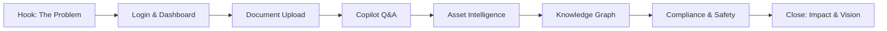
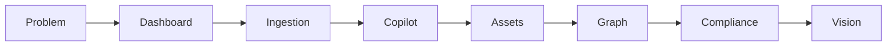
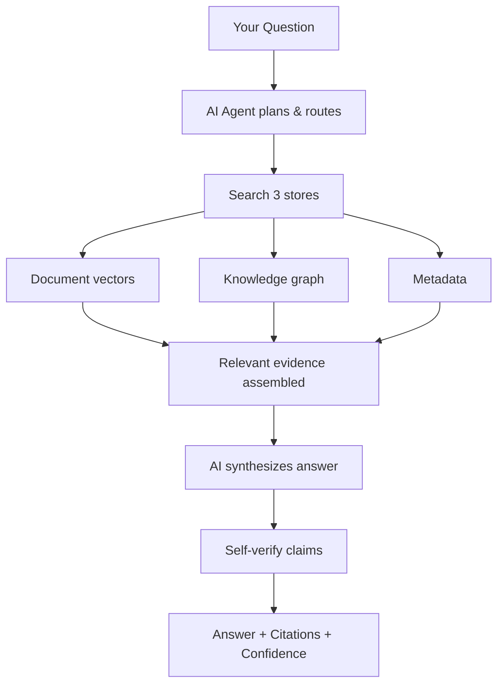
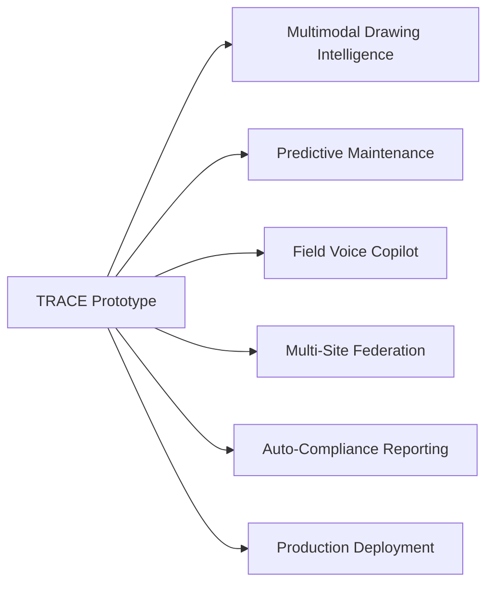

# TRACE — Presentation & Demo Guide

### Technical Records & Asset Compliance Engine · Problem Statement 8

---

## Table of Contents

1. [Overview](#1-overview)
2. [Demo Strategy](#2-demo-strategy)
3. [Demo Script](#3-demo-script)
4. [Feature Order](#4-feature-order)
5. [Judge Talking Points](#5-judge-talking-points)
6. [How to Explain the AI Architecture](#6-how-to-explain-the-ai-architecture)
7. [Likely Questions & Answers](#7-likely-questions--answers)
8. [Backup Plan](#8-backup-plan)
9. [Future Scope](#9-future-scope)
10. [Presentation Tips](#10-presentation-tips)
11. [References](#11-references)

---

## 1. Overview

This guide prepares the team to deliver a compelling **10–15 minute live demo** of TRACE.
The demo must prove that TRACE is an **industrial operating system for knowledge** — not a
PDF chatbot — and that every answer is grounded, cited, and auditable.

| Demo goal | Message |
| --- | --- |
| Problem | Industrial knowledge is fragmented and undiscoverable |
| Solution | TRACE unifies it into one searchable Industrial Knowledge Brain |
| Differentiation | Grounded, cited, agentic — not ChatGPT for PDFs |
| Impact | Hours of search → seconds; safety and compliance proactive |

---

## 2. Demo Strategy

| Principle | Application |
| --- | --- |
| Tell a story | Follow an engineer's real workflow |
| Show, don't tell | Live queries, not slides |
| Prove grounding | Click citations to open source documents |
| Show confidence | Point out confidence badges |
| Show decline | Ask one out-of-scope question to prove safety |
| Keep it tight | 10–15 minutes; no feature dumping |

---

## 3. Demo Script

### Opening (1 minute)

> "Industrial facilities generate hundreds of thousands of documents — SOPs, P&IDs,
> maintenance logs, incident reports, OEM manuals. Today, finding the right information
> takes hours. Engineers rely on tribal knowledge. Critical safety information is buried
> in PDFs.
>
> TRACE — the Technical Records & Asset Compliance Engine — transforms this entire
> document estate into one searchable Industrial Knowledge Brain. It's not a PDF chatbot.
> It's Copilot for industrial operations."

---

### Scene 1: Login & Dashboard (1 minute)

**Action:** Log in as engineer. Show dashboard.

**Say:**
> "This is the TRACE dashboard — the operational command center. We can see KPIs: total
> assets tracked, documents ingested, compliance status, and recent incidents. The Quick
> Ask bar lets engineers jump straight into the Copilot."

**Show:** KPI cards, activity feed, alerts panel.

---

### Scene 2: Document Upload (1 minute)

**Action:** Navigate to Documents. Show ingested corpus. Upload one new document live.

**Say:**
> "TRACE ingests all industrial document types — PDFs, images, Excel, emails, engineering
> drawings. When we upload a document, it goes through an automated pipeline: OCR, parsing,
> entity extraction, chunking, embedding, and knowledge graph update. All of this happens
> in the background."

**Show:** Document list with status badges. Upload a PDF. Show ingestion progress.

---

### Scene 3: Copilot — The Core Demo (3 minutes)

**Action:** Open Copilot. Ask three questions in sequence.

**Query 1:**
> "What are the safety steps before maintaining Pump P-101?"

**Say while waiting:**
> "The Copilot doesn't just search — it plans, retrieves from multiple sources, verifies
> its answer, and returns a grounded response with citations."

**Show:** Streamed answer. Click a citation to open the source SOP at the correct page.
Point out the confidence badge (High: 0.91).

**Query 2:**
> "What incidents have occurred on P-101?"

**Show:** Answer referencing incident history. Multiple citations from different documents.

**Query 3 (Decline demo):**
> "What is the maintenance procedure for pump Z-999?"

**Say:**
> "Notice TRACE doesn't guess. When there's insufficient evidence, it declines and tells
> you why. This is critical in industrial environments — a wrong answer is worse than no
> answer."

**Show:** Decline response with partial related results.

---

### Scene 4: Asset Intelligence (2 minutes)

**Action:** Navigate to Assets → P-101.

**Say:**
> "Every asset in the facility has a unified knowledge view. All documents, maintenance
> history, inspections, incidents, and compliance items — connected in one place."

**Show:** Asset header, tabs (Overview, Documents, Maintenance, Inspections, Incidents,
Compliance). Click through 2–3 tabs.

**Query 4 (from asset page):**
> "When was P-101 last maintained and what was done?"

**Show:** Copilot answer with maintenance timeline and citation.

---

### Scene 5: Knowledge Graph (2 minutes)

**Action:** Navigate to Graph. Show P-101 neighborhood.

**Say:**
> "Behind the scenes, TRACE builds a knowledge graph connecting assets, documents,
> procedures, incidents, and standards. This enables relationship-aware reasoning that
> keyword search or simple RAG cannot provide."

**Show:** Interactive graph. Click a node (incident). Show detail panel. Expand neighborhood.

---

### Scene 6: Compliance & Safety (2 minutes)

**Action:** Navigate to Compliance dashboard.

**Say:**
> "Compliance officers need to prove that assets meet regulatory requirements. TRACE
> surfaces compliance status, links evidence documents, and provides a full audit trail
> for every answer."

**Show:** Compliance donut (compliant/non-compliant/pending). Click an overdue item.
Show evidence document link.

**Query 5:**
> "Which standards apply to P-101 and are they compliant?"

**Show:** Copilot answer with standard references and compliance status.

---

### Closing (1 minute)

> "TRACE transforms fragmented industrial documents into one trustworthy knowledge brain.
> Every answer is grounded in source documents with citations. Every query is logged for
> audit. Specialized AI agents handle maintenance, compliance, incidents, and
> recommendations — not one generic chatbot.
>
> The result: engineers find answers in seconds instead of hours, safety information is
> proactive, and institutional knowledge is preserved forever.
>
> TRACE — Copilot for industrial operations."

---

## 4. Feature Order

Present features in this order to build the narrative:

| Order | Feature | Duration | Why this order |
| --- | --- | --- | --- |
| 1 | Problem statement | 1 min | Set context |
| 2 | Login + Dashboard | 1 min | Show it's a real platform |
| 3 | Document upload | 1 min | Show ingestion capability |
| 4 | Copilot Q&A (3 queries) | 3 min | Core value — grounded answers |
| 5 | Asset detail | 2 min | Asset-centric intelligence |
| 6 | Knowledge graph | 2 min | Differentiation — relationships |
| 7 | Compliance | 2 min | Enterprise value — audit |
| 8 | Decline demo | 30 sec | Trust — doesn't hallucinate |
| 9 | Vision + close | 1 min | Impact statement |

---

## 5. Judge Talking Points

Use these phrases during the demo to reinforce key messages:

| Talking point | When to use |
| --- | --- |
| "Not a PDF chatbot — an industrial operating system" | Opening |
| "Every answer is grounded in source documents" | After first Copilot query |
| "Click the citation — it opens the exact page" | When showing citations |
| "Confidence score tells you how reliable the answer is" | When showing confidence badge |
| "It declines rather than hallucinate" | During decline demo |
| "Seven specialized AI agents, not one generic prompt" | When explaining architecture |
| "Knowledge graph connects assets, procedures, and incidents" | Graph section |
| "Full audit trail for compliance" | Compliance section |
| "Hours of search reduced to seconds" | Closing |
| "Institutional knowledge preserved forever" | Closing |

### Key differentiators to emphasize

| vs. Generic ChatGPT | TRACE |
| --- | --- |
| "ChatGPT answers from memory" | "TRACE answers from YOUR documents" |
| "No citations" | "Every claim cited to source + page" |
| "Hallucinates when unsure" | "Declines when evidence is insufficient" |
| "One generic model" | "Seven specialized industrial agents" |
| "No audit trail" | "Every query logged for compliance" |
| "No asset awareness" | "Asset-centric knowledge views" |

---

## 6. How to Explain the AI Architecture

Use this simplified explanation for judges (avoid jargon):

### The 30-second version

> "When you ask TRACE a question, it doesn't go straight to an AI model. First, specialized
> agents plan what information is needed. Then the system searches across three stores —
> semantic vectors, a knowledge graph, and structured metadata — to find the most relevant
> evidence. Only then does the AI synthesize an answer, strictly from that evidence. Every
> claim is verified and cited. If the evidence isn't strong enough, TRACE says so."

### The architecture diagram (show if asked)

### The 7 agents (if asked)

| Agent | One-line description |
| --- | --- |
| Document Intelligence | Reads and understands uploaded documents |
| Expert Knowledge Copilot | Answers any industrial question with citations |
| Maintenance Intelligence | Maintenance procedures and history |
| Compliance Intelligence | Standards, requirements, and audit evidence |
| Lessons Learned | Incident analysis and prevention |
| Recommendation | Proactive suggestions before work begins |
| Knowledge Graph | Connects assets, documents, and events |

### Key technical terms (plain language)

| Term | Plain explanation |
| --- | --- |
| RAG | "Search your documents first, then generate an answer from what was found" |
| Knowledge Graph | "A map of how assets, documents, and events are connected" |
| Embeddings | "Converting text into numbers so similar content can be found" |
| FAISS | "A fast search engine for those number representations" |
| LangGraph | "Orchestrates multi-step AI reasoning like a workflow" |
| Confidence score | "How sure TRACE is that the answer is correct" |
| OCR | "Reading text from scanned documents and images" |

---

## 7. Likely Questions & Answers

### Product & Vision

| Question | Answer |
| --- | --- |
| "How is this different from ChatGPT?" | ChatGPT answers from its training data. TRACE answers only from your ingested documents, with citations. It declines when it doesn't have evidence. |
| "Is this just a PDF chatbot?" | No. TRACE ingests all industrial document types, builds a knowledge graph, uses 7 specialized agents, and provides asset-centric views, compliance tracking, and maintenance intelligence. |
| "Who is the target user?" | Maintenance engineers, plant operators, inspectors, compliance officers, and safety officers in heavy-asset industries. |
| "What's the business value?" | Reduces search time from hours to seconds, prevents knowledge loss, improves safety, and supports compliance audits. |

### Technical

| Question | Answer |
| --- | --- |
| "What LLM do you use?" | Configurable — supports self-hosted models for data privacy. The LLM is the synthesis engine, not the knowledge source. |
| "How do you prevent hallucination?" | Five layers: retrieval-first, context-only prompts, structured output, self-verification, and confidence gating. TRACE declines rather than guess. |
| "How does the knowledge graph work?" | Neo4j stores entities (assets, documents, incidents) and relationships (governs, caused_by, complies_with). Agents traverse the graph for relationship-aware answers. |
| "Can it handle engineering drawings?" | Yes — OCR for tags/labels, symbol recognition for P&IDs, and diagram topology extraction. |
| "How do you handle document updates?" | Version tracking in PostgreSQL. Re-ingestion updates vectors and graph. Latest version is always used. |
| "What about data privacy?" | Self-hosted architecture. Documents and embeddings stay on-premises. No data sent to external APIs in production. |

### Demo-specific

| Question | Answer |
| --- | --- |
| "What documents did you ingest?" | [List the demo corpus: SOPs, manuals, logs, incident reports, inspection reports] |
| "Can I ask it a question?" | Yes — [have 2–3 safe backup queries ready] |
| "What happens if it doesn't know?" | [Demonstrate decline live with Z-999 query] |
| "How fast is it?" | Typical queries respond in 2–5 seconds with streaming. |

---

## 8. Backup Plan

### If live demo fails

| Failure | Backup |
| --- | --- |
| LLM service down | Pre-recorded video of Copilot queries (2 min clip) |
| Ingestion fails live | Pre-ingested corpus already in database |
| Slow response | Switch to pre-cached queries; explain streaming |
| Neo4j down | Demo vector-only search; explain graph is optional enhancement |
| Network issue | Run fully local (localhost frontend + backend) |
| Unexpected question | Redirect to prepared queries; explain decline behavior |

### Pre-demo checklist

| # | Check | Status |
| --- | --- | --- |
| 1 | All services running (PostgreSQL, Neo4j, FAISS, backend, frontend) | ☐ |
| 2 | Demo corpus ingested (10+ documents) | ☐ |
| 3 | Demo assets seeded (P-101, V-203, T-501) | ☐ |
| 4 | All 5 demo queries return grounded answers | ☐ |
| 5 | Decline query (Z-999) returns decline | ☐ |
| 6 | Citations clickable and open correct page | ☐ |
| 7 | Dashboard KPIs show real data | ☐ |
| 8 | Graph visualization renders | ☐ |
| 9 | Compliance page shows status | ☐ |
| 10 | Backup video recorded | ☐ |
| 11 | Demo runs in < 15 minutes | ☐ |

### Safe backup queries (always work)

| Query | Expected |
| --- | --- |
| "What are the safety steps before maintaining Pump P-101?" | Grounded answer with SOP citation |
| "What incidents have occurred on P-101?" | Incident history with citations |
| "Which standards apply to P-101?" | ISO-55000 and compliance status |

---

## 9. Future Scope

Use this section if judges ask "What's next?"

| Theme | Future capability |
| --- | --- |
| Multimodal vision | Deep visual understanding of P&IDs (symbol recognition, line tracing) |
| Predictive maintenance | Combine logs and sensor data to forecast failures |
| Proactive alerts | Notify teams of relevant compliance or safety changes |
| Voice & field access | Hands-free Copilot for field technicians |
| Multi-site federation | Cross-facility knowledge sharing and benchmarking |
| Real-time data fusion | Integrate IoT/sensor telemetry with document knowledge |
| Auto-compliance reporting | Generate audit-ready compliance documentation |
| Workflow automation | Trigger maintenance and inspection workflows from insights |
| Continuous learning | Improve retrieval and reasoning from user feedback |
| Deployment & scale | Production deployment after prototype validation |

> Deployment documentation and infrastructure will be produced after the prototype is
> validated and the demo is complete.

---

## 10. Presentation Tips

| Tip | Detail |
| --- | --- |
| Start with the problem | Judges care about why before how |
| One screen at a time | Don't split attention |
| Click citations live | Most impactful moment in the demo |
| Show the decline | Proves trustworthiness |
| Know your timing | Practice to 12 minutes; leave 3 for questions |
| Have the backup video ready | Tab open, muted, ready to play |
| Dress the UI | Use real industrial document names (P-101, SOP-042) |
| Avoid jargon | Say "search" not "vector retrieval" unless asked |
| End with impact | "Hours → seconds. Knowledge preserved forever." |
| Invite one question | "Would you like to ask TRACE a question?" |

---

## 11. References

- [`14_IMPLEMENTATION_ROADMAP.md`](14_IMPLEMENTATION_ROADMAP.md)
- [`08_AI_ARCHITECTURE.md`](08_AI_ARCHITECTURE.md)
- [`09_AGENT_ARCHITECTURE.md`](09_AGENT_ARCHITECTURE.md)
- [`15_AI_DEVELOPMENT_RULES.md`](15_AI_DEVELOPMENT_RULES.md)
- [`01_PROBLEM_STATEMENT.md`](01_PROBLEM_STATEMENT.md)
- [`02_PRODUCT_REQUIREMENTS.md`](02_PRODUCT_REQUIREMENTS.md)
